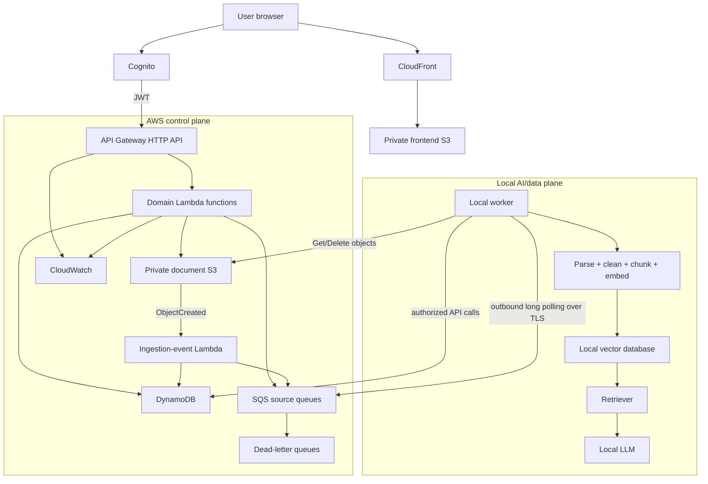

# StudyBot System Overview

## Purpose

StudyBot is a personal AI notebook for uploading study documents, asking grounded questions, receiving citations, and generating flashcards. The MVP is designed as an event-driven hybrid system: AWS provides the durable control plane, while a local machine provides AI compute and vector retrieval.

## System context

AWS never opens an inbound connection to the local machine. The worker initiates all cloud communication.

## Responsibility split

| AWS — durable control plane | Local — rebuildable AI/data plane |
|---|---|
| Authentication and API | Document parsing and cleaning |
| Original document storage | Chunking and embedding |
| Sessions, jobs, messages and flashcards | Vector index and retrieval |
| Job queues and DLQs | Local LLM inference |
| Logs, metrics and alarms | Temporary files and local logs |

SQS is a delivery notification: “job X needs processing.” DynamoDB is the source of truth for the job payload, state and result.

## Confirmed MVP scope

- Text-based PDF ingestion; OCR and multimodal parsing are deferred.
- Session-scoped RAG with user/document authorization filters.
- English and Vietnamese queries where the selected models support them.
- Answer or truthful refusal with document/page/section citations.
- Background flashcard generation.
- Asynchronous document deletion including local vectors and S3 object.
- Frontend polling for job results; token streaming is deferred.

## Deployment topology

CloudFront is global. Cognito, API Gateway, Lambda, DynamoDB, SQS, document S3 and CloudWatch are deployed in one selected AWS Region. The MVP has no application VPC, EC2, ALB, NAT Gateway, RDS or VPC endpoints.

The current frontend is static HTML/CSS/JavaScript. React or Next.js is not a confirmed dependency.

