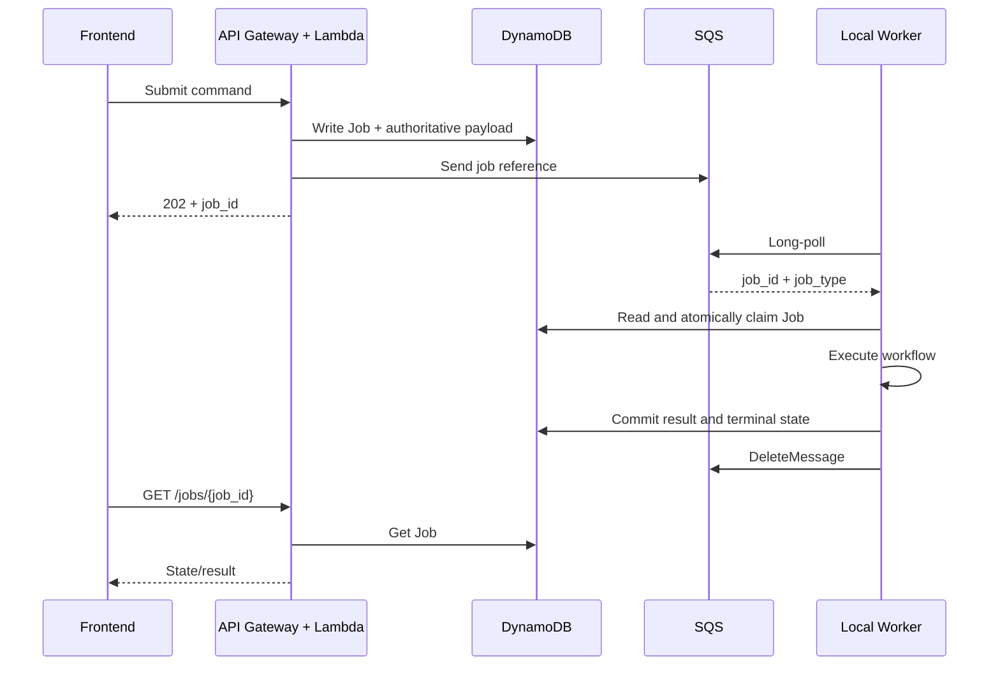
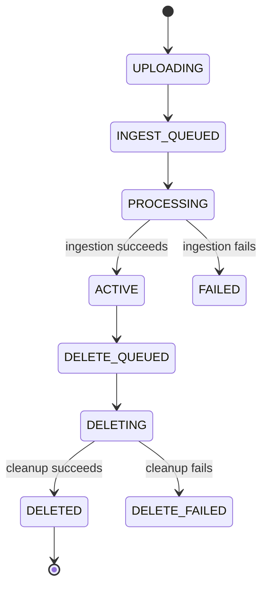
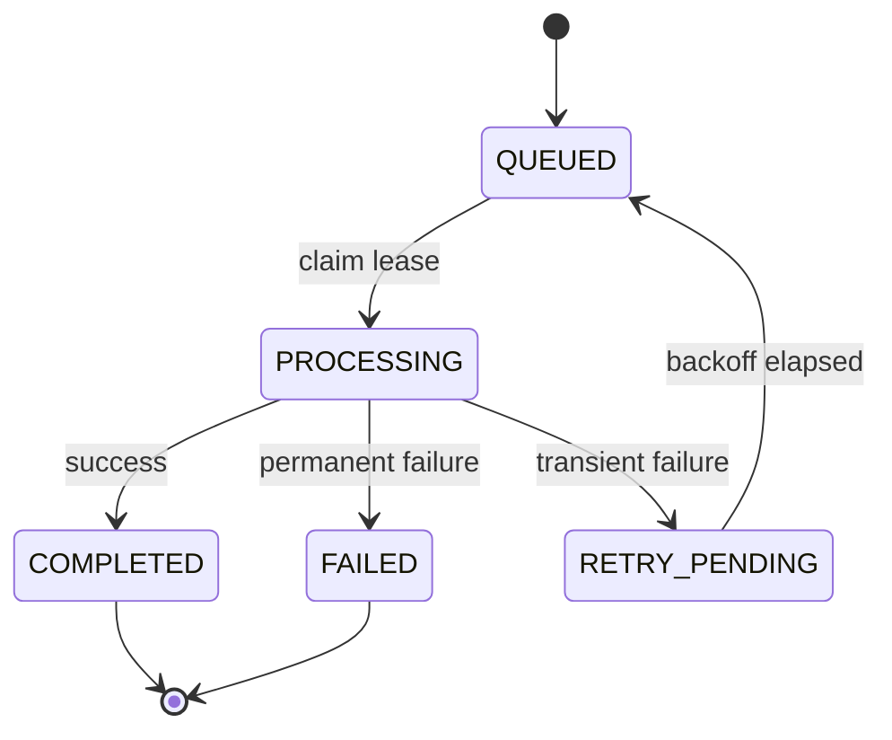
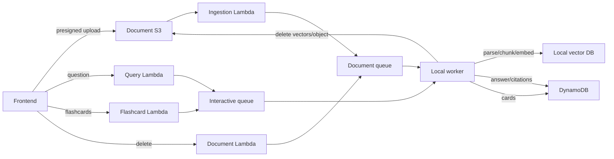

# Workflows and Contracts

## Cloud–local protocol



Canonical SQS notification:

```json
{
  "schema_version": 1,
  "job_id": "job_123",
  "job_type": "ANSWER_QUERY"
}
```

The notification contains no PDF, chunks, question or authoritative document list. The worker reads current data from DynamoDB.

## Queues

| Queue | Job types | DLQ |
|---|---|---|
| `studybot-interactive-queue` | `ANSWER_QUERY`, `GENERATE_FLASHCARDS` | `studybot-interactive-dlq` |
| `studybot-document-queue` | `INGEST_DOCUMENT`, `DELETE_DOCUMENT` | `studybot-document-dlq` |

## Document lifecycle



`DELETE_QUEUED` immediately excludes a document from retrieval even if physical cleanup is pending.

## Job lifecycle



All claims and terminal updates are conditional. The job stores `worker_id`, `lease_token`, `lease_expires_at`, `attempt_count`, `max_attempts`, `last_error` and `next_attempt_at`.

## Job contracts

| Job type | Required context/payload | Result |
|---|---|---|
| `INGEST_DOCUMENT` | `user_id`, `document_id` | `chunk_count` |
| `ANSWER_QUERY` | `user_id`, `session_id`, `question` | answer/refusal and citations |
| `GENERATE_FLASHCARDS` | `user_id`, `session_id`, `count`, `difficulty` | `generated_count` |
| `DELETE_DOCUMENT` | `user_id`, `document_id` | `deleted_vector_count` |

Each contract includes `job_version`. Unsupported versions fail without executing business operations.

## Workflow summary



## Public API surface

| Area | Endpoints |
|---|---|
| Documents | `POST /documents/uploads`, `GET /documents`, `GET /documents/{id}`, `DELETE /documents/{id}` |
| Sessions | `POST /sessions`, `GET /sessions`, `GET /sessions/{id}`, attach/detach document routes |
| Query | `POST /sessions/{id}/questions`, `GET /sessions/{id}/messages` |
| Flashcards | `POST /sessions/{id}/flashcards`, `GET /sessions/{id}/flashcards` |
| Jobs | `GET /jobs/{job_id}` |

Commands that start AI/background work return `202 Accepted` and a `job_id`. File bytes upload directly to S3 using a constrained presigned POST.

