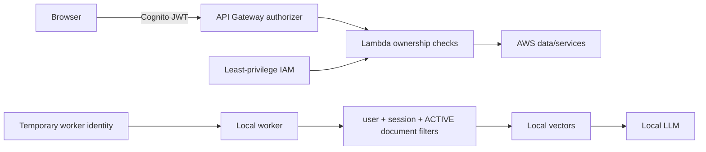

# Data and Security

## Data placement

| Data | Location | Authoritative source |
|---|---|---|
| Frontend assets | Frontend S3 | Source repository/build artifact |
| Identity | Cognito | Cognito |
| Original documents | Document S3 | S3 |
| Documents, sessions and jobs | DynamoDB | Corresponding DynamoDB table |
| Chat answers and citations | `StudyBotMessages` | Messages table |
| Flashcards | `StudyBotFlashcards` | Flashcards table |
| Job notification | SQS | Not authoritative |
| Parsed chunks and embeddings | Local vector store | Rebuildable derived index |
| Model files | Local model cache | Model source/release |

`StudyBotJobs.result` may contain a small denormalized polling copy. The assistant message remains authoritative. Large generated artifacts are stored once in their domain table or S3 and referenced by the Job.

If the local index is lost, original documents are downloaded from S3 and re-ingested. During rebuild, cloud state alone must not cause a document to be presented as searchable.

## DynamoDB model

| Table | Key | GSI |
|---|---|---|
| `StudyBotJobs` | `job_id` | — |
| `StudyBotDocuments` | `document_id` | `UserDocuments(user_id, created_at)` |
| `StudyBotSessions` | `session_id` | `UserSessions(user_id, updated_at)` |
| `StudyBotSessionDocuments` | `(session_id, document_id)` | `DocumentSessions(document_id, session_id)` |
| `StudyBotMessages` | `(session_id, created_at#message_id)` | — |
| `StudyBotFlashcards` | `(session_id, flashcard_id)` | `DocumentFlashcards(document_id, flashcard_id)` |
| `StudyBotWorkers` | `worker_id` | — |

Access patterns use `GetItem`, `BatchGetItem`, `Query` and conditional `UpdateItem`; application workflows must not depend on `Scan`.

## Security boundaries

Cognito authenticates the user; Lambda application code enforces tenant ownership; IAM limits service actions; retrieval filters prevent cross-user/document leakage. `user_id` is derived from the verified JWT and is never trusted from the request body.

## Principal permissions

| Principal | Main allowed resources/actions |
|---|---|
| Document Lambda | Documents read/write/query, Jobs create, presign S3 upload, send document queue |
| Session Lambda | Sessions and mappings read/write/query, Documents read |
| Query Lambda | Sessions read, Messages write/query, Jobs create, send interactive queue |
| Flashcard Lambda | Sessions read, Flashcards query, Jobs create, send interactive queue |
| Job Lambda | Jobs read |
| Ingestion-event Lambda | Documents read/update, Jobs create, send document queue |
| Local worker | Receive/ack/extend both queues; required DynamoDB reads/writes; S3 Get/Delete; update own heartbeat |

Each Lambda has its own execution role. Policies target exact tables/indexes, queue ARNs and bucket object prefixes. Wildcard administrative policies are prohibited.

## Upload and RAG security

- Frontend has no AWS access keys and cannot access DynamoDB/SQS directly.
- Presigned POST is short-lived and restricts generated key, content type and content length.
- Extension and client MIME checks are preliminary; ingestion validates actual size and magic bytes/parser result.
- Buckets are private and deny insecure transport; frontend S3 is readable through CloudFront OAC only.
- Uploaded text is untrusted data and cannot override system instructions or expand tool/IAM permissions.
- Only authorized retrieved chunks may appear in citations.
- TLS protects traffic; S3, SQS and DynamoDB use encryption at rest.
- Logs exclude tokens, credentials, presigned URLs, document/chunk contents and full prompts/answers.

The target local identity uses IAM Roles Anywhere and STS temporary credentials. A dedicated IAM user may be used only as a documented local-development exception.

