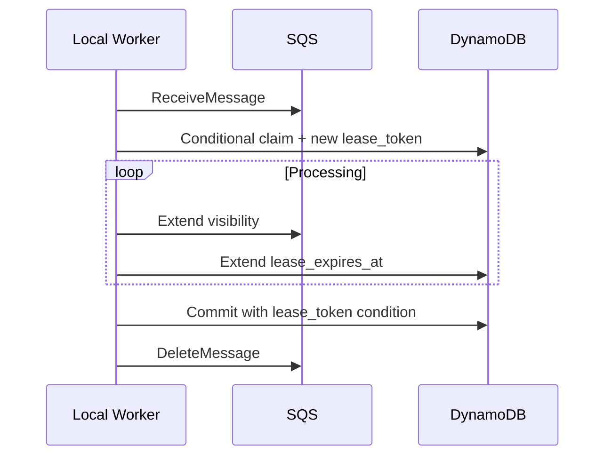
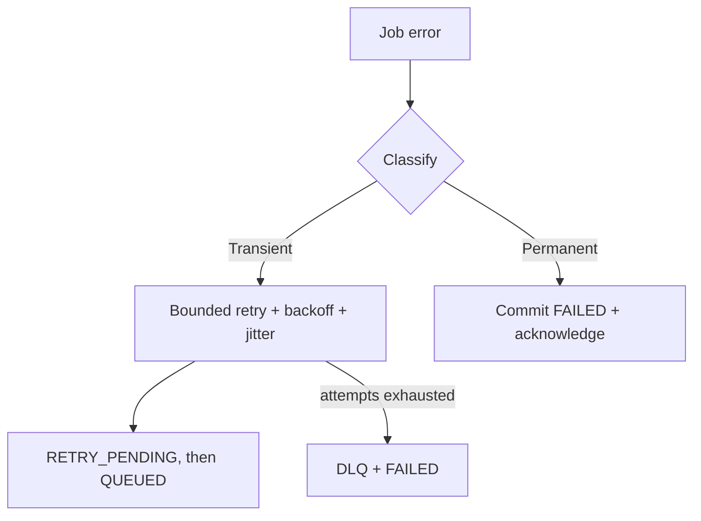
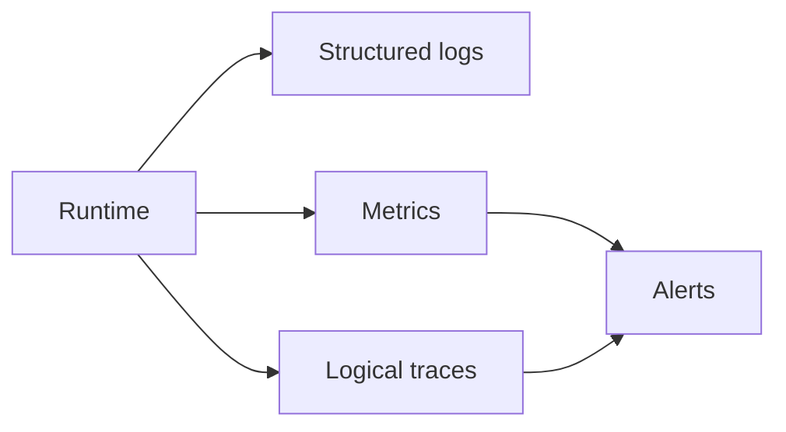

# Reliability and Observability

## Delivery model

SQS Standard queues provide at-least-once delivery. Exactly-once business execution is not assumed.

The lease token is a fencing token. A stale worker cannot overwrite a job reclaimed by another worker.

## Failure handling

Transient examples include network timeout, AWS throttling and temporary model/vector-store failure. Permanent examples include corrupt/unsupported documents, invalid payload/version and unauthorized or inactive resources.

Known permanent failures are acknowledged after committing `FAILED`; they are not retried into a DLQ. DLQs quarantine crashes, unclassified failures and exhausted transient retries.

Idempotency rules:

- Ingestion upserts stable `document_id + index_version` chunk/vector keys.
- Assistant message identity is derived from `job_id`.
- Flashcard batches are identified by `job_id`.
- Deleting already-missing vectors or S3 objects is successful cleanup.
- Redelivery after terminal completion is acknowledged without repeating side effects.

## Observability model

`job_id` is the primary correlation ID across API, queue and worker. `request_id` correlates the originating API call. The MVP stores structured local worker logs locally; full log shipping and OpenTelemetry export are deferred.

Key signals:

| Area | Signals |
|---|---|
| Lambda | invocations, errors, duration, throttles |
| SQS | visible/in-flight messages, oldest-message age, DLQ depth |
| Jobs | created/completed/failed/retried counts and duration by job type |
| Worker | heartbeat age, active jobs, lease-extension failures |
| RAG runtime | parsing, embedding, retrieval and generation latency; retrieved chunks; refusals; citations |

High-cardinality IDs must not be metric dimensions. RAG runtime telemetry is separate from quality evaluation such as Recall@k, faithfulness and citation correctness.

## Worker health and alerts

`StudyBotWorkers` stores `worker_id`, `last_seen_at`, version, supported job versions and active job. Online/offline is derived from heartbeat age, not a permanent boolean.

An offline worker is expected and does not alert by itself. Alerts focus on actionable combinations:

- DLQ contains messages.
- Interactive/document oldest-message age exceeds its SLO.
- Lambda error/throttle rate remains elevated.
- Worker heartbeat is stale while a source queue has pending work.
- Lease-extension failures remain elevated.

Thresholds are finalized from measured workload and product SLOs, not hardcoded before testing.
