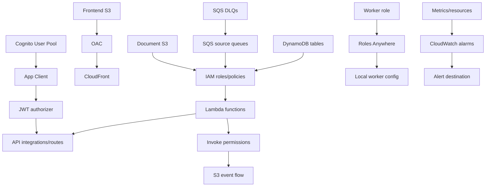

# Infrastructure Inventory

Terraform is the selected IaC tool. It manages AWS resources, not local model weights, vector contents or user documents as Terraform resources.

## Resource inventory

| Group | Resources | Important configuration/cost risk |
|---|---|---|
| Frontend | Private S3, CloudFront, OAC, bucket policy | Cache/egress; accidental public access |
| Identity/API | Cognito User Pool/App Client, HTTP API, JWT authorizer, routes/stage | Auth settings, CORS, throttling, requests |
| Compute | Six Lambda functions, invoke permissions, log groups | Invocation/duration/memory; overly broad roles |
| Data | Seven DynamoDB tables and GSIs | On-demand reads/writes/storage; item growth |
| Storage | Private document S3, policy, event notification | Storage/requests; retention and deletion |
| Messaging | Two source queues and two DLQs | Requests; visibility, retention and redrive |
| Observability | Logs, alarms, optional dashboard, alert target, budget notification | Log/custom metric volume; noisy alarms |
| Security | Per-Lambda roles/policies, worker role, Roles Anywhere resources | Credential/policy scope and certificate lifecycle |

Custom Route 53/ACM resources are excluded until a domain is selected. The MVP excludes VPC, EC2, ALB, NAT Gateway, RDS and VPC endpoints.

## Lambda inventory

| Function | Trigger |
|---|---|
| `studybot-document` | Document HTTP routes |
| `studybot-session` | Session/mapping HTTP routes |
| `studybot-query` | Question/history HTTP routes |
| `studybot-flashcard` | Flashcard HTTP routes |
| `studybot-job` | Job status HTTP route |
| `studybot-ingestion-event` | S3 ObjectCreated |

## Dependency graph



## Terraform requirements

- Remote encrypted state and concurrency locking for deployed environments.
- Provider version constraints; commit `.terraform.lock.hcl`.
- Never commit `terraform.tfstate`, backups or secret `.tfvars`.
- Review `terraform plan` before apply.
- Explicit environment naming and default tags: `Project`, `Environment`, `ManagedBy`.
- Logical modules for frontend, auth, storage, database, messaging, compute, API and observability.
- Repeatable creation and teardown; bootstrap/state is not destroyed with `dev`.
- Lifecycle and deletion decisions are explicit for stateful S3/DynamoDB resources.

Planned structure:

```text
infrastructure/
├── bootstrap/
├── modules/
│   ├── frontend/
│   ├── auth/
│   ├── storage/
│   ├── database/
│   ├── messaging/
│   ├── compute/
│   ├── api/
│   └── observability/
├── environments/dev/
└── README.md
```

