# Parser Contracts

## 1. Purpose and status

This document defines the boundary of the complete StudyBot Parser subsystem: what a parse job receives, which artifacts it produces, how source provenance is preserved, and how completion or partial failure is reported. A parser identifies, extracts, locates, and preserves source content; it does not use AI to interpret images, transcribe media, resolve external links, or generate answers.

| Profile | Status |
|---|---|
| Common Parser subsystem | Frozen v1 — amended with unified `source_order` |
| Common `ParsedBlock` | Accepted v1 foundation; native text only |
| `pdf_book_v1` | Frozen v1 |
| `pptx_v1` | Frozen v1 |
| `docx_v1` | Frozen v1 |
| `markdown_v1` | Frozen v1 |
| `txt_v1` | Frozen v1 |

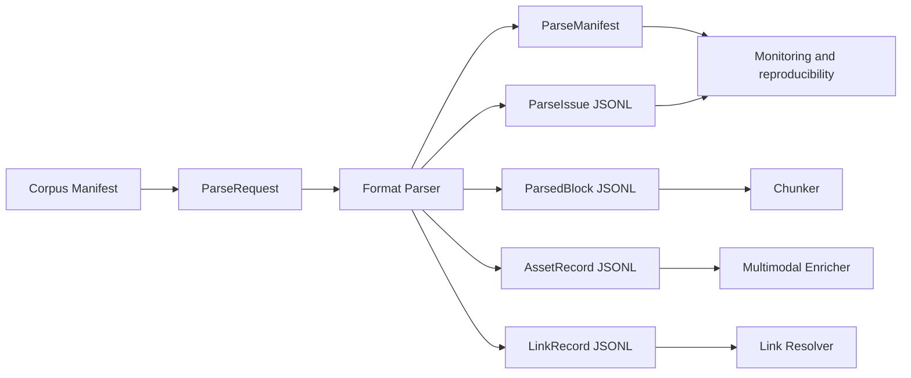

The parser extracts and normalizes source content. It must not infer answers, summarize facts, write a vision-generated description, crawl a URL, or rewrite a multiple-choice item into a declarative answer.

## 2. ParseRequest

`ParseRequest` is the deterministic input contract for a format parser. The binary source remains in local storage or S3; it is referenced by URI and is not embedded in the request.

```json
{
  "schema_version": "1.0",
  "parse_job_id": "parse_job_001",
  "document_id": "pptx_nlp_001",
  "source_type": "pptx",
  "parser_profile": "pptx_v1",
  "source": {
    "uri": "local://corpus/pptx_nlp_001.pptx",
    "file_name": "Day-6 Natural Language Processing.pptx",
    "media_type": "application/vnd.openxmlformats-officedocument.presentationml.presentation",
    "sha256": "sha256:TBD"
  }
}
```

Required invariants:

- Required fields are `schema_version`, `parse_job_id`, `document_id`, `source_type`, `parser_profile`, `source.uri`, `source.file_name`, `source.media_type`, and `source.sha256`.
- `document_id` exists in the corpus manifest.
- `source_type` agrees with the selected `parser_profile` and detected media type.
- `source.sha256` identifies the exact source version used by this parse run.
- The parser must reject an unsupported profile instead of silently selecting a fallback profile.

## 3. ParseBundle output

`ParseBundle` is a logical bundle, not one large in-memory JSON object. One parse job produces the following artifact layout:

```text
parsed/{document_id}/{parse_job_id}/
├── manifest.json
├── blocks.jsonl
├── assets.jsonl
├── links.jsonl
├── issues.jsonl
└── assets/
    └── extracted binary files
```

Downstream ownership is explicit:

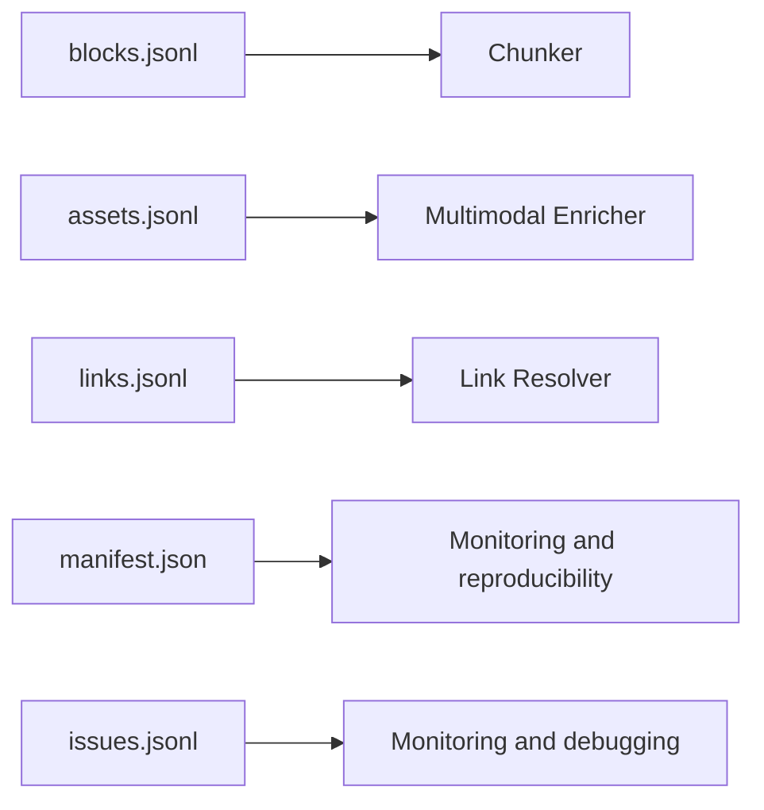

Writers must publish a bundle atomically: incomplete temporary artifacts must not be exposed as a completed bundle, and `manifest.json` is finalized only after the artifact counts and checksums are known.

## 4. ParseManifest

```json
{
  "schema_version": "1.0",
  "contract_version": "1.0",
  "parse_job_id": "parse_job_001",
  "document_id": "pptx_nlp_001",
  "source_sha256": "sha256:TBD",
  "parser_profile": "pptx_v1",
  "status": "PARTIAL",
  "created_at": "2026-08-24T14:30:00Z",
  "parser": {
    "name": "python-pptx",
    "build_id": "git:f674ad2"
  },
  "artifacts": {
    "blocks": {
      "path": "blocks.jsonl",
      "sha256": "sha256:TBD",
      "record_count": 120
    },
    "assets": {
      "path": "assets.jsonl",
      "sha256": "sha256:TBD",
      "record_count": 8
    },
    "links": {
      "path": "links.jsonl",
      "sha256": "sha256:TBD",
      "record_count": 3
    },
    "issues": {
      "path": "issues.jsonl",
      "sha256": "sha256:TBD",
      "record_count": 2
    }
  }
}
```

Each artifact descriptor is the single source of truth for its path, record count, and checksum. Bundle integrity is valid only when the actual JSONL record count equals `record_count` and the artifact hash equals `sha256`. Top-level duplicate counts are forbidden.

Every published bundle has a fixed shape: all four JSONL artifacts and descriptors are required, including empty files with `record_count = 0`. For a parser-level `FAILED` result, the Parser publishes a full bundle when atomic publication remains possible: blocks, assets, and links are empty, while issues contains at least one `FATAL` record. If infrastructure prevents atomic publication, no ParseBundle is considered published and the Job/observability layer records the operational failure.

`parser.build_id` is the authoritative immutable implementation identity. `created_at` is required in RFC 3339 UTC and records when the finalized Manifest was created; it supports audit and display ordering but does not participate in deterministic record IDs or provide distributed concurrency ordering.

Status semantics are scoped to Parser responsibilities:

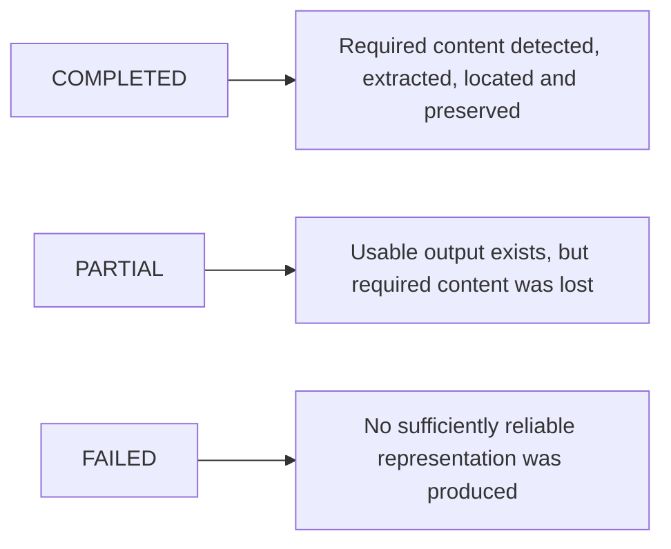

An image extracted successfully but not yet interpreted by a Vision model does not make parsing `PARTIAL`. For example, an extracted chart may yield `COMPLETED`; unsupported SmartArt required by the profile yields `PARTIAL + UNSUPPORTED_SMARTART`.

Final status is derived deterministically from `ParseIssue.impact`:

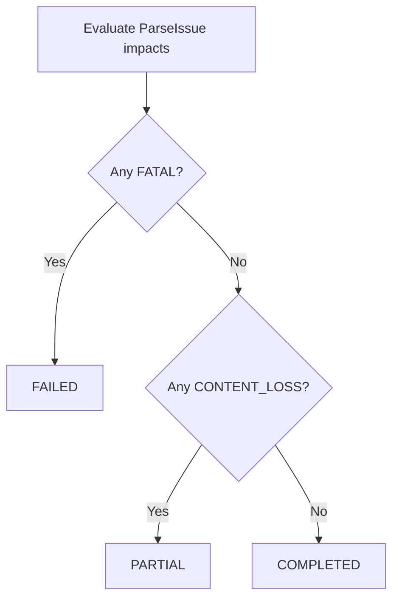

## 5. Common ParsedBlock envelope

`ParsedBlock` contains native textual content that the source parser can read directly. It does not represent an image, chart, audio, video, attachment, or hyperlink.

```json
{
  "schema_version": "1.0",
  "document_id": "pdf_dmls_001",
  "block_id": "pdf_dmls_001_b0124",
  "source_type": "pdf",
  "block_index": 124,
  "source_order": 124,
  "block_type": "paragraph",
  "text": "...",
  "heading_path": [],
  "related_asset_ids": [],
  "locator": {},
  "metadata": {}
}
```

Common invariants:

- `block_id` is unique within one ParseBundle.
- `block_id` is derived from `document_id`, a canonical physical locator, and normalized native content. It must not be derived from `block_index`, `source_order`, `parse_job_id`, or `created_at`.
- Record IDs are deterministic when `source_sha256`, canonical locator/content normalization, `parser_profile`, parser name/build ID, and `contract_version` are unchanged. `parse_job_id` and `created_at` do not participate in record-ID generation, so an identical rerun produces identical record IDs.
- Record IDs are not guaranteed to remain stable when the source, profile, parser build, or contract version changes. This rule also applies to `asset_id`, `link_id`, and `issue_id`.
- All human-facing indices are 1-based.
- `block_index` is required, unique, and contiguous from `1..N` within `blocks.jsonl`; it counts only `ParsedBlock` records.
- `source_order` is required on flow-bearing `ParsedBlock` and `AssetRecord` records. It provides one 1-based ordering namespace across the separate `blocks.jsonl` and `assets.jsonl` artifacts.
- `source_order` is unique and contiguous across all native flow objects recognized by the Parser. A link or issue references its source record/locator and does not consume a separate order position.
- A detected asset that cannot be extracted must retain its `source_order` through an `AssetRecord` in `DETECTED_ONLY` or `FAILED` state; the Parser must not silently drop the object and renumber later content.
- Format profiles define how native objects receive `source_order`; downstream code reconstructs source flow by merging blocks and assets on this field.
- `text` preserves source meaning; normalization may fix whitespace but must not generate new facts.
- `heading_path` is always present, ordered root-to-leaf, and may be `[]` when no reliable heading exists.
- Heading levels increase from parent to child. The final item is the nearest reliable heading containing the block.
- For `block_type=heading`, the final `heading_path` item is the heading block itself. For other block types, it is the nearest containing heading.
- Document title is stored in the corpus manifest and is not repeated in every `heading_path`.
- `metadata` follows the conditional schema for the selected `block_type`; it is not an unrestricted extension bag.
- `related_asset_ids` is required as an array and may be empty. Persisted block-to-asset references must be symmetric with `AssetRecord.native_context.related_block_ids`.
- A chunk stores `source_block_ids`; locators remain owned by the referenced parsed blocks.

Allowed initial `block_type` values are:

```text
title
heading
paragraph
list_item
table_row
caption
code_block
quote
```

Normalized heading form:

```json
{
  "level": 2,
  "role": "chapter",
  "text": "Data Engineering Fundamentals"
}
```

Heading roles in v1 are `chapter`, `section`, `subsection`, `slide`, and `generic`. `generic` means structural evidence proves that a node is a heading but deterministic evidence does not support a more specific semantic role. When structural heading evidence itself is uncertain, the parser keeps the text as a paragraph instead of assigning `generic`.

## 6. Common AssetRecord

`AssetRecord` preserves non-text source content without claiming to understand it. Binary data is stored under `assets/`; JSONL stores identity, provenance, native context, checksum, and extraction status.

```json
{
  "schema_version": "1.0",
  "document_id": "pptx_nlp_001",
  "asset_id": "pptx_nlp_001_a0001",
  "source_order": 44,
  "asset_type": "chart",
  "media_type": "image/png",
  "locator": {
    "type": "pptx",
    "slide": 4,
    "shape_path": [5],
    "shape_id": 205,
    "shape_bounding_box": null
  },
  "native_context": {
    "alt_text": null,
    "caption": "Model performance",
    "related_block_ids": [
      "pptx_nlp_001_b0043"
    ]
  },
  "extraction": {
    "status": "EXTRACTED",
    "storage_uri": "local://parsed/pptx_nlp_001/assets/asset_001.png",
    "sha256": "sha256:TBD"
  }
}
```

Initial asset types are `image`, `chart`, `diagram`, `audio`, `video`, `smartart`, `embedded_object`, and `attachment`. Extraction status is `EXTRACTED`, `DETECTED_ONLY`, or `FAILED`. Only native caption/alt text may be recorded here; OCR, Vision, ASR, chart interpretation, and other generated descriptions belong to Multimodal Enrichment.

Conditional requirements:

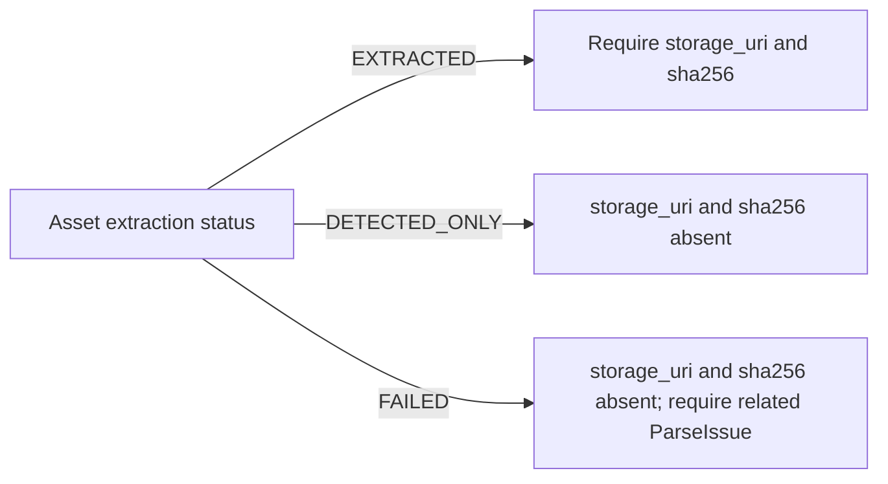

An `AssetRecord` in `FAILED` state still preserves its identity and physical locator. These conditions must be encoded with conditional JSON Schema rules when schemas are implemented.

Block–asset cross-reference invariants:

- When `AssetRecord.native_context.related_block_ids` contains a block ID, that `ParsedBlock.related_asset_ids` must contain the asset ID.
- When `ParsedBlock.related_asset_ids` contains an asset ID, that asset must reference the block in `native_context.related_block_ids`.
- Both records must exist in the same ParseBundle and share the same `document_id`.
- Duplicate references and dangling one-sided relationships make the bundle invalid.

## 7. Common LinkRecord

One link record represents one source occurrence, even when the same URL appears multiple times.

```json
{
  "schema_version": "1.0",
  "document_id": "md_interview_001",
  "link_id": "md_interview_001_l0001",
  "url": "https://example.com/reference",
  "anchor_text": "Reference architecture",
  "link_type": "external",
  "source_block_id": "md_interview_001_b0042",
  "source_asset_id": null,
  "locator": {
    "type": "markdown",
    "start_line": 120,
    "end_line": 120
  },
  "resolution": {
    "status": "NOT_RESOLVED"
  }
}
```

Initial link types are `internal_anchor`, `local_file`, `external`, and `embedded_attachment`. Parser validation may classify a link and preserve its source occurrence, but network fetching, crawling, redirects, and content snapshots belong to Link Resolver.

Cross-record reference invariants:

- `locator` is required for every source occurrence.
- At least one of `source_block_id` or `source_asset_id` is required.
- A text hyperlink normally references `source_block_id`; an image or shape hyperlink normally references `source_asset_id`.
- Both references may be present when a source link is semantically attached to an asset and its native caption block.
- Referenced IDs must exist in the same ParseBundle.

## 8. Common ParseIssue

```json
{
  "schema_version": "1.0",
  "issue_id": "pptx_nlp_001_i0001",
  "document_id": "pptx_nlp_001",
  "severity": "WARNING",
  "impact": "CONTENT_LOSS",
  "code": "UNSUPPORTED_SMARTART",
  "message": "SmartArt was detected but its semantics were not extracted.",
  "locator": {
    "type": "pptx",
    "slide": 18,
    "shape_path": [4],
    "shape_id": 804
  },
  "related_record_id": "pptx_nlp_001_a0007",
  "recoverable": true
}
```

Severity is `INFO`, `WARNING`, or `ERROR` and controls logging or alerting. Impact is `NONE`, `CONTENT_LOSS`, or `FATAL` and controls ParseManifest status. Severity alone must never determine parse status.

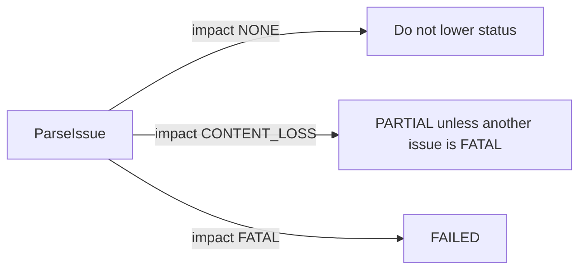

Issues are centralized here instead of being embedded inconsistently in individual format records. A `FAILED` parse must still publish a failure manifest and at least one `FATAL` issue when artifact publication itself remains possible.

## 9. PDF book profile — frozen v1

For `pdf_book_v1`, every published block must identify at least one physical PDF page. A human-facing printed page label is preserved when deterministic evidence exists and is otherwise explicitly `null`; unlabeled pages may still produce searchable blocks because physical provenance remains available through `pdf_page`.

Required locator fields:

```text
type = pdf
locations: array with at least one PageLocation

PageLocation:
pdf_page: integer >= 1
printed_page: string | null
bounding_boxes: array with zero or more normalized boxes
```

`locations` is sorted by strictly increasing `pdf_page`, and one physical page appears at most once per block. `bounding_boxes` preserves reliable native reading order within its page. An empty array means page-level provenance is reliable but precise geometry is unavailable; this does not cause content loss.

`printed_page` evidence is accepted from reliable PDF PageLabels metadata or from a deterministic printed-number rule packaged in the immutable parser build. Offset extrapolation is forbidden unless that offset itself is established by a deterministic versioned rule with explicit evidence. When evidence is insufficient, the required field is `null`; an empty string or invented label is invalid.

Bounding boxes use normalized top-left coordinates:

```text
0 <= x_min < x_max <= 1
0 <= y_min < y_max <= 1
```

Each box represents one contiguous physical region. Exact duplicate boxes, zero-area boxes, and coordinates outside the normalized range are invalid. Small overlaps may remain valid and produce a quality signal; hard rules for large overlaps are deferred until fixtures justify them.

### PDF example

```json
{
  "schema_version": "1.0",
  "document_id": "pdf_dmls_001",
  "block_id": "pdf_dmls_001_b_91a7c42f20e63b18d9214a7c4129e845",
  "source_type": "pdf",
  "block_index": 124,
  "source_order": 124,
  "block_type": "paragraph",
  "text": "Another source is system-generated data. This is the data generated by different components of your systems.",
  "heading_path": [
    {
      "level": 2,
      "role": "chapter",
      "text": "Data Engineering Fundamentals"
    },
    {
      "level": 3,
      "role": "section",
      "text": "Data Sources"
    }
  ],
  "related_asset_ids": [],
  "locator": {
    "type": "pdf",
    "locations": [
      {
        "pdf_page": 70,
        "printed_page": "50",
        "bounding_boxes": [
          {
            "x_min": 0.12,
            "y_min": 0.34,
            "x_max": 0.87,
            "y_max": 0.51
          }
        ]
      }
    ]
  },
  "metadata": {}
}
```

### PDF object mapping

| Native PDF object | Common record | Mapping rule |
|---|---|---|
| Heading, paragraph, list, caption, table text | `ParsedBlock` | Preserve native text, normalized heading hierarchy, physical and printed page |
| Raster image | `AssetRecord(asset_type=image)` | Extract binary when possible; retain page and bounding box |
| Native chart object | `AssetRecord(asset_type=chart)` | Use `chart` only when the source object exposes native chart structure |
| Vector figure/diagram | `AssetRecord(asset_type=diagram)` | Render the detected region when possible; do not interpret its semantics |
| Audio or video | `AssetRecord(asset_type=audio|video)` | Extract embedded binary when supported |
| Embedded file | `AssetRecord(asset_type=attachment|embedded_object)` | Preserve original media type, binary hash, and locator |
| URI annotation or hyperlink | `LinkRecord` | Preserve each source occurrence without fetching it |

PDF-specific invariants:

- A figure caption remains a native `ParsedBlock(block_type=caption)` and is connected to the figure through `related_block_ids`.
- Surrounding paragraphs remain independent blocks; the parser must not merge an AI-generated description into them.
- A raster image that visually contains a chart remains `asset_type=image`. Semantic reclassification belongs to Multimodal Enrichment.
- A vector figure successfully rendered to an asset is `EXTRACTED`; a detected figure that cannot be rendered or grouped is `DETECTED_ONLY` with a related issue.
- Required figure content that cannot be preserved produces `impact=CONTENT_LOSS` and therefore a `PARTIAL` parse.
- Assets and links reuse the same page-grouped provenance principle where applicable: one page location with zero or more physical regions, rather than duplicate page entries.
- Missing required `pdf_page` provenance prevents publication of the affected record and produces `ParseIssue(impact=CONTENT_LOSS)`; `printed_page = null` and `bounding_boxes = []` remain valid.

Example source mapping:

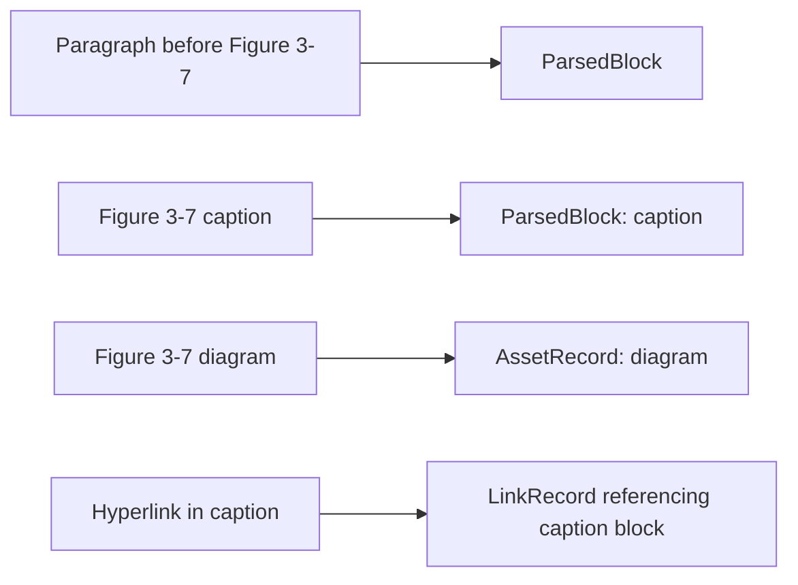

## 10. PPTX profile — frozen v1

A slide is a container and source location. A logical title, paragraph, list item, table row, or caption is a `ParsedBlock`; a whole slide is not flattened into one block.

Required behavior:

- `slide`, every `shape_path` element, `physical_paragraph_index`, `physical_row_index`, `source_order`, logical table row, and logical column positions are 1-based where applicable.
- `shape_path` follows native OOXML shape-tree order without filtering or renumbering objects that do not produce ParsedBlocks.
- `shape_id` is normalized from `<p:cNvPr id>` to an integer `>= 1` and must identify the final shape addressed by `shape_path`.
- Slide title is represented with heading role `slide`.
- A reliable intra-slide heading extends `heading_path` with role `generic` unless a deterministic template-specific rule packaged in the parser build proves a specific role; uncertain textbox text remains a paragraph.
- A table row retains explicit column positions.
- PPTX table granularity is intentional: one physical table row produces at most one `ParsedBlock(table_row)`; cell paragraphs do not create separate ParsedBlocks and remain represented in `metadata.cells`.
- Speaker notes, image OCR, SmartArt semantics, and chart interpretation are deferred.

### PPTX example

```json
{
  "schema_version": "1.0",
  "document_id": "pptx_nlp_001",
  "block_id": "pptx_nlp_001_b_42ae107b17473e92d1ea0bb89a41d198",
  "source_type": "pptx",
  "block_index": 43,
  "source_order": 43,
  "block_type": "list_item",
  "text": "Java",
  "heading_path": [
    {
      "level": 2,
      "role": "slide",
      "text": "Natural Language Processing"
    },
    {
      "level": 3,
      "role": "generic",
      "text": "Artificial Languages"
    }
  ],
  "related_asset_ids": [],
  "locator": {
    "type": "pptx",
    "element_type": "text_paragraph",
    "slide": 4,
    "shape_path": [3],
    "shape_id": 102,
    "physical_paragraph_index": 1,
    "shape_bounding_box": null
  },
  "metadata": {
    "list_id": "pptx_nlp_001_list_01",
    "item_index": 1,
    "list_type": "unordered",
    "list_level": 0,
    "marker": "•"
  }
}
```

Table cells use explicit column positions:

```json
"cells": [
  {"column_start": 1, "column_span": 1, "row_span": 1, "text": "S3 Glacier"},
  {"column_start": 2, "column_span": 1, "row_span": 1, "text": "Retrieve takes hours"},
  {"column_start": 3, "column_span": 1, "row_span": 1, "text": "Compliance archive"}
]
```

PPTX partial-parse warnings include `NO_EXTRACTABLE_TEXT`, `UNSUPPORTED_SMARTART`, `UNSUPPORTED_CHART`, and `INVALID_READING_ORDER`. A missing slide title is not an error; its `heading_path` may be empty.

### PPTX object mapping

| Native PPTX object | Common record | Mapping rule |
|---|---|---|
| Title, textbox paragraph, bullet, caption | `ParsedBlock` | Preserve logical text unit, slide provenance, source order, and bullet hierarchy |
| Table | `ParsedBlock(block_type=table_row)` | Preserve explicit 1-based column positions in `metadata.cells` |
| Raster image | `AssetRecord(asset_type=image)` | Extract the image binary and retain slide, shape, and bounding box |
| Native PowerPoint chart | `AssetRecord(asset_type=chart)` | Preserve native chart identity without interpreting its trend or meaning |
| Grouped shapes/connectors | `AssetRecord(asset_type=diagram)` | Render/group when possible while preserving native text labels as blocks |
| SmartArt | `AssetRecord(asset_type=smartart)` | Extract/render when supported; otherwise retain `DETECTED_ONLY` provenance |
| Audio, video, embedded object | `AssetRecord` | Extract binary when supported and retain native media type |
| Text/image/shape hyperlink | `LinkRecord` | Reference the originating block or asset and retain physical locator |

PPTX-specific invariants:

- Slide is a provenance container; logical title, paragraph, bullet, table row, and caption are separate blocks.
- `asset_type` is based on the native PPTX object, not visual meaning inferred from pixels.
- `physical_paragraph_index` and `physical_row_index` preserve native positions and may contain gaps; `metadata.row_index` is the separately reconstructed logical table order.
- `shape_bounding_box` describes the final containing shape, not an exact paragraph or row region. It is absolute on the slide, normalized to `0..1`, and may be `null` without content loss.
- Native text labels within a diagram may remain `ParsedBlock` records while the complete spatial diagram is also preserved as one `AssetRecord`.
- A hyperlink in text references `source_block_id`; a hyperlink attached to an image or shape references `source_asset_id`. Both may be present when appropriate.
- `related_block_ids` connect an asset to its native caption, title, bullets, or other surrounding text on the same slide.
- An asset extracted but not yet processed by Vision/OCR remains compatible with `COMPLETED`.
- A required SmartArt/vector diagram that cannot be preserved yields `DETECTED_ONLY`, a related `ParseIssue(impact=CONTENT_LOSS)`, and `PARTIAL`.
- `NO_SLIDE_TITLE` has `impact=NONE`; an empty heading path is valid.

Example source mapping:

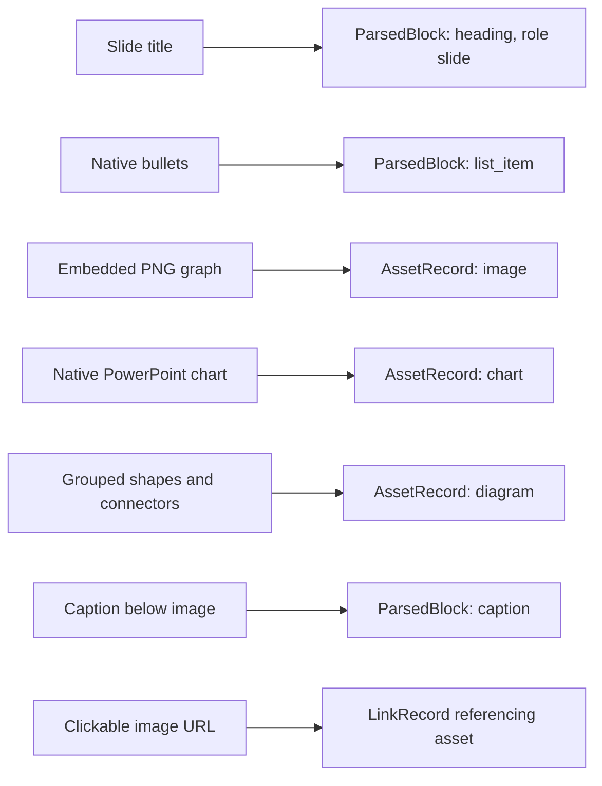

### Legacy PowerPoint boundary

Binary `.ppt` is not supported by `pptx_v1`:

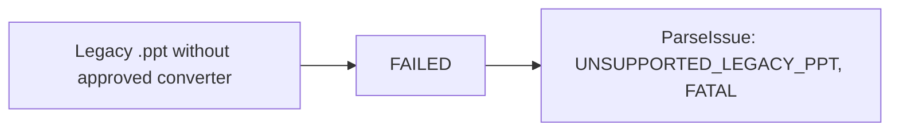

A future conversion workflow is a separate ingestion step:

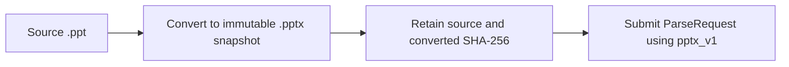

## 11. DOCX profile — frozen v1

`docx_v1` preserves the interleaving of paragraphs, tables, and assets. The parser must traverse `w:body` children in XML document order. Separately iterating `document.paragraphs` and `document.tables` is non-conforming because it loses their relative positions.

### Unified source order

The parser assigns one monotonically increasing `source_order` across flow-bearing blocks and assets:

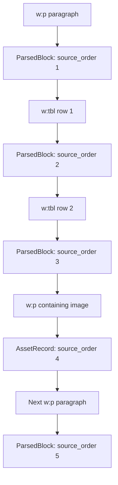

An otherwise empty paragraph containing an image does not create an empty block. A paragraph containing both native text and an image creates both records in run order. `body_child_index` is the required one-based physical anchor for top-level body paragraphs and tables; every native body child consumes an index even when it produces no record. A table-row locator additionally uses one-based `physical_row_index`. These fields are not substitutes for `source_order`.

### Paragraph and logical-block policy

One non-empty Word paragraph produces one `ParsedBlock`. The parser must not merge adjacent paragraphs merely because they appear related. A table cell may contain multiple paragraphs; their text and internal order are preserved in the row's cell representation. Grouping a question, options, and answer into a higher-level unit belongs to deterministic normalization or chunking.

Headings are derived only from reliable Word paragraph style or outline-level metadata and normalized into `heading_path`. Bold or enlarged text alone must not be promoted to a heading.

### Table and merged-cell policy

One logical table row produces one `ParsedBlock(block_type=table_row)`. `metadata.cells` preserves the logical grid:

```json
"cells": [
  {
    "column_start": 1,
    "column_span": 2,
    "row_span": 1,
    "text": "Question"
  },
  {
    "column_start": 3,
    "column_span": 1,
    "row_span": 1,
    "text": "Answer"
  }
]
```

Horizontal merges (`w:gridSpan`) increase `column_span`; vertical merges (`w:vMerge`) increase `row_span` on the origin cell. Continuation cells must not duplicate origin text. If merge topology cannot be reconstructed reliably, the parser preserves recoverable text and emits `INVALID_TABLE_MERGE` with `impact=CONTENT_LOSS`.

### DOCX object mapping

| Native DOCX object | Common record | Mapping rule |
|---|---|---|
| Heading, paragraph, list item, caption | `ParsedBlock` | Preserve native text, structure, physical locator, and source order |
| Table row/cells | `ParsedBlock(block_type=table_row)` | Preserve cell grid, paragraph order, and merged-cell spans |
| Raster image | `AssetRecord(asset_type=image)` | Follow its OOXML relationship and extract the original binary |
| Native Word drawing/grouped shapes | `AssetRecord(asset_type=diagram)` | Preserve or render when supported without interpreting semantics |
| Chart/SmartArt | `AssetRecord(asset_type=chart|smartart)` | Type from native OOXML object; extract or retain detected-only provenance |
| Embedded object/file | `AssetRecord(asset_type=embedded_object|attachment)` | Preserve relationship, media type, and binary when supported |
| Text/image hyperlink | `LinkRecord` | Preserve each occurrence and reference its source block or asset |

Asset locator baseline:

```json
{
  "type": "docx",
  "body_child_index": 4,
  "physical_run_index": 2,
  "relationship_id": "rId8"
}
```

The parser follows `relationship_id` through the DOCX relationship part to a target such as `word/media/image3.png`. A diagram inserted as PNG/JPEG remains `asset_type=image`; semantic reclassification belongs to Multimodal Enrichment.

External references remain native paragraph/list-item blocks plus one `LinkRecord` per hyperlink occurrence. The Parser does not fetch URLs. Missing or malformed relationships emit a `ParseIssue`; loss of required content uses `impact=CONTENT_LOSS`.

### DOCX example

```json
{
  "schema_version": "1.0",
  "document_id": "docx_review_001",
  "block_id": "docx_review_001_b_613e2ff9ce7c60bfe24dc22c33460832",
  "source_type": "docx",
  "block_index": 9,
  "source_order": 9,
  "block_type": "table_row",
  "text": "Q5 ___ are general computers that can learn algorithms to map input sequences to output sequences? A. CNN B. LSTM C. RNN D. None of these",
  "heading_path": [],
  "related_asset_ids": [],
  "locator": {
    "type": "docx",
    "element_type": "table_row",
    "body_child_index": 1,
    "physical_row_index": 5
  },
  "metadata": {
    "table_id": "docx_review_001_table_01",
    "row_index": 5,
    "cells": [
      {
        "column_start": 1,
        "column_span": 1,
        "row_span": 1,
        "text": "Q5 ___ are general computers that can learn algorithms to map input sequences to output sequences? A. CNN B. LSTM C. RNN D. None of these"
      }
    ]
  }
}
```

DOCX native locator policy:

- The `paragraph` variant uses `body_child_index` and optional native `w14:paraId` as `paragraph_id`.
- The `table_row` variant uses `body_child_index` and `physical_row_index`; physical and logical row indices may differ.
- Main-body top-level paragraphs and table rows are the supported v1 granularity. Cell paragraphs remain in `metadata.cells` rather than producing duplicate blocks.
- DOCX is reflowable. Native `docx_v1` locators never contain page numbers, bounding boxes, or X/Y coordinates. Geometry belongs to a future rendered-document profile tied to an immutable rendered artifact.
- Nested tables and textbox text inside the main body produce issues according to recoverability; headers, footers, notes, comments, footnotes, and endnotes are outside `docx_v1`.

DOCX-specific issues include `INVALID_READING_ORDER`, `INVALID_TABLE_MERGE`, `BROKEN_RELATIONSHIP`, `UNSUPPORTED_NESTED_TABLE`, `UNSUPPORTED_TEXTBOX`, `UNSUPPORTED_WORD_DRAWING`, and `UNSUPPORTED_EMBEDDED_OBJECT`.

## 12. Common text-source locator

`markdown_v1` and `txt_v1` share the same physical line-span convention but remain separate parser profiles:

```json
{
  "type": "markdown",
  "start_line": 120,
  "end_line": 124
}
```

Both indices are required, 1-based, inclusive, and refer to one contiguous span in the decoded source snapshot identified by `source.sha256`. `end_line` must be greater than or equal to `start_line`. Every physical line, including blank lines, participates in numbering; parsing and text normalization never renumber locators. A source-version or decoding change requires regenerated locators.

The locator spans the complete native construct while `ParsedBlock.text` contains its searchable native content. For example, a fenced Markdown code block locator includes both fences, while block text contains code content and metadata may preserve an explicitly declared language. A block quote locator includes the physical quote-marker lines even when extracted text removes those structural markers.

One block never merges disjoint source regions. A comment or unsupported node separating two text regions results in separate blocks/records rather than `line_ranges[]`. If a reliable line span cannot be recovered, the parser does not publish the block and emits `ParseIssue(impact=CONTENT_LOSS)`.

Line counting rules:

- UTF BOM does not create a line.
- CRLF and LF are line boundaries.
- A final line without a trailing newline still counts.
- Blank separator lines are counted physically even when they are outside the block span.

Shared implementation utilities may normalize whitespace, create line locators and records, and detect language. They must not erase the distinction between syntax-driven Markdown parsing and conservative line-driven TXT parsing.

## 13. Markdown profile — frozen v1

`markdown_v1` parses a Markdown syntax tree rather than inferring structure from visual appearance. Heading hierarchy, paragraphs, lists, fenced code, block quotes, tables, links, and image references are mapped from explicit syntax.

### Markdown mapping

| Markdown node | Common record | Mapping rule |
|---|---|---|
| ATX/setext heading | `ParsedBlock(block_type=heading)` | Preserve explicit level and update `heading_path` |
| Paragraph | `ParsedBlock(block_type=paragraph)` | Preserve inline text and line span |
| Ordered/unordered list item | `ParsedBlock(block_type=list_item)` | Preserve nesting depth and source marker |
| Fenced/indented code | `ParsedBlock(block_type=code_block)` | Locator spans the complete construct; preserve code text, explicitly declared language, and meaningful whitespace |
| Block quote | `ParsedBlock(block_type=quote)` | Preserve quoted text and nesting depth |
| Table | `ParsedBlock(block_type=table_row)` | Preserve the logical cells and explicit column positions |
| External/internal hyperlink | `LinkRecord` | Reference the containing block; do not fetch the target |
| Local image reference | `AssetRecord(image)` + `LinkRecord(local_file)` | Preserve alt text and path; resolver/extractor handles the target later |
| Remote image reference | `AssetRecord(image)` + `LinkRecord(external)` | Preserve occurrence without network access |

Inline formatting such as emphasis or inline code remains within its containing text block unless a later contract explicitly adds inline spans. HTML blocks are preserved as native text; unsupported HTML structure may emit `UNSUPPORTED_MARKDOWN_HTML` without AI interpretation.

Malformed link or image syntax must not be silently repaired. The parser preserves recoverable raw text and emits `MALFORMED_MARKDOWN_LINK` when an intended target cannot be represented reliably.

### Markdown example

```json
{
  "schema_version": "1.0",
  "document_id": "md_interview_001",
  "block_id": "md_interview_001_b_f7e24ee82e436d9f46f70554630302b2",
  "source_type": "markdown",
  "block_index": 42,
  "source_order": 42,
  "block_type": "paragraph",
  "text": "Image là immutable package; container là process đang chạy từ image:",
  "heading_path": [
    {
      "level": 3,
      "role": "section",
      "text": "3.6. Docker"
    }
  ],
  "related_asset_ids": [],
  "locator": {
    "type": "markdown",
    "start_line": 638,
    "end_line": 638
  },
  "metadata": {}
}
```

Example image/link mapping:

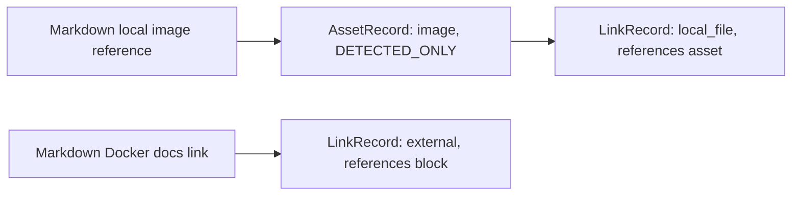

The Parser records these references but does not read the image or crawl the website.

## 14. TXT profile — frozen v1

`txt_v1` is conservative and line-driven. Paragraph boundaries may be formed from non-empty line runs separated by blank lines. Structure beyond paragraphs is accepted only when an explicit configured convention supports it; uncertain visual patterns remain paragraphs.

### TXT mapping

| TXT pattern | Common record | Mapping rule |
|---|---|---|
| Non-empty line run | `ParsedBlock(block_type=paragraph)` | Baseline representation with inclusive line span |
| Explicit configured heading convention | `ParsedBlock(block_type=heading)` | Example: a recognized numbered-section grammar; record convention in parser config |
| Explicit configured list marker | `ParsedBlock(block_type=list_item)` | Preserve marker and nesting only when grammar is deterministic |
| Explicit delimited table convention | `ParsedBlock(block_type=table_row)` | Preserve columns only when delimiter/schema is unambiguous |
| Syntactically valid URL occurrence | `LinkRecord(external)` | Attach to containing block without fetching it |
| Explicit configured local-file reference | `LinkRecord(local_file)` | Do not assume an arbitrary path-like string is an asset |

Underlining, capitalization, repeated spaces, alignment, or a path-like token alone must not create a heading, table, or asset. Heuristic inference is outside `txt_v1`; a future opt-in profile may add it with explicit confidence and issue rules.

### TXT example

```json
{
  "schema_version": "1.0",
  "document_id": "txt_aiops_001",
  "block_id": "txt_aiops_001_b_a18dbd694fe12e5f0321aef41af01226",
  "source_type": "txt",
  "block_index": 88,
  "source_order": 88,
  "block_type": "table_row",
  "text": "OpenSearch | Phiên bản AWS fork lại của Elasticsearch sau khi Elastic đổi license.",
  "heading_path": [
    {
      "level": 2,
      "role": "section",
      "text": "Pipeline Architecture — Data Đi Từ Đâu Đến Đâu"
    },
    {
      "level": 3,
      "role": "subsection",
      "text": "Storage — Lưu ở đâu?"
    }
  ],
  "related_asset_ids": [],
  "locator": {
    "type": "txt",
    "start_line": 238,
    "end_line": 238
  },
  "metadata": {
    "table_id": "txt_aiops_001_table_01",
    "row_index": 1,
    "cells": [
      {
        "column_start": 1,
        "column_span": 2,
        "row_span": 1,
        "text": "OpenSearch | Phiên bản AWS fork lại của Elasticsearch sau khi Elastic đổi license."
      }
    ]
  }
}
```

TXT-specific issues include `INVALID_TEXT_ENCODING`, `AMBIGUOUS_STRUCTURE_PRESERVED_AS_TEXT`, and `INVALID_URL`. Ambiguous structure preserved without content loss uses `impact=NONE`.

## 15. Next decision

The Common Parser subsystem and all five baseline format profiles are frozen at the design level. All five ParsedBlock locator profiles are now defined. The next step is the final cross-field and cross-profile consistency review for ParsedBlock before encoding JSON Schema. Schema implementation, fixtures, expected ParseBundles, and parser code begin only after that review passes.
