# Parser Field Rules

## 1. Purpose and status

This document translates the human-readable decisions in `06-parser-contracts.md` into reviewable field rules before they are encoded as JSON Schema and Python bundle validation.

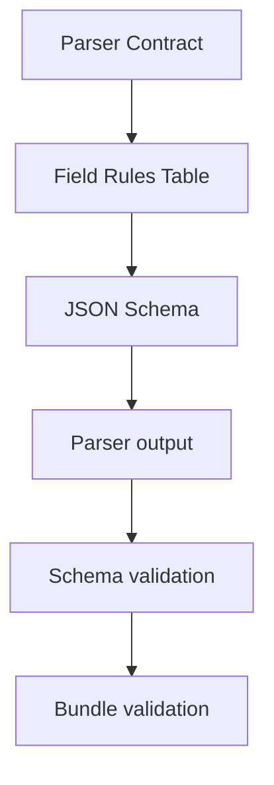

Status:

| Record | Field rules status |
|---|---|
| `ParseRequest` | Frozen v1 |
| `ParseManifest` | Frozen v1 |
| `ParsedBlock` | In progress — common fields, metadata, and heading path frozen; locators pending |
| `AssetRecord` | Pending |
| `LinkRecord` | Pending |
| `ParseIssue` | Pending |

## 2. Record definitions and responsibilities

### 2.1 ParseRequest

**Definition:** The immutable instruction that starts one parse job. It identifies the exact document source, source version, format, and parser profile to use.

**Role:** Prevent the Parser from receiving ambiguous input or silently choosing a parser/configuration. The source binary is referenced by URI; it is not embedded in the request.


### 2.2 ParseManifest

**Definition:** The control record describing the result of one parse job and the artifacts published in its ParseBundle.

**Role:** Act as the entry point and source of truth for bundle status, reproducibility, artifact locations, record counts, and checksums. It does not contain the document content itself.

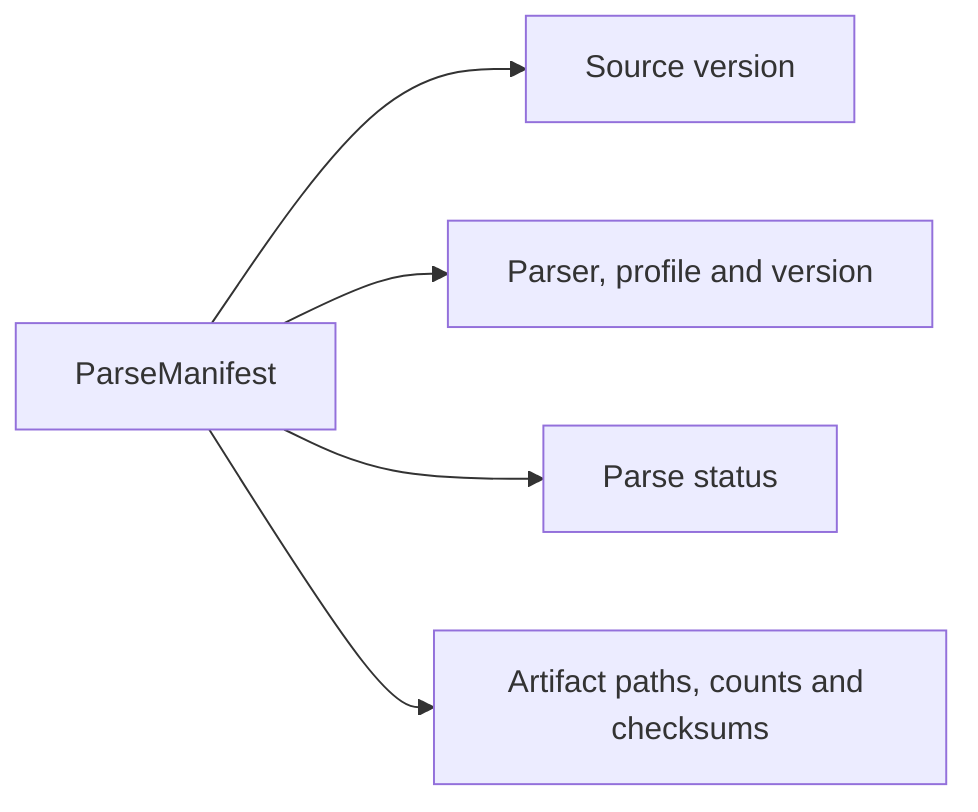

### 2.3 ParsedBlock

**Definition:** One logical unit of native textual content extracted directly from the source, such as a heading, paragraph, list item, table row, caption, code block, or quote.

**Role:** Provide structure-preserving, searchable text to the Chunker while retaining document hierarchy, source order, and a locator for citation. Generated OCR/Vision text does not belong in the baseline `ParsedBlock` artifact.

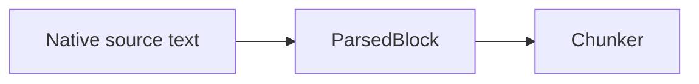

### 2.4 AssetRecord

**Definition:** A provenance record for non-text content detected in the source, including an image, chart, diagram, SmartArt, audio, video, embedded object, or attachment.

**Role:** Ensure non-text content is not silently lost. It records what native object was detected, where it occurred, whether its binary was extracted, and which surrounding blocks relate to it. Semantic interpretation belongs to Multimodal Enrichment.


### 2.5 LinkRecord

**Definition:** One occurrence of an internal anchor, local-file reference, external URL, or embedded-attachment link found in the source.

**Role:** Preserve the target, anchor text, physical occurrence, and originating block/asset without fetching or trusting the target. Repeated occurrences of the same URL remain separate records.


### 2.6 ParseIssue

**Definition:** A structured description of a parser warning or failure associated with a source location or output record.

**Role:** Make content loss and parser limitations observable and deterministically derive the final ParseManifest status. `severity` controls logging/alerting; `impact` controls parse status.

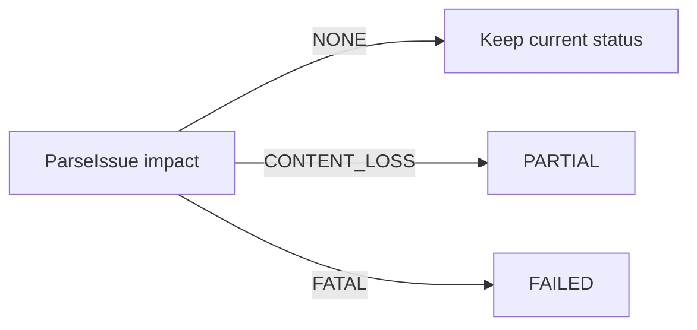

## 3. Validation levels

| Level | Question | Mechanism |
|---|---|---|
| Field | Is the value present and of the correct type/range? | JSON Schema |
| Record | Is this object internally valid for its selected type/state? | JSON Schema |
| Bundle | Do records and artifacts agree with one another? | Python bundle validator |
| Source | Does the locator/file/hash correspond to the real source? | Python bundle/source validator |

Examples:

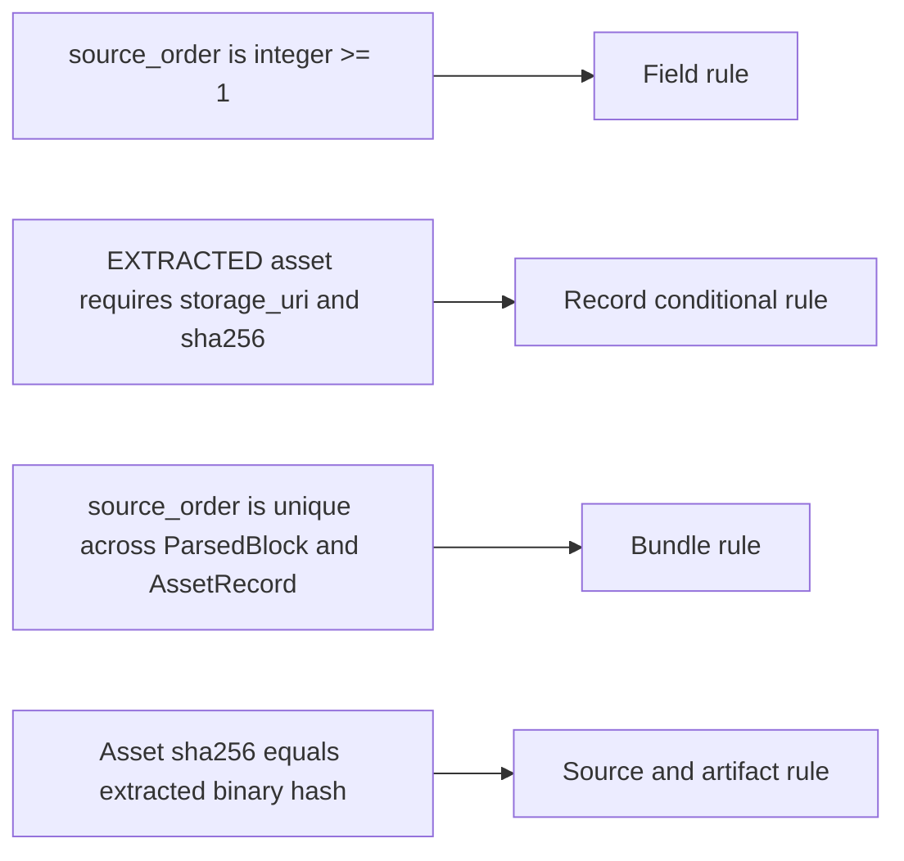

## 4. ParseRequest field rules — frozen v1

| Field | Required | Type | Allowed / field-record rule | Bundle/source-level rule |
|---|---:|---|---|---|
| `schema_version` | Yes | string | Exactly `"1.0"` | Must be compatible with the selected contract implementation |
| `parse_job_id` | Yes | string | Pattern `^parse_job_[A-Za-z0-9_-]+$` | Unique for the submitted parse job; must not affect deterministic output record IDs |
| `document_id` | Yes | string | Non-empty; follows the document ID convention | Must exist in the corpus manifest |
| `source_type` | Yes | string enum | `pdf`, `pptx`, `docx`, `markdown`, or `txt` | Must agree with `parser_profile`, detected media type, and corpus entry |
| `parser_profile` | Yes | string enum | `pdf_book_v1`, `pptx_v1`, `docx_v1`, `markdown_v1`, or `txt_v1` | Parser must reject unsupported profiles; no silent fallback |
| `source` | Yes | object | Must contain exactly the defined source fields | Describes the immutable source snapshot for this job |
| `source.uri` | Yes | string | MVP permits only `local://` and `s3://` | Referenced object/file must exist and be readable by the Parser; HTTP/FTP fetching is forbidden |
| `source.file_name` | Yes | string | Non-empty display/debug metadata; not authoritative identity | May change without changing source identity; must not participate in deterministic record IDs |
| `source.media_type` | Yes | string | Strict canonical MIME type from the profile mapping | Must match detected bytes, `source_type`, and selected parser profile; no parser fallback |
| `source.sha256` | Yes | string | `sha256:` followed by 64 hexadecimal characters | Must equal the SHA-256 of the exact source bytes read by the Parser |

### 4.1 ParseRequest record-level mappings

| `source_type` | Required `parser_profile` | Accepted media type baseline |
|---|---|---|
| `pdf` | `pdf_book_v1` | `application/pdf` |
| `pptx` | `pptx_v1` | `application/vnd.openxmlformats-officedocument.presentationml.presentation` |
| `docx` | `docx_v1` | `application/vnd.openxmlformats-officedocument.wordprocessingml.document` |
| `markdown` | `markdown_v1` | `text/markdown` |
| `txt` | `txt_v1` | `text/plain` |

These mappings can be encoded as JSON Schema conditional rules. Actual file existence, detected media type, and source checksum require the Python source validator.

### 4.2 ParseRequest example

```json
{
  "schema_version": "1.0",
  "parse_job_id": "parse_job_001",
  "document_id": "docx_review_001",
  "source_type": "docx",
  "parser_profile": "docx_v1",
  "source": {
    "uri": "local://corpus/docx_review_001.docx",
    "file_name": "on_Tap.docx",
    "media_type": "application/vnd.openxmlformats-officedocument.wordprocessingml.document",
    "sha256": "sha256:0123456789abcdef0123456789abcdef0123456789abcdef0123456789abcdef"
  }
}
```

### 4.3 Frozen ParseRequest decisions

- `parse_job_id` identifies a run only. It is excluded from deterministic `block_id`, `asset_id`, `link_id`, and `issue_id` generation.
- `source.uri` accepts only managed local storage and S3 in MVP. The Parser is not a web crawler.
- MIME types are canonical and strict. A mismatch among declared type, detected bytes, and profile is rejected rather than rerouted.
- `source.file_name` is for display and debugging. Source identity and reproducibility depend on `document_id`, `source.uri`, `source.sha256`, parser profile, parser build ID, and contract version.

## 5. ParseManifest field rules — frozen v1

`ParseManifest` answers: **What did this parse job actually process, what did it produce, and can that output be trusted?**

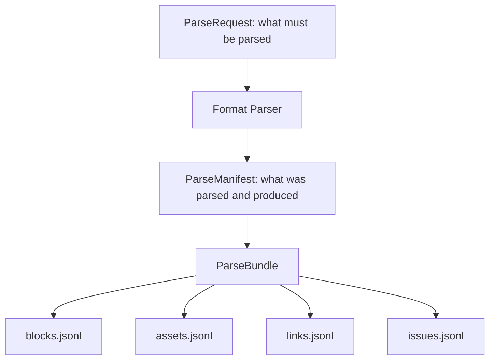

| Field | Required | Type | Allowed / field-record rule | Bundle/source-level rule |
|---|---:|---|---|---|
| `schema_version` | Yes | string | Exactly `"1.0"` | Must be compatible with the manifest schema implementation |
| `contract_version` | Yes | string | Exactly `"1.0"` for Parser Contract v1 | Must match the contract used by every bundle artifact |
| `parse_job_id` | Yes | string | Same pattern as ParseRequest | Must equal the originating `ParseRequest.parse_job_id` |
| `document_id` | Yes | string | Non-empty; follows document ID convention | Must equal ParseRequest and every record in the bundle |
| `source_sha256` | Yes | string | `sha256:` plus 64 hexadecimal characters | Must equal ParseRequest source hash and the bytes actually parsed |
| `parser_profile` | Yes | string enum | One frozen baseline parser profile | Must equal the requested profile; no silent fallback |
| `status` | Yes | string enum | `COMPLETED`, `PARTIAL`, or `FAILED` | Must be derived deterministically from all `ParseIssue.impact` values |
| `created_at` | Yes | string | RFC 3339 timestamp normalized to UTC, for example `2026-08-24T14:30:00Z` | Records when the finalized Manifest was created; audit/display ordering only, not distributed concurrency control |
| `parser` | Yes | object | Contains exactly `name` and `build_id` | Together with profile/contract/source hash, defines reproducibility scope |
| `parser.name` | Yes | string | Non-empty implementation identifier | Must identify the parser implementation actually executed |
| `parser.build_id` | Yes | string | Non-empty immutable build identifier, such as Git SHA or image digest | A build change changes reproducibility identity and may change deterministic output IDs |
| `artifacts` | Yes | object | Contains exactly `blocks`, `assets`, `links`, and `issues` descriptors | Manifest is finalized only after all declared artifacts are published |
| `artifacts.blocks` | Yes | artifact descriptor | Describes `blocks.jsonl` | Count/hash must match the actual artifact |
| `artifacts.assets` | Yes | artifact descriptor | Describes `assets.jsonl` | Count/hash must match the actual artifact |
| `artifacts.links` | Yes | artifact descriptor | Describes `links.jsonl` | Count/hash must match the actual artifact |
| `artifacts.issues` | Yes | artifact descriptor | Describes `issues.jsonl` | Count/hash must match the actual artifact; `FAILED` requires a `FATAL` issue when publication is possible |

### 5.1 Artifact descriptor rules

The four descriptors share one reusable record shape:

| Field | Required | Type | Allowed / field-record rule | Bundle/source-level rule |
|---|---:|---|---|---|
| `path` | Yes | string | Non-empty relative path inside the ParseBundle; no absolute path or `..` traversal | Referenced artifact must exist inside the published bundle |
| `sha256` | Yes | string | `sha256:` plus 64 hexadecimal characters | Must equal the SHA-256 of the exact artifact bytes |
| `record_count` | Yes | integer | `>= 0` | Must equal the number of valid JSONL records in the artifact |

The artifact descriptor is the only source of truth for path, checksum, and record count. Duplicate top-level counts are forbidden.

### 5.2 Fixed bundle and failure publication rules

Every successfully published ParseBundle has a fixed shape:

```text
manifest.json
blocks.jsonl
assets.jsonl
links.jsonl
issues.jsonl
```

All four artifact descriptors are required even when a JSONL file has zero records. An empty artifact still has a checksum and `record_count = 0`. Missing files therefore mean an invalid/incomplete bundle, not “no records of this type.”

When parsing reaches `FAILED` but publication remains possible, the Parser publishes a full failure bundle:

- `manifest.json` has `status = FAILED`.
- All four JSONL files and descriptors exist.
- `issues.jsonl` contains at least one `ParseIssue` with `impact = FATAL`.
- `blocks.jsonl`, `assets.jsonl`, and `links.jsonl` are empty because `FAILED` means no output representation is sufficiently reliable for downstream use.
- Temporary partial records are not published as usable output.

If storage/infrastructure prevents atomic publication itself, no ParseBundle is considered published. The Job/observability layer records that operational failure.

### 5.3 Status propagation

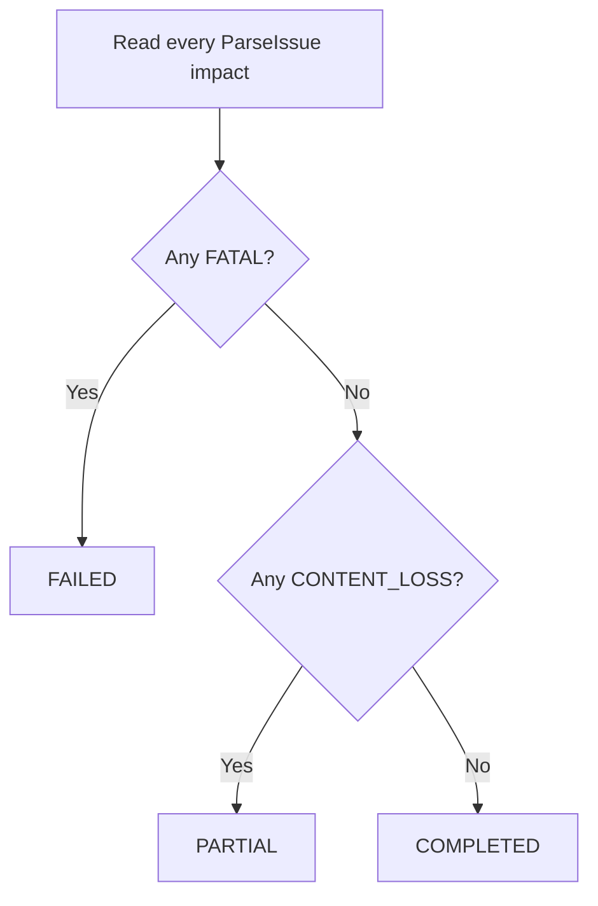

Status does not depend on `severity`. An extracted image awaiting Vision enrichment is compatible with `COMPLETED`; content required by the parser profile that could not be preserved produces `PARTIAL`.

### 5.4 ParseManifest example

```json
{
  "schema_version": "1.0",
  "contract_version": "1.0",
  "parse_job_id": "parse_job_20260824_001",
  "document_id": "docx_review_001",
  "source_sha256": "sha256:0123456789abcdef0123456789abcdef0123456789abcdef0123456789abcdef",
  "parser_profile": "docx_v1",
  "status": "COMPLETED",
  "created_at": "2026-08-24T14:30:00Z",
  "parser": {
    "name": "studybot-docx-parser",
    "build_id": "git:f674ad2"
  },
  "artifacts": {
    "blocks": {
      "path": "blocks.jsonl",
      "sha256": "sha256:aaaaaaaaaaaaaaaaaaaaaaaaaaaaaaaaaaaaaaaaaaaaaaaaaaaaaaaaaaaaaaaa",
      "record_count": 120
    },
    "assets": {
      "path": "assets.jsonl",
      "sha256": "sha256:bbbbbbbbbbbbbbbbbbbbbbbbbbbbbbbbbbbbbbbbbbbbbbbbbbbbbbbbbbbbbbbb",
      "record_count": 2
    },
    "links": {
      "path": "links.jsonl",
      "sha256": "sha256:cccccccccccccccccccccccccccccccccccccccccccccccccccccccccccccccc",
      "record_count": 3
    },
    "issues": {
      "path": "issues.jsonl",
      "sha256": "sha256:dddddddddddddddddddddddddddddddddddddddddddddddddddddddddddddddd",
      "record_count": 0
    }
  }
}
```

### 5.5 Frozen ParseManifest decisions

- Bundle shape is fixed: every published bundle contains all four JSONL artifacts, including empty files.
- A parser-level `FAILED` result publishes a full failure bundle when atomic publication remains possible.
- Parser implementation identity uses immutable `parser.build_id`, not semantic version as the authoritative identifier.
- Manifest includes required `created_at` in RFC 3339 UTC for audit and chronological display.
- `created_at` does not participate in deterministic record-ID generation and does not replace job sequence/version checks for concurrency.

## 6. ParsedBlock foundation decisions — frozen

### 6.0 Common fields — frozen v1

| Field | Required | Type | Field/record rule | Bundle/source-level rule |
| --- | ---: | --- | --- | --- |
| `schema_version` | Yes | string | Exactly `"1.0"` | Must use the schema version declared for the bundle contract |
| `document_id` | Yes | string | Non-empty document ID | Must equal ParseRequest, ParseManifest, and every record in the bundle |
| `block_id` | Yes | string | Deterministic ID using the 32-hex truncated SHA-256 rule in Section 6.2 | Unique in `blocks.jsonl`; must reproduce from the canonical identity payload |
| `source_type` | Yes | string enum | `pdf`, `pptx`, `docx`, `markdown`, or `txt` | Must agree with parser profile, source media type, and `locator.type` |
| `block_index` | Yes | integer | `>= 1` | Unique and contiguous `1..N` in `blocks.jsonl` |
| `source_order` | Yes | integer | `>= 1` | Unique and contiguous across recognized flow-bearing `ParsedBlock` and `AssetRecord` records |
| `block_type` | Yes | string enum | `title`, `heading`, `paragraph`, `list_item`, `table_row`, `caption`, `code_block`, or `quote` | Selects exactly one metadata variant |
| `text` | Yes | string | Non-empty after block-type-aware canonicalization; contains only native text | Empty table cells remain in `metadata.cells[].text`; non-text-only objects become assets rather than empty blocks |
| `heading_path` | Yes | array of objects | May be empty; detailed semantics are pending | Must represent only reliably detected source hierarchy |
| `related_asset_ids` | Yes | array of strings | May be empty; no duplicates | Every ID must resolve symmetrically to an AssetRecord in the same document and bundle |
| `locator` | Yes | object | Shape is selected by `source_type`; detailed variants are pending | Must resolve to the physical source and participate in deterministic identity |
| `metadata` | Yes | object | Shape is selected by `block_type`; Section 7 is frozen v1 | Bundle validator enforces list, table, caption, and relationship invariants |

### 6.1 Parallel index namespaces

`block_index` and `source_order` are both required because they answer different questions:

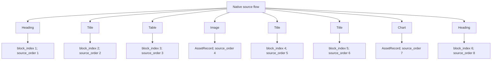

Frozen rules:

- `block_index` counts only records in `blocks.jsonl` and is contiguous `1..N`.
- `source_order` counts recognized native flow objects across `blocks.jsonl` and `assets.jsonl`.
- Merging blocks and assets by `source_order` reconstructs the recognized source flow.
- A detected but unextractable asset remains `DETECTED_ONLY` or `FAILED` and keeps its `source_order`; it is not silently dropped.
- `LinkRecord` and `ParseIssue` do not consume `source_order`.
- Gaps are validation signals, not the official representation of content loss; `AssetRecord + ParseIssue` represent detected loss.

### 6.2 Location-and-content block identity

`block_id` uses the first 32 hexadecimal characters of SHA-256:

```text
canonical_identity = {
  document_id,
  source_type,
  canonical_locator,
  block_type,
  canonical_native_content
}

block_id =
document_id + "_b_" +
first_32_hex(SHA256(canonical_json(canonical_identity)))
```

Canonical JSON uses stable key ordering and preserves meaningful array order. Moving identical content changes the ID because its locator changed; changing native content or structure at the same locator also changes the ID.

Canonical native content is block-type specific:

| `block_type` | Included native content/structure |
| --- | --- |
| `title`, `heading`, `paragraph` | Canonical text |
| `list_item` | Canonical text, `list_type`, `list_level`, and native `marker` when present |
| `table_row` | Canonical text plus ordered cells, positions, spans, and cell text |
| `caption` | Canonical text and `caption_kind` |
| `code_block` | Code with meaningful whitespace preserved, plus native declared `language` when present |
| `quote` | Canonical text and `quote_level` |

`marker` and `language` participate only when explicitly present in the source. The parser must not infer either field merely to construct identity.

Canonicalization rules:

- All text normalizes line endings to LF and Unicode to NFC; case is preserved.
- Prose removes outer whitespace and normalizes only whitespace that the parser profile declares non-semantic.
- Code preserves indentation and internal whitespace; only line endings and Unicode form are normalized.
- Objects use stable key ordering; arrays whose order carries native meaning retain that order.

The following are excluded because they describe processing order, grouping, surrounding context, relationships, or a parse run rather than the block's native identity:

```text
block_index, source_order
list_id, item_index, table_id
heading_path
related_asset_ids, caption target
parse_job_id, created_at, parser build
```

These identity rules are frozen v1. They are reopened only if fixtures or validation demonstrate a contract defect.

### 6.3 `heading_path` semantics — frozen v1

`heading_path` is an ordered root-to-leaf array of reliably recognized content headings. Document root is reserved as StudyBot level `1` in the Corpus Manifest and is not repeated in block paths.

#### 6.3.1 HeadingPathItem

| Field | Required | Type | Rule |
| --- | ---: | --- | --- |
| `level` | Yes | integer | `>= 2`; normalized StudyBot hierarchy level |
| `role` | Yes | string enum | `chapter`, `section`, `subsection`, `slide`, or `generic` |
| `text` | Yes | string | Non-empty native heading text; preserve case |

`level` answers where the item occurs in the hierarchy. `role` records only semantic meaning supported by deterministic source evidence. A `subsection` may occur at multiple levels, and role is not derived mechanically from level. `part`, `native_role`, confidence scores, and separate hierarchy records are deferred.

`generic` has one precise meaning: the parser has reliable structural evidence that the object is a heading and knows its hierarchy level, but lacks deterministic semantic evidence for a more specific role. If structural evidence itself is insufficient, the object remains a paragraph; `generic` is not used as a guess.

#### 6.3.2 Hierarchy invariants

- Items are ordered root to leaf.
- Levels MUST be strictly increasing; duplicate or decreasing levels are invalid.
- Levels SHOULD be contiguous.
- A level gap is valid and produces a non-fatal quality signal; it never causes the parser to fabricate a missing heading.
- An empty array is valid when no reliable content hierarchy applies.

For PDF, Markdown, DOCX, and TXT, normalization uses one content base for the entire document, not one base per chapter or section:

```text
normalized_level = native_level - content_base_level + 2
```

The parser first identifies reliable headings and a reliable document title. A source title is excluded from content hierarchy only when it occurs at the document start, has reliable native title/top-level structure, and its normalized text matches the Corpus Manifest title. After exclusion, `content_base_level` is the minimum native level among all remaining content headings. Relative gaps are preserved. If no content heading remains, the base is undefined and ordinary blocks use `heading_path = []`.

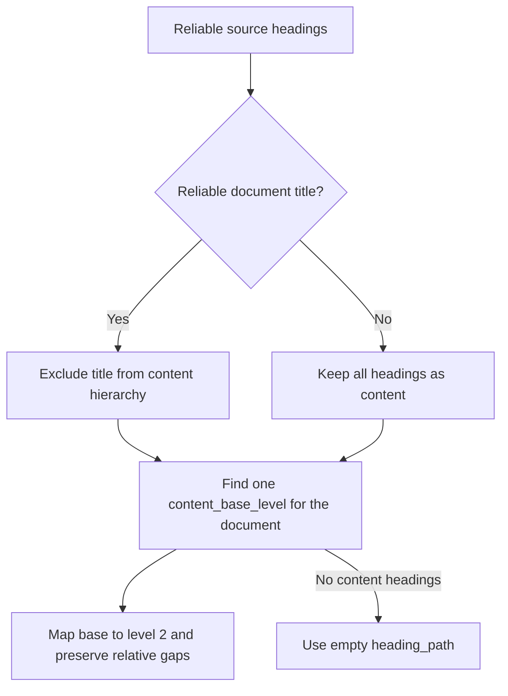

PPTX uses a separate hierarchy scope per slide and does not use the document-wide base formula:

- Entering a new slide clears the previous slide's active heading path.
- A native slide-title placeholder is a heading at level `2` with role `slide`.
- Reliable intra-slide headings use level `3` or deeper.
- A titleless slide may begin with a reliable intra-slide heading at level `3`; the gap is valid and no anonymous slide-title node is fabricated.

#### 6.3.3 Block semantics and active-path update

For a heading block, the final path item is the heading itself. For any other block, the path is the active hierarchy that most closely contains the block. When no reliable hierarchy is active, the path is empty.

When a new heading at level `L` is encountered, the parser removes active headings whose level is greater than or equal to `L`, then appends the new heading:


Bundle validation requires a heading block to have a non-empty path whose final item has the same `level`, `role`, and `text` as that heading. A non-heading block must not append itself to the path.

#### 6.3.4 Recognition and role evidence

Structural evidence decides whether an object is a heading. Semantic evidence is evaluated only after heading recognition and decides whether role is specific or `generic`.

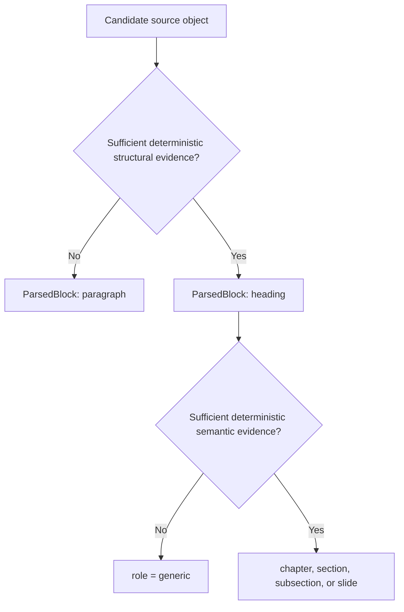

| Source | Reliable heading evidence | Evidence for a specific role | Fallback when heading is certain | Insufficient heading evidence |
| --- | --- | --- | --- | --- |
| Markdown | Valid ATX or Setext heading syntax | Text/numbering matches grammar packaged in the immutable parser build | `generic` | Paragraph; emphasis/bold alone is insufficient |
| DOCX | Native Heading style or outline level | Text/numbering matches grammar packaged in the immutable parser build | `generic` | Paragraph; font size/bold alone is insufficient |
| PDF | Clear TOC/bookmark, or a deterministic multi-signal rule combining numbering with consistent layout/style patterns | TOC labels, numbering, or text matches packaged semantic grammar | `generic` | Paragraph; one typography/layout signal alone is insufficient |
| PPTX | Native title placeholder or other deterministic structural evidence defined for the parser build | Native title placeholder gives `slide`; template-specific section mapping requires an explicit deterministic build rule | `generic` | Paragraph; a large/bold free textbox alone is insufficient |
| TXT | Explicit configured heading grammar packaged in the parser build | The same grammar has an explicit role mapping | `generic` | Paragraph; capitalization or blank-line heuristics alone are insufficient |

Grammar/configuration is packaged with the immutable parser build. Any grammar change requires a new `parser.build_id`; v1 does not add a separate config identifier. Semantic-looking text must never promote a paragraph to a heading without structural evidence.

#### 6.3.5 Valid examples

Contiguous content hierarchy:

```json
[
  {"level": 2, "role": "chapter", "text": "Chapter 3"},
  {"level": 3, "role": "generic", "text": "Installation"},
  {"level": 4, "role": "subsection", "text": "Package Management"}
]
```

Preserved source gap; valid with a quality signal:

```json
[
  {"level": 2, "role": "generic", "text": "Storage"},
  {"level": 4, "role": "generic", "text": "Versioning"}
]
```

Titleless PPTX slide with a reliable intra-slide heading:

```json
[
  {"level": 3, "role": "generic", "text": "Retrieval"}
]
```

No reliable content hierarchy:

```json
[]
```

#### 6.3.6 Invalid examples

Duplicate/decreasing levels:

```json
[
  {"level": 2, "role": "chapter", "text": "Chapter 3"},
  {"level": 2, "role": "section", "text": "Storage"}
]
```

Unsupported role:

```json
[
  {"level": 2, "role": "part", "text": "Part I"}
]
```

A heading block is also invalid when its path is empty or its final path item does not equal the heading's own `level`, `role`, and `text`.

### 6.4 Metadata uses block-type-specific shapes

`metadata` is conditionally validated by `block_type`, rather than acting as an unrestricted bag. Examples include list hierarchy for `list_item`, cells for `table_row`, and code-language information for `code_block`. The field-rules table must define each variant before JSON Schema encodes it with `if/then` or `oneOf`.

Parser name/build ID remain in ParseManifest and are not duplicated in each block.

### 6.5 Bidirectional block–asset relationships

The persisted relationship is symmetric:

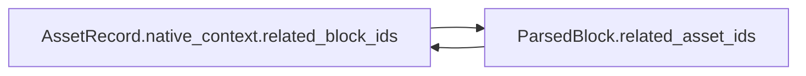

The bundle validator must reject dangling, duplicate, cross-document, or one-sided references. This intentionally trades additional validation complexity for direct traversal from either record type.

## 7. ParsedBlock metadata field rules — frozen v1

`block_type` is the discriminator that selects exactly one allowed `metadata` shape. Unknown fields are rejected. Metadata stores only native structure that is not already represented by common fields, `heading_path`, `locator`, relationships, or ParseManifest.

### 7.1 Empty metadata variants

The following block types require an empty object:

| `block_type` | Required metadata value | Reason |
| --- | --- | --- |
| `title` | `{}` | Title text and provenance already exist in common fields and locator |
| `heading` | `{}` | Level, role, and text are authoritative in `heading_path[-1]` |
| `paragraph` | `{}` | Baseline paragraph has no additional native structure |

For `heading`, the bundle validator additionally requires a non-empty `heading_path` and `heading_path[-1].text == text`.

### 7.2 `list_item` metadata

| Field | Required | Type | Record-level rule | Bundle-level rule |
| --- | ---: | --- | --- | --- |
| `list_id` | Yes | string | Non-empty deterministic ID for one logical list | Groups only list items from the same document |
| `item_index` | Yes | integer | `>= 1` | Unique and contiguous `1..N` within `list_id`, following source order |
| `list_type` | Yes | string enum | `ordered \| unordered` | Consistent with the native list structure represented by the item |
| `list_level` | Yes | integer | `>= 0` | First item is level `0`; a following item may increase by at most one level |
| `marker` | No | string | Non-empty when present; preserve only a native marker that was identified reliably | Must not be synthesized when the source has no reliable marker |

`parent_item_id` is not stored in v1. The tree is reconstructed by scanning earlier items in the same `list_id` for the nearest item with a lower `list_level`.

### 7.3 `table_row` metadata

| Field | Required | Type | Record-level rule | Bundle-level rule |
| --- | ---: | --- | --- | --- |
| `table_id` | Yes | string | Non-empty deterministic ID for one logical table | Groups rows from the same table and document |
| `row_index` | Yes | integer | `>= 1` | Unique and contiguous `1..N` within `table_id` |
| `cells` | Yes | array of objects | Non-empty; cells remain in logical column order | Cells from all rows reconstruct one non-overlapping logical grid |

Each cell has this shape:

| Cell field | Required | Type | Rule |
| --- | ---: | --- | --- |
| `column_start` | Yes | integer | `>= 1`, one-based logical starting column |
| `column_span` | Yes | integer | `>= 1` |
| `row_span` | Yes | integer | `>= 1` |
| `text` | Yes | string | May be empty so native empty cells are not silently dropped |

The bundle validator derives the table's logical column count as:

```text
max(column_start + column_span - 1)
```

across all cells belonging to the same `table_id`. It rejects overlapping cell ranges, invalid row spans, missing trailing empty cells, and inconsistent logical-grid coverage. `TableRecord` and stored `logical_column_count` are intentionally deferred because they add no information that cannot currently be derived.

### 7.4 `caption` metadata

| Field | Required | Type | Rule |
| --- | ---: | --- | --- |
| `caption_kind` | Yes | string enum | `figure \| table` |
| `target` | Yes | object | Exactly one typed target in v1 |
| `target.type` | Yes | string enum | `asset \| table` |
| `target.id` | Yes | string | Non-empty target ID |

Allowed combinations are deterministic:

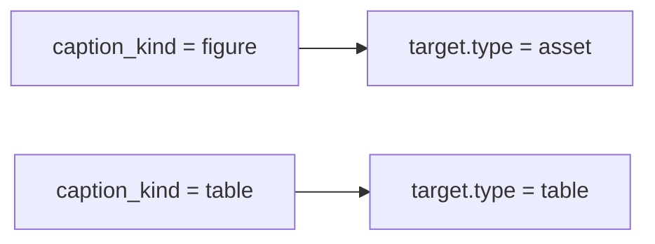

For an asset target, `target.id` must exist in `assets.jsonl`, must be present in `related_asset_ids`, and the corresponding `AssetRecord` must reference the caption block. For a table target, at least one `table_row` must carry the matching `table_id`. Physical adjacency is not required because the typed ID is authoritative.

### 7.5 `code_block` metadata

| Field | Required | Type | Rule |
| --- | ---: | --- | --- |
| `language` | No | string | Non-empty when present; preserve only an explicitly declared native language |

The parser must not infer a programming language from code content. If the source does not declare one reliably, metadata is `{}`.

### 7.6 `quote` metadata

| Field | Required | Type | Rule |
| --- | ---: | --- | --- |
| `quote_level` | Yes | integer | `>= 0`; zero is the outermost quote |

A quote block is emitted only when the source exposes a reliable quote structure. Quotation marks inside an ordinary paragraph do not make that paragraph a quote block.

### 7.7 Duplicate-source-of-truth review

| Candidate information | Authoritative location | Metadata decision | Consistency rule |
| --- | --- | --- | --- |
| Heading level and role | `heading_path[-1]` | Do not duplicate | Heading path must be non-empty for a heading block |
| Parser identity/build | `ParseManifest.parser` | Do not duplicate | All bundle records inherit the manifest identity |
| Physical position | `locator` and `source_order` | Do not duplicate | Metadata contains only logical structure |
| Block–asset relationship | `related_asset_ids` and `AssetRecord.native_context.related_block_ids` | Caption keeps a semantic typed target | Asset target and common relationship must agree bidirectionally |
| Table identity | `table_row.metadata.table_id` | Caption may reference the same ID | Validator resolves the caption target to existing rows |
| List parent | Derived from `list_id`, `item_index`, and `list_level` | Do not store `parent_item_id` | Validator rejects invalid level transitions |
| Logical column count | Derived from all cells sharing `table_id` | Do not store | Validator recomputes it from the logical grid |

No duplicate field is retained merely for convenience. The caption target is retained because it adds semantic meaning—what the caption describes—while `related_asset_ids` represents the generic block–asset relationship.

## 8. Common locator philosophy — frozen v1

### 8.1 Purpose and boundary

A locator provides physical provenance for traceability, source inspection, and citation. It is not intended to reconstruct the complete native document. Semantic context belongs in `heading_path` and block-type metadata rather than being duplicated in the locator.

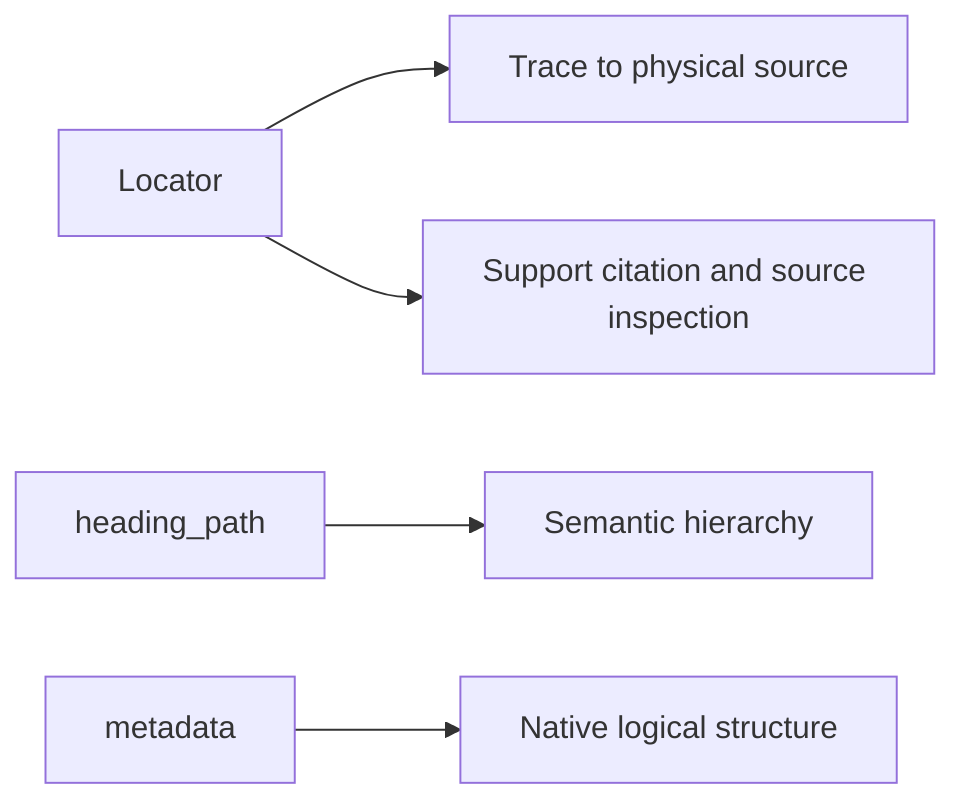

### 8.2 Contract indexes and native identifiers

All human-facing and contract-level positional indexes are one-based. Native technical identifiers retain their source representation and are not treated as indexes.

| Category | Examples | Rule |
| --- | --- | --- |
| Contract-level index | `pdf_page`, `slide`, `shape_index`, `paragraph_index`, `table_index`, `row_index`, `start_line`, `end_line` | Integer `>= 1`; one-based |
| Native technical identifier | `shape_id`, `relationship_id`, `paragraph_id`, XML IDs | Preserve the native string/integer representation when required; do not increment or normalize as an index |
| Human-facing page label | `printed_page` | Preserve reliable source labels as strings; use `null` when unavailable; it is not an array index |

Example:

```json
{
  "type": "pptx",
  "slide": 5,
  "shape_index": 2,
  "shape_id": 102
}
```

`slide` and `shape_index` are StudyBot one-based positions. `shape_id` is the native PowerPoint/XML identifier.

For PDF:

```json
{
  "type": "pdf",
  "pdf_page": 27,
  "printed_page": "6"
}
```

`pdf_page` is the one-based physical file page used by parser/UI logic. `printed_page` is the preserved book page label used in human-facing citation.

### 8.3 Locator reliability and publication

Every published `ParsedBlock` must have a locator satisfying all fields required by its parser profile and locator variant. Optional enrichment such as a nullable bounding box does not make an otherwise complete locator unreliable.

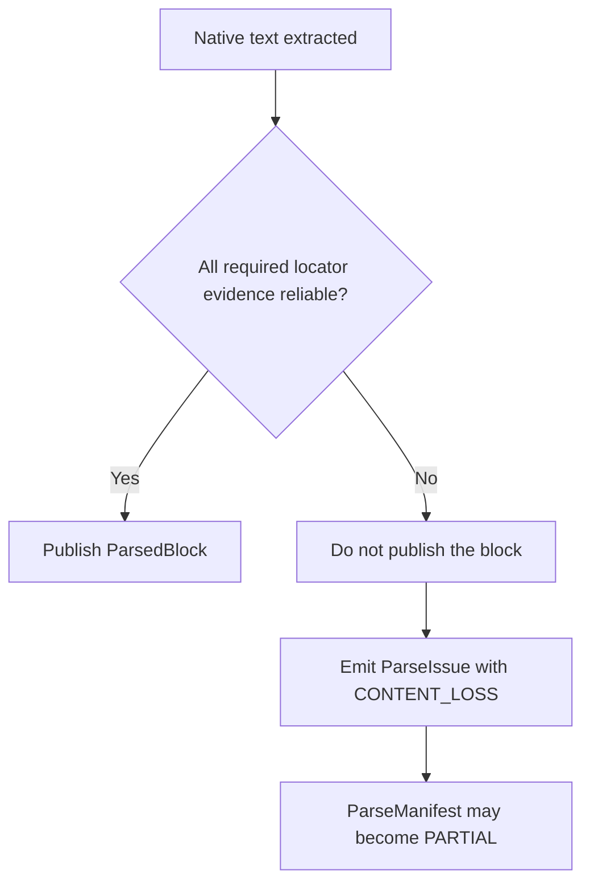

Indexing text whose required physical provenance cannot be demonstrated is forbidden because retrieval could use evidence that the system cannot trace or cite. The exact required fields and permitted optional fields are defined separately by each source-specific locator profile.

## 9. PDF locator field rules — frozen v1

### 9.1 PdfLocator

| Field | Required | Type | Field/record rule | Bundle/source-level rule |
| --- | ---: | --- | --- | --- |
| `type` | Yes | string const | Exactly `pdf` | Must equal `ParsedBlock.source_type` |
| `locations` | Yes | array of PageLocation | At least one item | Sorted by strictly increasing `pdf_page`; no duplicate physical page |

One PageLocation represents exactly one physical PDF page touched by the block:

| Field | Required | Type | Field/record rule | Bundle/source-level rule |
| --- | ---: | --- | --- | --- |
| `pdf_page` | Yes | integer | `>= 1`; one-based physical file page | Must exist in the immutable PDF source snapshot |
| `printed_page` | Yes | string or null | Preserve a reliable human-facing page label as a string; otherwise `null`; empty string forbidden | Non-null value must match accepted deterministic page-label evidence |
| `bounding_boxes` | Yes | array of BoundingBox | May be empty; boxes remain in reliable native reading order | Empty array falls back to page-level provenance and does not cause content loss |

`locations` answers which pages contain the block. `bounding_boxes` answers which contiguous regions belong to it within each page. A page occurs once in `locations`, even when the block occupies multiple disjoint regions on that page.

### 9.2 BoundingBox

Coordinates are normalized against page dimensions. The origin is the top-left corner; X increases to the right and Y increases downward.

| Field | Required | Type | Rule |
| --- | ---: | --- | --- |
| `x_min` | Yes | number | `0 <= x_min < x_max <= 1` |
| `y_min` | Yes | number | `0 <= y_min < y_max <= 1` |
| `x_max` | Yes | number | `0 <= x_min < x_max <= 1` |
| `y_max` | Yes | number | `0 <= y_min < y_max <= 1` |

Exact duplicate boxes, zero-area boxes, and out-of-range coordinates are invalid. The validator never swaps or repairs coordinates. Small overlaps caused by extraction/rounding may remain valid and optionally produce a quality signal; a hard large-overlap rule is deferred until fixtures provide evidence.

### 9.3 Printed-page evidence

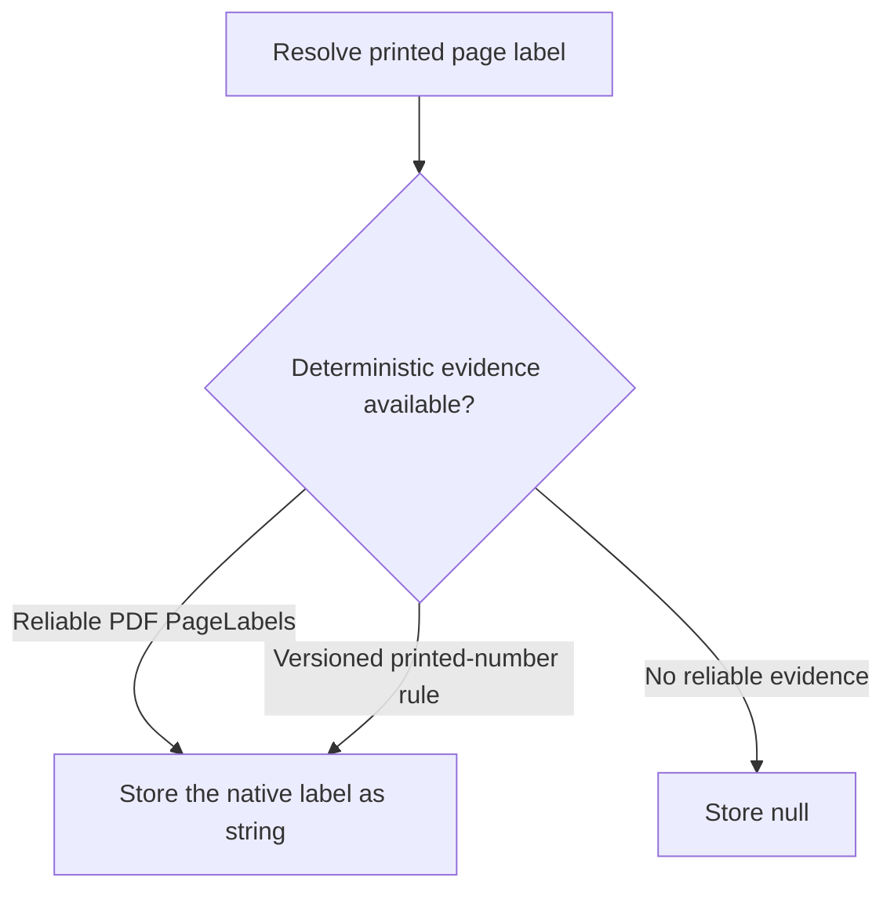

Accepted evidence:

1. Reliable PDF PageLabels metadata.
2. A deterministic printed-page recognition rule packaged in the immutable parser build.
3. An offset only when the offset itself is established by an explicit deterministic versioned rule with reliable evidence.

Ad-hoc extrapolation from a few observed pages is forbidden. Changing the recognition grammar/configuration requires a new `parser.build_id`.

### 9.4 Publication and citation behavior

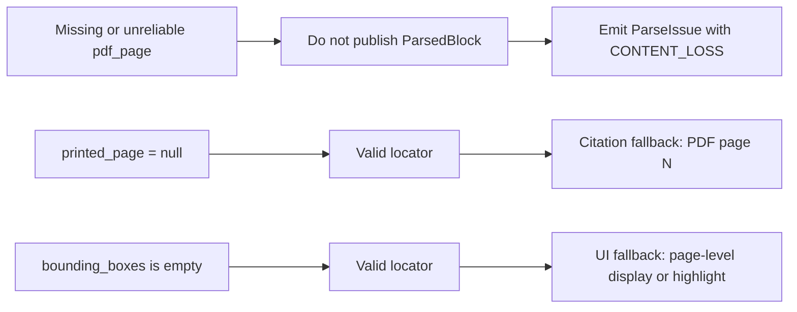

### 9.5 Valid examples

One page with a printed label and two physical regions:

```json
{
  "type": "pdf",
  "locations": [
    {
      "pdf_page": 10,
      "printed_page": "8",
      "bounding_boxes": [
        {"x_min": 0.08, "y_min": 0.72, "x_max": 0.46, "y_max": 0.94},
        {"x_min": 0.54, "y_min": 0.08, "x_max": 0.92, "y_max": 0.28}
      ]
    }
  ]
}
```

Multiple pages, including an unlabeled page and page-level geometry fallback:

```json
{
  "type": "pdf",
  "locations": [
    {
      "pdf_page": 10,
      "printed_page": "8",
      "bounding_boxes": []
    },
    {
      "pdf_page": 11,
      "printed_page": null,
      "bounding_boxes": []
    }
  ]
}
```

### 9.6 Invalid examples

Duplicate physical page:

```json
{
  "type": "pdf",
  "locations": [
    {"pdf_page": 10, "printed_page": "8", "bounding_boxes": []},
    {"pdf_page": 10, "printed_page": "8", "bounding_boxes": []}
  ]
}
```

Invalid geometry:

```json
{
  "type": "pdf",
  "locations": [
    {
      "pdf_page": 10,
      "printed_page": "8",
      "bounding_boxes": [
        {"x_min": 0.80, "y_min": 0.20, "x_max": 0.20, "y_max": 0.40}
      ]
    }
  ]
}
```

The PDF locator is frozen v1. Changes to page grouping, printed-page evidence, coordinate normalization, or required publication provenance require an explicit contract-version decision.

## 10. Next ParsedBlock work

Design and freeze the remaining source-specific locators in this order: PPTX variants, DOCX variants, Markdown line range, and TXT line range. Then run the final ParsedBlock consistency review before encoding `parsed-block.schema.json`.
