# Parser Field Rules

## 1. Purpose and status

This document translates the human-readable decisions in `06-parser-contracts.md` into reviewable field rules before they are encoded as JSON Schema and Python bundle validation.

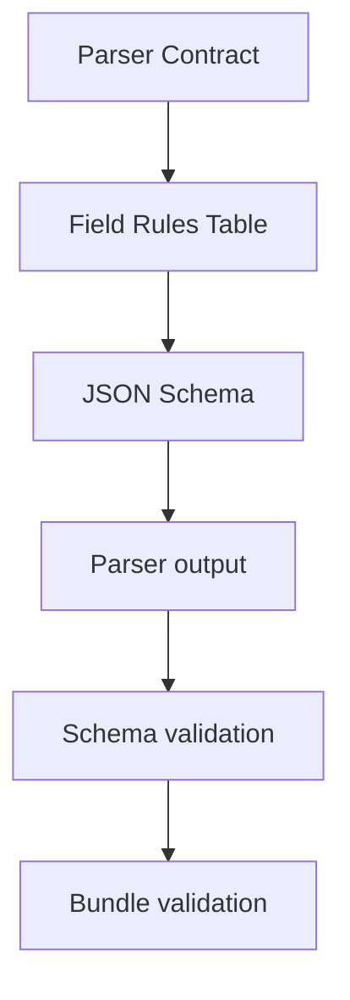

Status:

| Record | Field rules status |
|---|---|
| `ParseRequest` | Frozen v1 |
| `ParseManifest` | Frozen v1 |
| `ParsedBlock` | Final Consistency Review — common fields, metadata, heading path, and all five locator profiles frozen |
| `AssetRecord` | Pending |
| `LinkRecord` | Pending |
| `ParseIssue` | Pending |

## 2. Record definitions and responsibilities

### 2.1 ParseRequest

**Definition:** The immutable instruction that starts one parse job. It identifies the exact document source, source version, format, and parser profile to use.

**Role:** Prevent the Parser from receiving ambiguous input or silently choosing a parser/configuration. The source binary is referenced by URI; it is not embedded in the request.


### 2.2 ParseManifest

**Definition:** The control record describing the result of one parse job and the artifacts published in its ParseBundle.

**Role:** Act as the entry point and source of truth for bundle status, reproducibility, artifact locations, record counts, and checksums. It does not contain the document content itself.

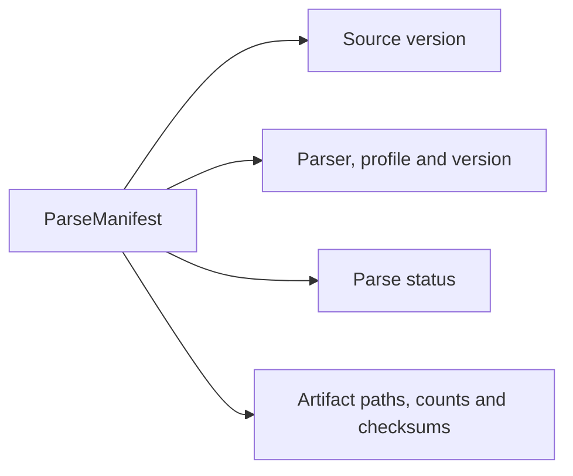

### 2.3 ParsedBlock

**Definition:** One logical unit of native textual content extracted directly from the source, such as a heading, paragraph, list item, table row, caption, code block, or quote.

**Role:** Provide structure-preserving, searchable text to the Chunker while retaining document hierarchy, source order, and a locator for citation. Generated OCR/Vision text does not belong in the baseline `ParsedBlock` artifact.

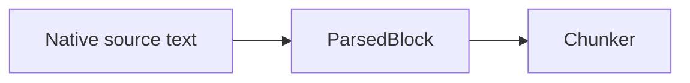

### 2.4 AssetRecord

**Definition:** A provenance record for non-text content detected in the source, including an image, chart, diagram, SmartArt, audio, video, embedded object, or attachment.

**Role:** Ensure non-text content is not silently lost. It records what native object was detected, where it occurred, whether its binary was extracted, and which surrounding blocks relate to it. Semantic interpretation belongs to Multimodal Enrichment.


### 2.5 LinkRecord

**Definition:** One occurrence of an internal anchor, local-file reference, external URL, or embedded-attachment link found in the source.

**Role:** Preserve the target, anchor text, physical occurrence, and originating block/asset without fetching or trusting the target. Repeated occurrences of the same URL remain separate records.


### 2.6 ParseIssue

**Definition:** A structured description of a parser warning or failure associated with a source location or output record.

**Role:** Make content loss and parser limitations observable and deterministically derive the final ParseManifest status. `severity` controls logging/alerting; `impact` controls parse status.

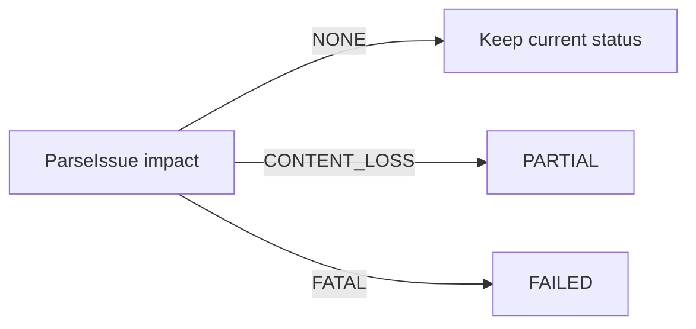

## 3. Validation levels

| Level | Question | Mechanism |
|---|---|---|
| Field | Is the value present and of the correct type/range? | JSON Schema |
| Record | Is this object internally valid for its selected type/state? | JSON Schema |
| Bundle | Do records and artifacts agree with one another? | Python bundle validator |
| Source | Does the locator/file/hash correspond to the real source? | Python bundle/source validator |

Examples:

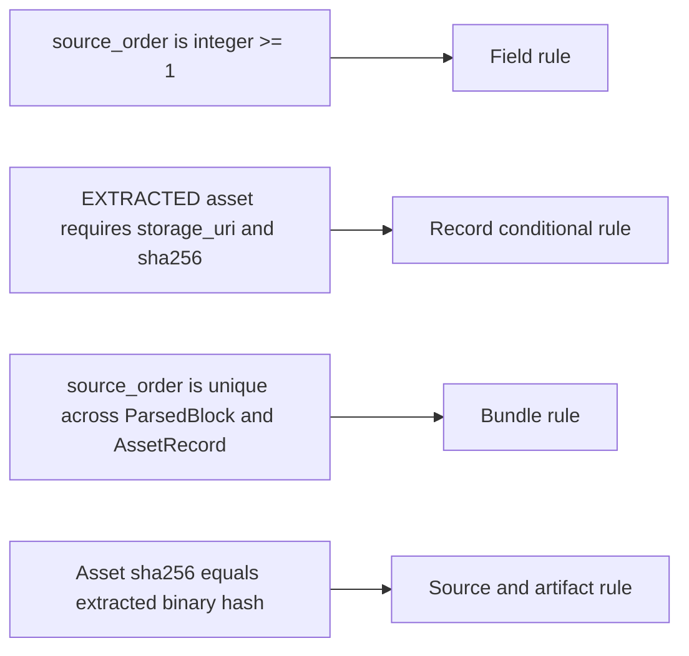

## 4. ParseRequest field rules — frozen v1

| Field | Required | Type | Allowed / field-record rule | Bundle/source-level rule |
|---|---:|---|---|---|
| `schema_version` | Yes | string | Exactly `"1.0"` | Must be compatible with the selected contract implementation |
| `parse_job_id` | Yes | string | Pattern `^parse_job_[A-Za-z0-9_-]+$` | Unique for the submitted parse job; must not affect deterministic output record IDs |
| `document_id` | Yes | string | Non-empty; follows the document ID convention | Must exist in the corpus manifest |
| `source_type` | Yes | string enum | `pdf`, `pptx`, `docx`, `markdown`, or `txt` | Must agree with `parser_profile`, detected media type, and corpus entry |
| `parser_profile` | Yes | string enum | `pdf_book_v1`, `pptx_v1`, `docx_v1`, `markdown_v1`, or `txt_v1` | Parser must reject unsupported profiles; no silent fallback |
| `source` | Yes | object | Must contain exactly the defined source fields | Describes the immutable source snapshot for this job |
| `source.uri` | Yes | string | MVP permits only `local://` and `s3://` | Referenced object/file must exist and be readable by the Parser; HTTP/FTP fetching is forbidden |
| `source.file_name` | Yes | string | Non-empty display/debug metadata; not authoritative identity | May change without changing source identity; must not participate in deterministic record IDs |
| `source.media_type` | Yes | string | Strict canonical MIME type from the profile mapping | Must match detected bytes, `source_type`, and selected parser profile; no parser fallback |
| `source.sha256` | Yes | string | `sha256:` followed by 64 hexadecimal characters | Must equal the SHA-256 of the exact source bytes read by the Parser |

### 4.1 ParseRequest record-level mappings

| `source_type` | Required `parser_profile` | Accepted media type baseline |
|---|---|---|
| `pdf` | `pdf_book_v1` | `application/pdf` |
| `pptx` | `pptx_v1` | `application/vnd.openxmlformats-officedocument.presentationml.presentation` |
| `docx` | `docx_v1` | `application/vnd.openxmlformats-officedocument.wordprocessingml.document` |
| `markdown` | `markdown_v1` | `text/markdown` |
| `txt` | `txt_v1` | `text/plain` |

These mappings can be encoded as JSON Schema conditional rules. Actual file existence, detected media type, and source checksum require the Python source validator.

### 4.2 ParseRequest example

```json
{
  "schema_version": "1.0",
  "parse_job_id": "parse_job_001",
  "document_id": "docx_review_001",
  "source_type": "docx",
  "parser_profile": "docx_v1",
  "source": {
    "uri": "local://corpus/docx_review_001.docx",
    "file_name": "on_Tap.docx",
    "media_type": "application/vnd.openxmlformats-officedocument.wordprocessingml.document",
    "sha256": "sha256:0123456789abcdef0123456789abcdef0123456789abcdef0123456789abcdef"
  }
}
```

### 4.3 Frozen ParseRequest decisions

- `parse_job_id` identifies a run only. It is excluded from deterministic `block_id`, `asset_id`, `link_id`, and `issue_id` generation.
- `source.uri` accepts only managed local storage and S3 in MVP. The Parser is not a web crawler.
- MIME types are canonical and strict. A mismatch among declared type, detected bytes, and profile is rejected rather than rerouted.
- `source.file_name` is for display and debugging. Source identity and reproducibility depend on `document_id`, `source.uri`, `source.sha256`, parser profile, parser build ID, and contract version.

## 5. ParseManifest field rules — frozen v1

`ParseManifest` answers: **What did this parse job actually process, what did it produce, and can that output be trusted?**

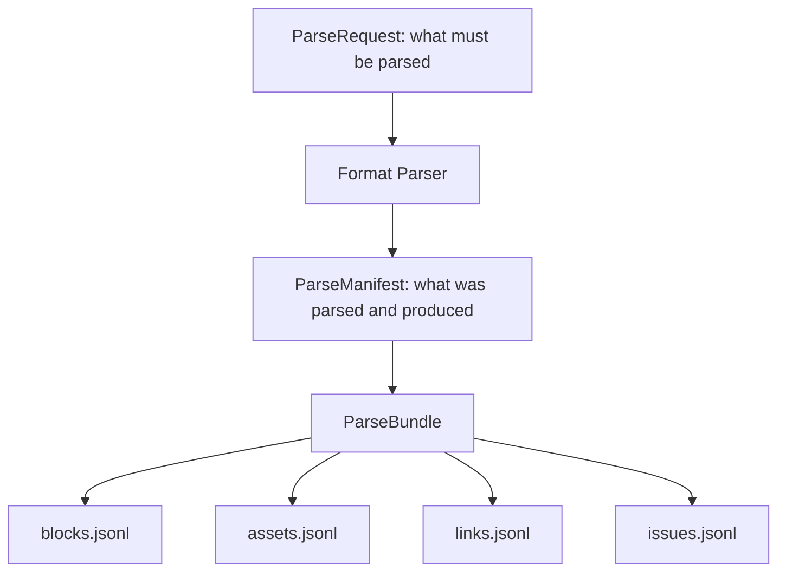

| Field | Required | Type | Allowed / field-record rule | Bundle/source-level rule |
|---|---:|---|---|---|
| `schema_version` | Yes | string | Exactly `"1.0"` | Must be compatible with the manifest schema implementation |
| `contract_version` | Yes | string | Exactly `"1.0"` for Parser Contract v1 | Must match the contract used by every bundle artifact |
| `parse_job_id` | Yes | string | Same pattern as ParseRequest | Must equal the originating `ParseRequest.parse_job_id` |
| `document_id` | Yes | string | Non-empty; follows document ID convention | Must equal ParseRequest and every record in the bundle |
| `source_sha256` | Yes | string | `sha256:` plus 64 hexadecimal characters | Must equal ParseRequest source hash and the bytes actually parsed |
| `parser_profile` | Yes | string enum | One frozen baseline parser profile | Must equal the requested profile; no silent fallback |
| `status` | Yes | string enum | `COMPLETED`, `PARTIAL`, or `FAILED` | Must be derived deterministically from all `ParseIssue.impact` values |
| `created_at` | Yes | string | RFC 3339 timestamp normalized to UTC, for example `2026-08-24T14:30:00Z` | Records when the finalized Manifest was created; audit/display ordering only, not distributed concurrency control |
| `parser` | Yes | object | Contains exactly `name` and `build_id` | Together with profile/contract/source hash, defines reproducibility scope |
| `parser.name` | Yes | string | Non-empty implementation identifier | Must identify the parser implementation actually executed |
| `parser.build_id` | Yes | string | Non-empty immutable build identifier, such as Git SHA or image digest | A build change changes reproducibility identity and may change deterministic output IDs |
| `artifacts` | Yes | object | Contains exactly `blocks`, `assets`, `links`, and `issues` descriptors | Manifest is finalized only after all declared artifacts are published |
| `artifacts.blocks` | Yes | artifact descriptor | Describes `blocks.jsonl` | Count/hash must match the actual artifact |
| `artifacts.assets` | Yes | artifact descriptor | Describes `assets.jsonl` | Count/hash must match the actual artifact |
| `artifacts.links` | Yes | artifact descriptor | Describes `links.jsonl` | Count/hash must match the actual artifact |
| `artifacts.issues` | Yes | artifact descriptor | Describes `issues.jsonl` | Count/hash must match the actual artifact; `FAILED` requires a `FATAL` issue when publication is possible |

### 5.1 Artifact descriptor rules

The four descriptors share one reusable record shape:

| Field | Required | Type | Allowed / field-record rule | Bundle/source-level rule |
|---|---:|---|---|---|
| `path` | Yes | string | Non-empty relative path inside the ParseBundle; no absolute path or `..` traversal | Referenced artifact must exist inside the published bundle |
| `sha256` | Yes | string | `sha256:` plus 64 hexadecimal characters | Must equal the SHA-256 of the exact artifact bytes |
| `record_count` | Yes | integer | `>= 0` | Must equal the number of valid JSONL records in the artifact |

The artifact descriptor is the only source of truth for path, checksum, and record count. Duplicate top-level counts are forbidden.

### 5.2 Fixed bundle and failure publication rules

Every successfully published ParseBundle has a fixed shape:

```text
manifest.json
blocks.jsonl
assets.jsonl
links.jsonl
issues.jsonl
```

All four artifact descriptors are required even when a JSONL file has zero records. An empty artifact still has a checksum and `record_count = 0`. Missing files therefore mean an invalid/incomplete bundle, not “no records of this type.”

When parsing reaches `FAILED` but publication remains possible, the Parser publishes a full failure bundle:

- `manifest.json` has `status = FAILED`.
- All four JSONL files and descriptors exist.
- `issues.jsonl` contains at least one `ParseIssue` with `impact = FATAL`.
- `blocks.jsonl`, `assets.jsonl`, and `links.jsonl` are empty because `FAILED` means no output representation is sufficiently reliable for downstream use.
- Temporary partial records are not published as usable output.

If storage/infrastructure prevents atomic publication itself, no ParseBundle is considered published. The Job/observability layer records that operational failure.

### 5.3 Status propagation

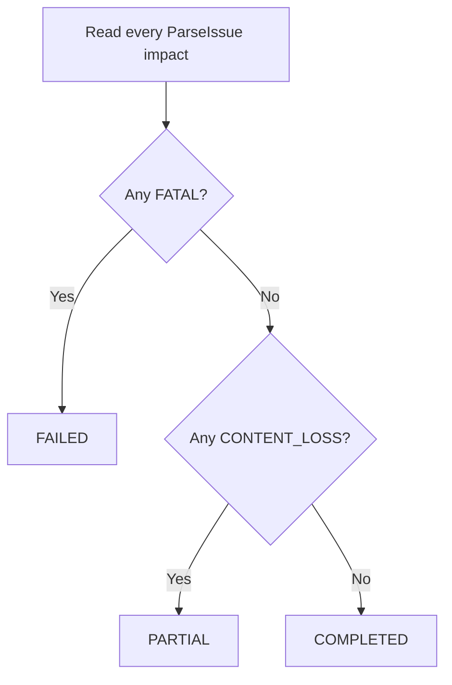

Status does not depend on `severity`. An extracted image awaiting Vision enrichment is compatible with `COMPLETED`; content required by the parser profile that could not be preserved produces `PARTIAL`.

### 5.4 ParseManifest example

```json
{
  "schema_version": "1.0",
  "contract_version": "1.0",
  "parse_job_id": "parse_job_20260824_001",
  "document_id": "docx_review_001",
  "source_sha256": "sha256:0123456789abcdef0123456789abcdef0123456789abcdef0123456789abcdef",
  "parser_profile": "docx_v1",
  "status": "COMPLETED",
  "created_at": "2026-08-24T14:30:00Z",
  "parser": {
    "name": "studybot-docx-parser",
    "build_id": "git:f674ad2"
  },
  "artifacts": {
    "blocks": {
      "path": "blocks.jsonl",
      "sha256": "sha256:aaaaaaaaaaaaaaaaaaaaaaaaaaaaaaaaaaaaaaaaaaaaaaaaaaaaaaaaaaaaaaaa",
      "record_count": 120
    },
    "assets": {
      "path": "assets.jsonl",
      "sha256": "sha256:bbbbbbbbbbbbbbbbbbbbbbbbbbbbbbbbbbbbbbbbbbbbbbbbbbbbbbbbbbbbbbbb",
      "record_count": 2
    },
    "links": {
      "path": "links.jsonl",
      "sha256": "sha256:cccccccccccccccccccccccccccccccccccccccccccccccccccccccccccccccc",
      "record_count": 3
    },
    "issues": {
      "path": "issues.jsonl",
      "sha256": "sha256:dddddddddddddddddddddddddddddddddddddddddddddddddddddddddddddddd",
      "record_count": 0
    }
  }
}
```

### 5.5 Frozen ParseManifest decisions

- Bundle shape is fixed: every published bundle contains all four JSONL artifacts, including empty files.
- A parser-level `FAILED` result publishes a full failure bundle when atomic publication remains possible.
- Parser implementation identity uses immutable `parser.build_id`, not semantic version as the authoritative identifier.
- Manifest includes required `created_at` in RFC 3339 UTC for audit and chronological display.
- `created_at` does not participate in deterministic record-ID generation and does not replace job sequence/version checks for concurrency.

## 6. ParsedBlock foundation decisions — frozen

### 6.0 Common fields — frozen v1

| Field | Required | Type | Field/record rule | Bundle/source-level rule |
| --- | ---: | --- | --- | --- |
| `schema_version` | Yes | string | Exactly `"1.0"` | Must use the schema version declared for the bundle contract |
| `document_id` | Yes | string | Non-empty document ID | Must equal ParseRequest, ParseManifest, and every record in the bundle |
| `block_id` | Yes | string | Deterministic ID using the 32-hex truncated SHA-256 rule in Section 6.2 | Unique in `blocks.jsonl`; must reproduce from the canonical identity payload |
| `source_type` | Yes | string enum | `pdf`, `pptx`, `docx`, `markdown`, or `txt` | Must agree with parser profile, source media type, and `locator.type` |
| `block_index` | Yes | integer | `>= 1` | Unique and contiguous `1..N` in `blocks.jsonl` |
| `source_order` | Yes | integer | `>= 1` | Unique and contiguous across recognized flow-bearing `ParsedBlock` and `AssetRecord` records |
| `block_type` | Yes | string enum | `title`, `heading`, `paragraph`, `list_item`, `table_row`, `caption`, `code_block`, or `quote` | Selects exactly one metadata variant |
| `text` | Yes | string | Non-empty after block-type-aware canonicalization; contains only native text | Empty table cells remain in `metadata.cells[].text`; non-text-only objects become assets rather than empty blocks |
| `heading_path` | Yes | array of objects | May be empty; frozen semantics are defined in Section 6.3 | Must represent only reliably detected source hierarchy |
| `related_asset_ids` | Yes | array of strings | May be empty; no duplicates | Every ID must resolve symmetrically to an AssetRecord in the same document and bundle |
| `locator` | Yes | object | Shape is selected by `source_type` | Must resolve to the physical source; only its frozen stable projection participates in deterministic identity |
| `metadata` | Yes | object | Shape is selected by `block_type`; Section 7 is frozen v1 | Bundle validator enforces list, table, caption, and relationship invariants |

### 6.1 Parallel index namespaces

`block_index` and `source_order` are both required because they answer different questions:

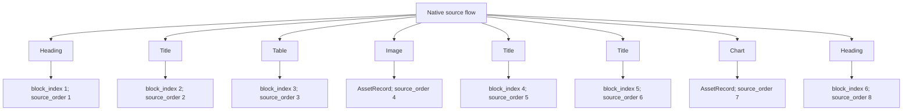

Frozen rules:

- `block_index` counts only records in `blocks.jsonl` and is contiguous `1..N`.
- `source_order` counts recognized native flow objects across `blocks.jsonl` and `assets.jsonl`.
- Merging blocks and assets by `source_order` reconstructs the recognized source flow.
- A detected but unextractable asset remains `DETECTED_ONLY` or `FAILED` and keeps its `source_order`; it is not silently dropped.
- `LinkRecord` and `ParseIssue` do not consume `source_order`.
- Gaps are validation signals, not the official representation of content loss; `AssetRecord + ParseIssue` represent detected loss.

### 6.2 Location-and-content block identity

`block_id` uses the first 32 hexadecimal characters of SHA-256:

```text
canonical_identity = {
  document_id,
  source_type,
  canonical_locator,
  block_type,
  canonical_native_content
}

block_id =
document_id + "_b_" +
first_32_hex(SHA256(canonical_json(canonical_identity)))
```

Canonical JSON uses stable key ordering and preserves meaningful array order. Moving identical content changes the ID because its locator changed; changing native content or structure at the same locator also changes the ID.

Canonical native content is block-type specific:

| `block_type` | Included native content/structure |
| --- | --- |
| `title`, `paragraph` | Canonical text |
| `heading` | Canonical text plus `heading_path[-1].level` and `heading_path[-1].role` |
| `list_item` | Canonical text, `list_type`, `list_level`, and native `marker` when present |
| `table_row` | Ordered cells only: `column_start`, `column_span`, `row_span`, and canonical cell text; exclude `ParsedBlock.text` |
| `caption` | Canonical text and `caption_kind` |
| `code_block` | Code with meaningful whitespace preserved, plus native declared `language` when present |
| `quote` | Canonical text and `quote_level` |

`marker` and `language` participate only when explicitly present in the source. The parser must not infer either field merely to construct identity. A native code-language declaration is canonicalized by trimming surrounding whitespace and applying Unicode-aware lowercase. Alias expansion is forbidden: values such as `py`/`python`, `js`/`javascript`, and `c++`/`cpp` remain distinct.

For `block_type = heading`, the final `heading_path` item describes the heading block itself rather than surrounding context. Canonical native content therefore includes its canonical text, normalized `level`, and deterministic `role`. Ancestor items `heading_path[0..n-2]` remain excluded. The final item's text must equal the block text under the frozen canonical text rules, so it is not hashed as a second independent copy.

For `table_row`, `metadata.cells` is the authoritative native content and structure. `ParsedBlock.text` is excluded from identity because it is a searchable projection whose separators are not native table identity. Cells are ordered by ascending `column_start`; each native logical cell appears once, including cells with empty text and cells spanning multiple rows or columns.

Every parser produces `table_row.text` deterministically as:

```text
join(ordered cells[].text, "\t")
```

Cell text first follows the applicable native text normalization rules, including LF line endings, Unicode NFC, and preserved meaningful content. Empty cells remain empty tab-separated segments. A spanning cell contributes its text once rather than being expanded across its span. The projection is required for consistent search/embedding output but is never hashed again after the authoritative cell structure has been included.

Canonicalization rules:

- All text normalizes line endings to LF and Unicode to NFC; case is preserved.
- Prose removes outer whitespace and normalizes only whitespace that the parser profile declares non-semantic.
- Code preserves indentation and internal whitespace; only line endings and Unicode form are normalized.
- Objects use stable key ordering; arrays whose order carries native meaning retain that order.

`canonical_locator` is a minimal stable projection of the public locator, not a copy of the complete provenance object:

| Source/variant | Fields included in `canonical_locator` | Public locator fields excluded from identity |
| --- | --- | --- |
| PDF | `type`, ordered `pdf_pages` projected from `locations[].pdf_page`, `occurrence_index` | `printed_page`, `bounding_boxes` |
| PPTX `text_paragraph` | `type`, `element_type`, `slide`, `shape_path`, `physical_paragraph_index` | `shape_id`, `shape_bounding_box` |
| PPTX `table_row` | `type`, `element_type`, `slide`, `shape_path`, `physical_row_index` | `shape_id`, `shape_bounding_box` |
| DOCX `paragraph` | `type`, `element_type`, `body_child_index` | `paragraph_id` |
| DOCX `table_row` | `type`, `element_type`, `body_child_index`, `physical_row_index` | None |
| Markdown | `type`, `start_line`, `end_line` | None |
| TXT | `type`, `start_line`, `end_line` | None |

`pdf_pages` is an internal canonical projection only; it is not a new public locator field. It preserves the already validated strictly increasing page order. The PPTX `shape_id` remains required public native cross-check evidence: the object reached through `slide + shape_path` must have that ID, but the path plus the physical paragraph/row index already uniquely identifies the block, so `shape_id` is excluded by minimality.

Canonical projection must reject missing or extra identity fields rather than silently copying the public locator. Public provenance may improve—for example geometry becomes available—without changing `block_id` when the stable physical identity and native content remain unchanged.

The following are excluded because they describe processing order, grouping, surrounding context, relationships, or a parse run rather than the block's native identity:

```text
block_index, source_order
list_id, item_index, table_id
heading_path ancestors; for a heading block, only the final item's level and role are included
related_asset_ids, caption target
parse_job_id, created_at, parser build
printed_page, PDF bounding_boxes
PPTX shape_id, PPTX shape_bounding_box
DOCX paragraph_id
```

`PPTX_SHAPE_ID_IDENTITY_REDUNDANCY` is closed: `shape_id` remains required in the public PPTX locator and is excluded from `canonical_locator` as redundant native validation evidence. `TABLE_ROW_TEXT_CANONICALIZATION` is closed: ordered `metadata.cells` defines table-row identity, while `ParsedBlock.text` is its required deterministic tab-separated projection and is excluded from the hash. `HEADING_SELF_STRUCTURE_IDENTITY` is closed: a heading hashes its own final normalized level and role but not ancestor hierarchy. The block-specific `block_id` and canonicalization review is complete for v1; it is reopened only if fixtures or validation demonstrate a contract defect.

### 6.3 `heading_path` semantics — frozen v1

`heading_path` is an ordered root-to-leaf array of reliably recognized content headings. Document root is reserved as StudyBot level `1` in the Corpus Manifest and is not repeated in block paths.

#### 6.3.1 HeadingPathItem

| Field | Required | Type | Rule |
| --- | ---: | --- | --- |
| `level` | Yes | integer | `>= 2`; normalized StudyBot hierarchy level |
| `role` | Yes | string enum | `chapter`, `section`, `subsection`, `slide`, or `generic` |
| `text` | Yes | string | Non-empty native heading text; preserve case |

`level` answers where the item occurs in the hierarchy. `role` records only semantic meaning supported by deterministic source evidence. A `subsection` may occur at multiple levels, and role is not derived mechanically from level. `part`, `native_role`, confidence scores, and separate hierarchy records are deferred.

`generic` has one precise meaning: the parser has reliable structural evidence that the object is a heading and knows its hierarchy level, but lacks deterministic semantic evidence for a more specific role. If structural evidence itself is insufficient, the object remains a paragraph; `generic` is not used as a guess.

#### 6.3.2 Hierarchy invariants

- Items are ordered root to leaf.
- Levels MUST be strictly increasing; duplicate or decreasing levels are invalid.
- Levels SHOULD be contiguous.
- A level gap is valid and produces a non-fatal quality signal; it never causes the parser to fabricate a missing heading.
- An empty array is valid when no reliable content hierarchy applies.

For PDF, Markdown, DOCX, and TXT, normalization uses one content base for the entire document, not one base per chapter or section:

```text
normalized_level = native_level - content_base_level + 2
```

The parser first identifies reliable headings and a reliable document title. A source title is excluded from content hierarchy only when it occurs at the document start, has reliable native title/top-level structure, and its normalized text matches the Corpus Manifest title. After exclusion, `content_base_level` is the minimum native level among all remaining content headings. Relative gaps are preserved. If no content heading remains, the base is undefined and ordinary blocks use `heading_path = []`.

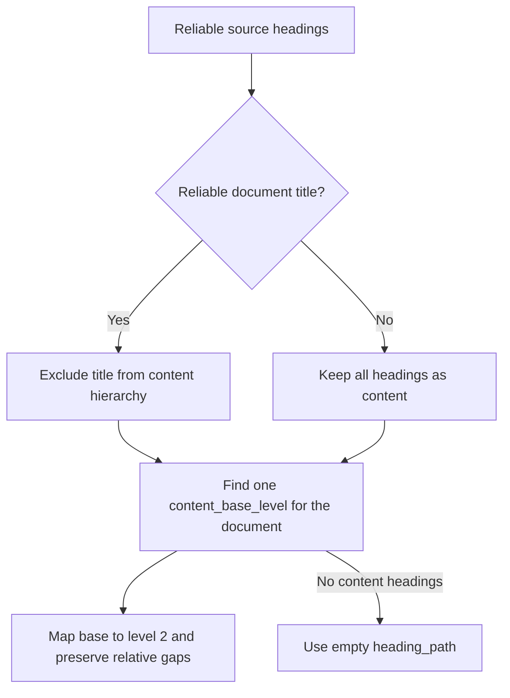

PPTX uses a separate hierarchy scope per slide and does not use the document-wide base formula:

- Entering a new slide clears the previous slide's active heading path.
- A native slide-title placeholder is a heading at level `2` with role `slide`.
- Reliable intra-slide headings use level `3` or deeper.
- A titleless slide may begin with a reliable intra-slide heading at level `3`; the gap is valid and no anonymous slide-title node is fabricated.

#### 6.3.3 Block semantics and active-path update

For a heading block, the final path item is the heading itself. For any other block, the path is the active hierarchy that most closely contains the block. When no reliable hierarchy is active, the path is empty.

When a new heading at level `L` is encountered, the parser removes active headings whose level is greater than or equal to `L`, then appends the new heading:


Bundle validation requires a heading block to have a non-empty path whose final item has the same `level`, `role`, and `text` as that heading. A non-heading block must not append itself to the path.

#### 6.3.4 Recognition and role evidence

Structural evidence decides whether an object is a heading. Semantic evidence is evaluated only after heading recognition and decides whether role is specific or `generic`.

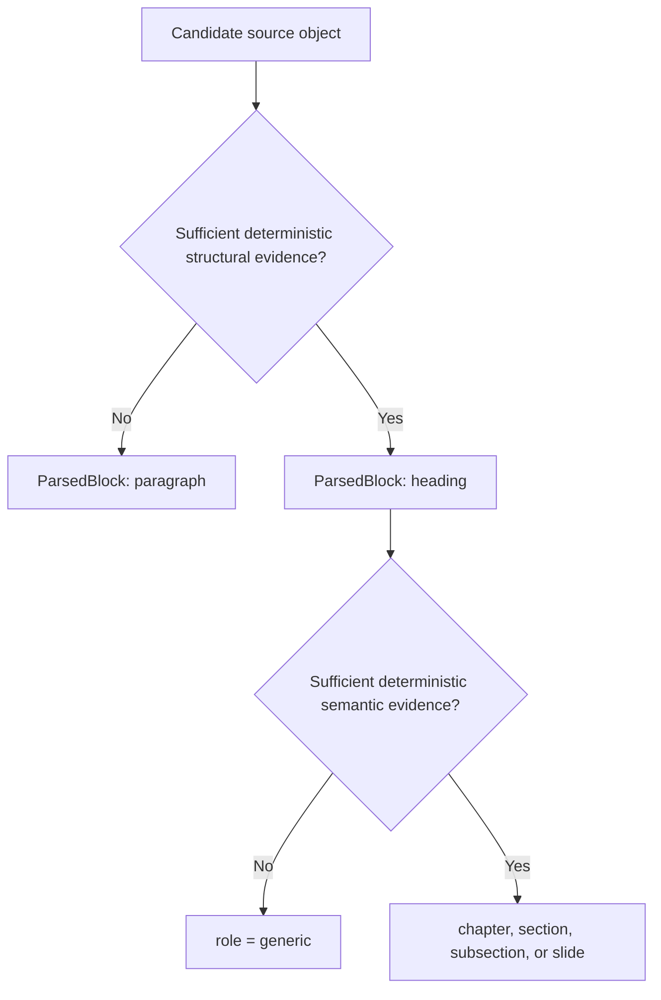

| Source | Reliable heading evidence | Evidence for a specific role | Fallback when heading is certain | Insufficient heading evidence |
| --- | --- | --- | --- | --- |
| Markdown | Valid ATX or Setext heading syntax | Text/numbering matches grammar packaged in the immutable parser build | `generic` | Paragraph; emphasis/bold alone is insufficient |
| DOCX | Native Heading style or outline level | Text/numbering matches grammar packaged in the immutable parser build | `generic` | Paragraph; font size/bold alone is insufficient |
| PDF | Clear TOC/bookmark, or a deterministic multi-signal rule combining numbering with consistent layout/style patterns | TOC labels, numbering, or text matches packaged semantic grammar | `generic` | Paragraph; one typography/layout signal alone is insufficient |
| PPTX | Native title placeholder or other deterministic structural evidence defined for the parser build | Native title placeholder gives `slide`; template-specific section mapping requires an explicit deterministic build rule | `generic` | Paragraph; a large/bold free textbox alone is insufficient |
| TXT | Explicit configured heading grammar packaged in the parser build | The same grammar has an explicit role mapping | `generic` | Paragraph; capitalization or blank-line heuristics alone are insufficient |

Grammar/configuration is packaged with the immutable parser build. Any grammar change requires a new `parser.build_id`; v1 does not add a separate config identifier. Semantic-looking text must never promote a paragraph to a heading without structural evidence.

#### 6.3.5 Valid examples

Contiguous content hierarchy:

```json
[
  {"level": 2, "role": "chapter", "text": "Chapter 3"},
  {"level": 3, "role": "generic", "text": "Installation"},
  {"level": 4, "role": "subsection", "text": "Package Management"}
]
```

Preserved source gap; valid with a quality signal:

```json
[
  {"level": 2, "role": "generic", "text": "Storage"},
  {"level": 4, "role": "generic", "text": "Versioning"}
]
```

Titleless PPTX slide with a reliable intra-slide heading:

```json
[
  {"level": 3, "role": "generic", "text": "Retrieval"}
]
```

No reliable content hierarchy:

```json
[]
```

#### 6.3.6 Invalid examples

Duplicate/decreasing levels:

```json
[
  {"level": 2, "role": "chapter", "text": "Chapter 3"},
  {"level": 2, "role": "section", "text": "Storage"}
]
```

Unsupported role:

```json
[
  {"level": 2, "role": "part", "text": "Part I"}
]
```

A heading block is also invalid when its path is empty or its final path item does not equal the heading's own `level`, `role`, and `text`.

### 6.4 Metadata uses block-type-specific shapes

`metadata` is conditionally validated by `block_type`, rather than acting as an unrestricted bag. Examples include list hierarchy for `list_item`, cells for `table_row`, and code-language information for `code_block`. The field-rules table must define each variant before JSON Schema encodes it with `if/then` or `oneOf`.

Parser name/build ID remain in ParseManifest and are not duplicated in each block.

### 6.5 Bidirectional block–asset relationships

The persisted relationship is symmetric:

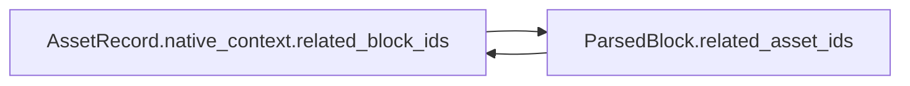

The bundle validator must reject dangling, duplicate, cross-document, or one-sided references. This intentionally trades additional validation complexity for direct traversal from either record type.

## 7. ParsedBlock metadata field rules — frozen v1

`block_type` is the discriminator that selects exactly one allowed `metadata` shape. Unknown fields are rejected. Metadata stores only native structure that is not already represented by common fields, `heading_path`, `locator`, relationships, or ParseManifest.

### 7.1 Empty metadata variants

The following block types require an empty object:

| `block_type` | Required metadata value | Reason |
| --- | --- | --- |
| `title` | `{}` | Title text and provenance already exist in common fields and locator |
| `heading` | `{}` | Level, role, and text are authoritative in `heading_path[-1]` |
| `paragraph` | `{}` | Baseline paragraph has no additional native structure |

For `heading`, the bundle validator additionally requires a non-empty `heading_path`; its final item must equal the heading block's authoritative native `level`, `role`, and `text`. These values are not duplicated in metadata.

### 7.2 `list_item` metadata

| Field | Required | Type | Record-level rule | Bundle-level rule |
| --- | ---: | --- | --- | --- |
| `list_id` | Yes | string | Non-empty deterministic ID for one logical list | Groups only list items from the same document |
| `item_index` | Yes | integer | `>= 1` | Unique and contiguous `1..N` within `list_id`, following source order |
| `list_type` | Yes | string enum | `ordered \| unordered` | Consistent with the native list structure represented by the item |
| `list_level` | Yes | integer | `>= 0` | First item is level `0`; a following item may increase by at most one level |
| `marker` | No | string | Non-empty when present; preserve only a native marker that was identified reliably | Must not be synthesized when the source has no reliable marker |

`parent_item_id` is not stored in v1. The tree is reconstructed by scanning earlier items in the same `list_id` for the nearest item with a lower `list_level`.

### 7.3 `table_row` metadata

| Field | Required | Type | Record-level rule | Bundle-level rule |
| --- | ---: | --- | --- | --- |
| `table_id` | Yes | string | Non-empty deterministic ID for one logical table | Groups rows from the same table and document |
| `row_index` | Yes | integer | `>= 1` | Unique and contiguous `1..N` within `table_id` |
| `cells` | Yes | array of objects | Non-empty; cells remain in logical column order | Cells from all rows reconstruct one non-overlapping logical grid |

Each cell has this shape:

| Cell field | Required | Type | Rule |
| --- | ---: | --- | --- |
| `column_start` | Yes | integer | `>= 1`, one-based logical starting column |
| `column_span` | Yes | integer | `>= 1` |
| `row_span` | Yes | integer | `>= 1` |
| `text` | Yes | string | May be empty so native empty cells are not silently dropped |

The bundle validator derives the table's logical column count as:

```text
max(column_start + column_span - 1)
```

across all cells belonging to the same `table_id`. It rejects overlapping cell ranges, invalid row spans, missing trailing empty cells, and inconsistent logical-grid coverage. `TableRecord` and stored `logical_column_count` are intentionally deferred because they add no information that cannot currently be derived.

For every `table_row`, the validator recomputes `ParsedBlock.text` by joining the ordered `cells[].text` values with one tab character and requires exact equality after the frozen text-normalization rules. A mismatch makes the record invalid even though `ParsedBlock.text` does not participate in `block_id`.

### 7.4 `caption` metadata

| Field | Required | Type | Rule |
| --- | ---: | --- | --- |
| `caption_kind` | Yes | string enum | `figure \| table` |
| `target` | Yes | object | Exactly one typed target in v1 |
| `target.type` | Yes | string enum | `asset \| table` |
| `target.id` | Yes | string | Non-empty target ID |

Allowed combinations are deterministic:

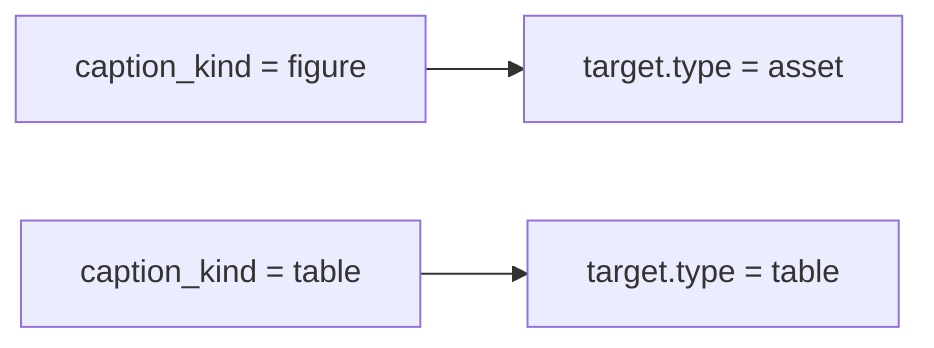

For an asset target, `target.id` must exist in `assets.jsonl`, must be present in `related_asset_ids`, and the corresponding `AssetRecord` must reference the caption block. For a table target, at least one `table_row` must carry the matching `table_id`. Physical adjacency is not required because the typed ID is authoritative.

### 7.5 `code_block` metadata

| Field | Required | Type | Rule |
| --- | ---: | --- | --- |
| `language` | No | string | Non-empty when present; derived only from an explicit native declaration, then trimmed and lowercased; no alias mapping |

The parser must not infer a programming language from code content. If the source does not declare one reliably, metadata is `{}`. Native declarations such as `Python` and ` python ` therefore canonicalize to `python`, while `py` remains `py`. The canonical value participates in code-block identity.

### 7.6 `quote` metadata

| Field | Required | Type | Rule |
| --- | ---: | --- | --- |
| `quote_level` | Yes | integer | `>= 0`; zero is the outermost quote |

A quote block is emitted only when the source exposes a reliable native quote structure. `quote_level` is its normalized native nesting depth and participates in canonical native content. One quote block has exactly one level. When a native span changes nesting depth, the parser emits the corresponding quote blocks rather than assigning one ambiguous shared level. Quotation marks inside an ordinary paragraph do not make that paragraph a quote block.

### 7.7 Duplicate-source-of-truth review

| Candidate information | Authoritative location | Metadata decision | Consistency rule |
| --- | --- | --- | --- |
| Heading level and role | `heading_path[-1]` | Do not duplicate | Heading path must be non-empty for a heading block |
| Parser identity/build | `ParseManifest.parser` | Do not duplicate | All bundle records inherit the manifest identity |
| Physical position | `locator` and `source_order` | Do not duplicate | Metadata contains only logical structure |
| Block–asset relationship | `related_asset_ids` and `AssetRecord.native_context.related_block_ids` | Caption keeps a semantic typed target | Asset target and common relationship must agree bidirectionally |
| Table identity | `table_row.metadata.table_id` | Caption may reference the same ID | Validator resolves the caption target to existing rows |
| List parent | Derived from `list_id`, `item_index`, and `list_level` | Do not store `parent_item_id` | Validator rejects invalid level transitions |
| Logical column count | Derived from all cells sharing `table_id` | Do not store | Validator recomputes it from the logical grid |

No duplicate field is retained merely for convenience. The caption target is retained because it adds semantic meaning—what the caption describes—while `related_asset_ids` represents the generic block–asset relationship.

### 7.8 Final `block_type` and metadata consistency review

Each `block_type` selects exactly one closed metadata shape:

| `block_type` | Only permitted metadata shape |
| --- | --- |
| `title` | `{}` |
| `heading` | `{}` |
| `paragraph` | `{}` |
| `list_item` | `list_id`, `item_index`, `list_type`, `list_level`, optional `marker` |
| `table_row` | `table_id`, `row_index`, `cells` |
| `caption` | `caption_kind`, `target` |
| `code_block` | optional `language`; otherwise `{}` |
| `quote` | `quote_level` |

Missing required fields, fields belonging to another variant, and unknown fields make the record invalid. A record may satisfy its metadata shape while still making the ParseBundle invalid when a bundle-level relationship fails—for example, a caption targets a missing asset/table, list/table indices are not contiguous, or a bidirectional asset reference is asymmetric.

Final boundary check:

- Metadata contains native/logical structure belonging to the block.
- Locator contains physical provenance and never duplicates logical row/list hierarchy.
- `heading_path` contains hierarchy context; heading level/role are not duplicated in metadata.
- Parse-run identity and artifact information remain in ParseManifest.

No blocking ambiguity remains in `block_type` to metadata selection. This relationship is consistent for ParsedBlock v1.

## 8. Common locator philosophy — frozen v1

### 8.1 Purpose and boundary

A locator provides physical provenance for traceability, source inspection, and citation. It is not intended to reconstruct the complete native document. Semantic context belongs in `heading_path` and block-type metadata rather than being duplicated in the locator.

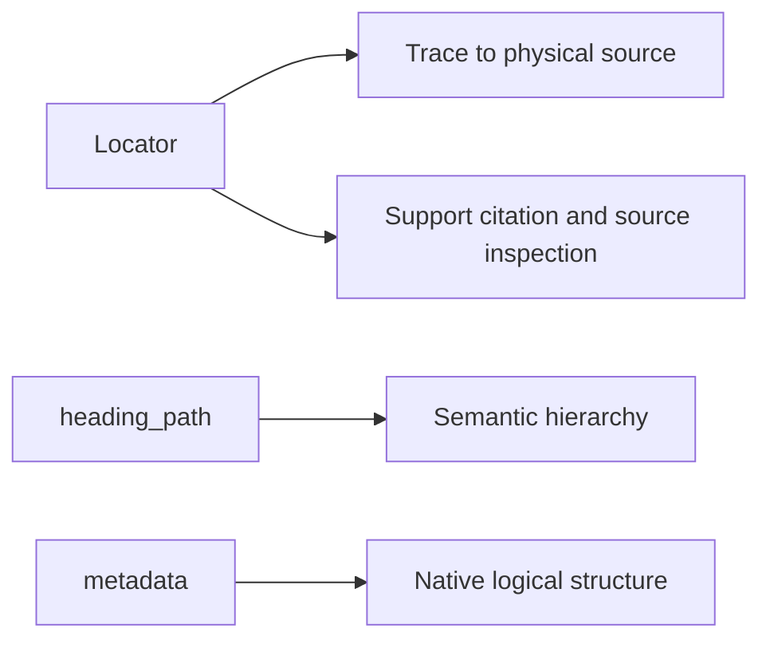

### 8.2 Contract indexes and native identifiers

All human-facing and contract-level positional indexes are one-based. Native technical identifiers retain their source representation and are not treated as indexes.

| Category | Examples | Rule |
| --- | --- | --- |
| Contract-level index | `pdf_page`, `slide`, each `shape_path` element, `body_child_index`, `physical_paragraph_index`, `physical_row_index`, logical `row_index`, `start_line`, `end_line` | Integer `>= 1`; one-based |
| Native technical identifier | `shape_id`, `relationship_id`, `paragraph_id`, XML IDs | Preserve the native string/integer representation when required; do not increment or normalize as an index |
| Human-facing page label | `printed_page` | Preserve reliable source labels as strings; use `null` when unavailable; it is not an array index |

Example:

```json
{
  "type": "pptx",
  "slide": 5,
  "shape_path": [2],
  "shape_id": 102,
  "physical_paragraph_index": 1
}
```

`slide`, each `shape_path` element, and `physical_paragraph_index` are StudyBot one-based positions. `shape_id` is the normalized numeric value of the native PowerPoint/XML identifier.

For PDF:

```json
{
  "type": "pdf",
  "occurrence_index": 1,
  "locations": [
    {
      "pdf_page": 27,
      "printed_page": "6",
      "bounding_boxes": []
    }
  ]
}
```

`pdf_page` is the one-based physical file page used by parser/UI logic. `printed_page` is the preserved book page label used in human-facing citation. `occurrence_index` is the parser-normalized physical disambiguator used when otherwise identical PDF blocks occur in the same canonical page span.

### 8.3 Locator reliability and publication

Every published `ParsedBlock` must have a locator satisfying all fields required by its parser profile and locator variant. Optional enrichment such as a nullable bounding box does not make an otherwise complete locator unreliable.

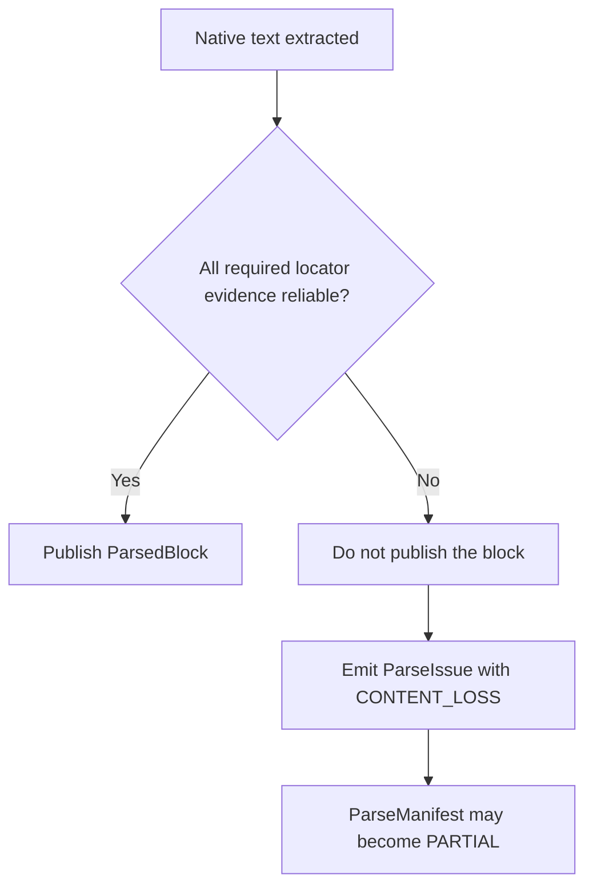

Indexing text whose required physical provenance cannot be demonstrated is forbidden because retrieval could use evidence that the system cannot trace or cite. The exact required fields and permitted optional fields are defined separately by each source-specific locator profile.

## 9. PDF locator field rules — frozen v1

### 9.1 PdfLocator

| Field | Required | Type | Field/record rule | Bundle/source-level rule |
| --- | ---: | --- | --- | --- |
| `type` | Yes | string const | Exactly `pdf` | Must equal `ParsedBlock.source_type` |
| `occurrence_index` | Yes | integer | `>= 1`; normalized duplicate occurrence ordinal | Unique and contiguous `1..N` inside its duplicate-signature group |
| `locations` | Yes | array of PageLocation | At least one item | Sorted by strictly increasing `pdf_page`; no duplicate physical page |

One PageLocation represents exactly one physical PDF page touched by the block:

| Field | Required | Type | Field/record rule | Bundle/source-level rule |
| --- | ---: | --- | --- | --- |
| `pdf_page` | Yes | integer | `>= 1`; one-based physical file page | Must exist in the immutable PDF source snapshot |
| `printed_page` | Yes | string or null | Preserve a reliable human-facing page label as a string; otherwise `null`; empty string forbidden | Non-null value must match accepted deterministic page-label evidence |
| `bounding_boxes` | Yes | array of BoundingBox | May be empty; boxes remain in reliable native reading order | Empty array falls back to page-level provenance and does not cause content loss |

`locations` answers which pages contain the block. `bounding_boxes` answers which contiguous regions belong to it within each page. A page occurs once in `locations`, even when the block occupies multiple disjoint regions on that page.

### 9.2 BoundingBox

Coordinates are normalized against page dimensions. The origin is the top-left corner; X increases to the right and Y increases downward.

| Field | Required | Type | Rule |
| --- | ---: | --- | --- |
| `x_min` | Yes | number | `0 <= x_min < x_max <= 1` |
| `y_min` | Yes | number | `0 <= y_min < y_max <= 1` |
| `x_max` | Yes | number | `0 <= x_min < x_max <= 1` |
| `y_max` | Yes | number | `0 <= y_min < y_max <= 1` |

Exact duplicate boxes, zero-area boxes, and out-of-range coordinates are invalid. The validator never swaps or repairs coordinates. Small overlaps caused by extraction/rounding may remain valid and optionally produce a quality signal; a hard large-overlap rule is deferred until fixtures provide evidence.

### 9.3 Printed-page evidence

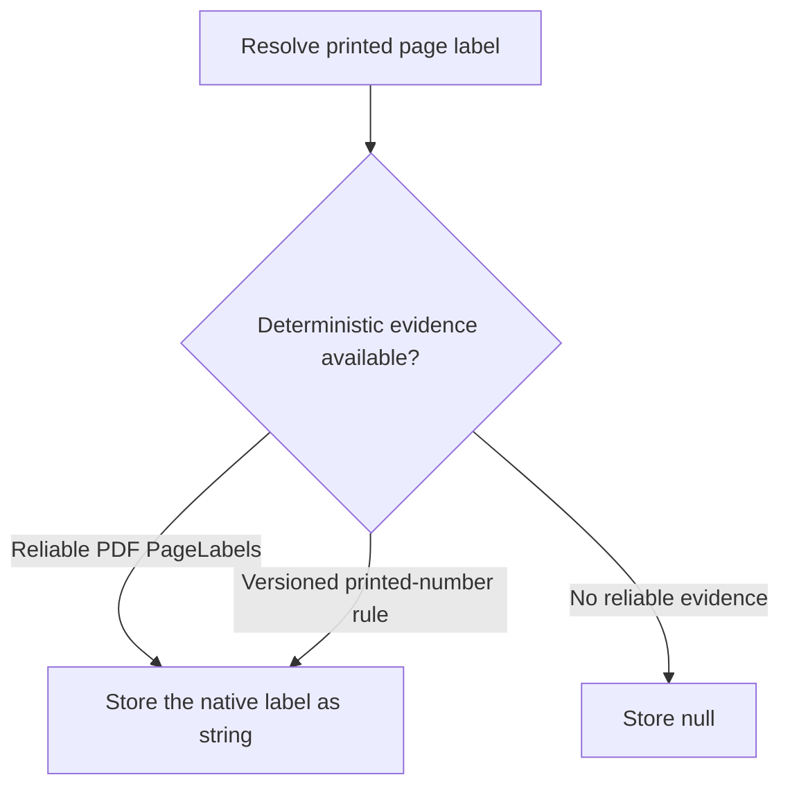

Accepted evidence:

1. Reliable PDF PageLabels metadata.
2. A deterministic printed-page recognition rule packaged in the immutable parser build.
3. An offset only when the offset itself is established by an explicit deterministic versioned rule with reliable evidence.

Ad-hoc extrapolation from a few observed pages is forbidden. Changing the recognition grammar/configuration requires a new `parser.build_id`.

### 9.4 Publication and citation behavior

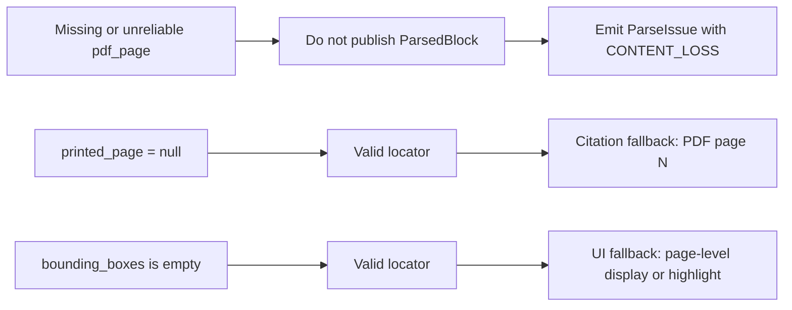

### 9.5 PDF identity disambiguation

PDF has no portable native paragraph/object ID. Two final candidate blocks may therefore have identical page spans, block types, and canonical native content. `occurrence_index` resolves that collision without depending on optional geometry or citation labels.

Assignment algorithm:

1. Determine final candidate ParsedBlock boundaries.
2. Group candidates by canonical page-span signature, `block_type`, and canonical native content.
3. Sort each group by the deterministic extraction/reading order defined by the immutable parser build/profile.
4. Assign `occurrence_index = 1..N`.

The ordinal is assigned to final candidate blocks, not raw PDF text objects. A unique signature group still receives `occurrence_index = 1`. It participates in `canonical_locator`; `printed_page` and `bounding_boxes` do not. It is never derived from `block_index` or `source_order`.

Identity guarantee:

```text
same source.sha256
+ same parser build/profile
+ same contract version
= deterministic occurrence_index and block_id
```

Cross-version PDF block matching and identity stability across different parser builds/profiles are outside v1.

### 9.6 Valid examples

One page with a printed label and two physical regions:

```json
{
  "type": "pdf",
  "occurrence_index": 1,
  "locations": [
    {
      "pdf_page": 10,
      "printed_page": "8",
      "bounding_boxes": [
        {"x_min": 0.08, "y_min": 0.72, "x_max": 0.46, "y_max": 0.94},
        {"x_min": 0.54, "y_min": 0.08, "x_max": 0.92, "y_max": 0.28}
      ]
    }
  ]
}
```

Multiple pages, including an unlabeled page and page-level geometry fallback:

```json
{
  "type": "pdf",
  "occurrence_index": 1,
  "locations": [
    {
      "pdf_page": 10,
      "printed_page": "8",
      "bounding_boxes": []
    },
    {
      "pdf_page": 11,
      "printed_page": null,
      "bounding_boxes": []
    }
  ]
}
```

Two otherwise identical blocks in the same page span are disambiguated as separate members of one group:

```json
{"type":"pdf","occurrence_index":1,"locations":[{"pdf_page":10,"printed_page":"8","bounding_boxes":[]}]}
```

```json
{"type":"pdf","occurrence_index":2,"locations":[{"pdf_page":10,"printed_page":"8","bounding_boxes":[]}]}
```

### 9.7 Invalid examples

Duplicate physical page:

```json
{
  "type": "pdf",
  "occurrence_index": 1,
  "locations": [
    {"pdf_page": 10, "printed_page": "8", "bounding_boxes": []},
    {"pdf_page": 10, "printed_page": "8", "bounding_boxes": []}
  ]
}
```

Invalid geometry:

```json
{
  "type": "pdf",
  "occurrence_index": 1,
  "locations": [
    {
      "pdf_page": 10,
      "printed_page": "8",
      "bounding_boxes": [
        {"x_min": 0.80, "y_min": 0.20, "x_max": 0.20, "y_max": 0.40}
      ]
    }
  ]
}
```

Invalid ordinal cases include `occurrence_index = 0`, duplicate ordinals inside one signature group, gaps such as `1,3`, and ordinals assigned before final ParsedBlock boundaries are determined.

The PDF locator is frozen v1. `PDF_IDENTITY_COLLISION` is closed by the persisted `occurrence_index` resolution. Changes to page grouping, occurrence grouping/order, printed-page evidence, coordinate normalization, or required publication provenance require an explicit contract-version decision.

## 10. PPTX locator field rules — frozen v1

### 10.1 Native addressing and shape path

`shape_path` addresses the final shape through the native OOXML shape tree. Every path element is one-based and counts every native child in XML shape-tree order, including images, empty shapes, groups, and unsupported objects that produce no ParsedBlock. Parser filtering never renumbers the path.

| Field | Required | Type | Rule |
| --- | ---: | --- | --- |
| `shape_path` | Yes | array of integers | Non-empty; each item `>= 1`; traverses from slide root through nested groups to the final shape |
| `shape_id` | Yes | integer | `>= 1`; normalized numeric value of the final shape's OOXML `<p:cNvPr id>` |

`shape_path[0]` already identifies the top-level shape position, so a separate `shape_index` is forbidden. `shape_path` is physical addressing, not reading order; `source_order` remains authoritative for reconstructed reading flow.

### 10.2 `text_paragraph` variant

Used for native title, heading, paragraph, list-item, caption, quote, or code text contained in a PPTX text frame.

| Field | Required | Type | Rule |
| --- | ---: | --- | --- |
| `type` | Yes | string const | Exactly `pptx` |
| `element_type` | Yes | string const | Exactly `text_paragraph` |
| `slide` | Yes | integer | `>= 1`; one-based physical slide |
| `shape_path` | Yes | array of integers | Valid native path defined in Section 10.1 |
| `shape_id` | Yes | integer | Valid native final-shape ID defined in Section 10.1 |
| `physical_paragraph_index` | Yes | integer | `>= 1`; one-based native paragraph position in the final text frame; never renumbered |
| `shape_bounding_box` | Yes | object or null | Absolute normalized geometry of the containing final shape; Section 10.4 |

Empty native paragraphs still consume `physical_paragraph_index` but produce no ParsedBlock. Therefore published paragraph indices may contain gaps.

### 10.3 `table_row` variant

| Field | Required | Type | Rule |
| --- | ---: | --- | --- |
| `type` | Yes | string const | Exactly `pptx` |
| `element_type` | Yes | string const | Exactly `table_row` |
| `slide` | Yes | integer | `>= 1`; one-based physical slide |
| `shape_path` | Yes | array of integers | Must resolve to a native table shape |
| `shape_id` | Yes | integer | Must match that native table shape |
| `physical_row_index` | Yes | integer | `>= 1`; one-based native table row; never renumbered |
| `shape_bounding_box` | Yes | object or null | Geometry of the complete containing table shape, not the individual row |

PPTX table granularity is intentionally fixed:

```mermaid
flowchart LR
    T["Native PPTX table"] --> R["One physical row"]
    R --> B["At most one ParsedBlock: table_row"]
    R --> C["Cell and paragraph content"]
    C --> M["metadata.cells"]
```

Cell paragraphs do not create separate `text_paragraph` blocks, so their absence is not content loss. `physical_row_index` records source provenance and may have gaps. `metadata.row_index` records reconstructed logical order and is unique and contiguous `1..N` within `table_id`; the two values need not be equal. A skipped physical row requires a ParseIssue, using `CONTENT_LOSS` when native content could not be represented.

### 10.4 Shape geometry

`shape_bounding_box` contains the axis-aligned box enclosing the final shape after applying rotation, flip, and every nested group transform. Coordinates are absolute on the slide, normalized to `0..1`, with top-left origin.

| Field | Required | Type | Rule |
| --- | ---: | --- | --- |
| `x_min` | Yes | number | `0 <= x_min < x_max <= 1` |
| `y_min` | Yes | number | `0 <= y_min < y_max <= 1` |
| `x_max` | Yes | number | `0 <= x_min < x_max <= 1` |
| `y_max` | Yes | number | `0 <= y_min < y_max <= 1` |

When the absolute transform cannot be computed reliably, the required field is `null`. This remains a valid locator and does not produce `CONTENT_LOSS`; UI falls back to slide/object addressing. Exact paragraph and row geometry is deferred to v2 or a rendering/enrichment stage.

### 10.5 Source and consistency invariants

- `slide` must exist in the immutable PPTX snapshot.
- `shape_path` must traverse successfully, and the final object must have the declared integer `shape_id`.
- A `text_paragraph` final shape must expose a native text frame containing `physical_paragraph_index`.
- A `table_row` final shape must be a native table containing `physical_row_index`.
- `element_type = table_row` requires `block_type = table_row`; other PPTX textual block types use `text_paragraph`.
- Notes, masters, layout-only text, and speaker notes are outside `pptx_v1` and do not produce locator failures.
- Paragraphs inside table cells belong only to `metadata.cells`; duplicate ParsedBlocks for the same cell text are invalid.
- Failure to resolve required slide/path/ID/physical index prevents publication of the affected block and produces `ParseIssue(impact=CONTENT_LOSS)`.

### 10.6 Valid examples

1. Normal textbox paragraph:

```json
{"type":"pptx","element_type":"text_paragraph","slide":5,"shape_path":[2],"shape_id":102,"physical_paragraph_index":1,"shape_bounding_box":{"x_min":0.10,"y_min":0.08,"x_max":0.90,"y_max":0.22}}
```

2. Empty native paragraph preserves a physical-index gap:

```json
{"type":"pptx","element_type":"text_paragraph","slide":5,"shape_path":[2],"shape_id":102,"physical_paragraph_index":3,"shape_bounding_box":null}
```

3. Textbox inside nested groups:

```json
{"type":"pptx","element_type":"text_paragraph","slide":6,"shape_path":[3,2,1],"shape_id":207,"physical_paragraph_index":1,"shape_bounding_box":{"x_min":0.20,"y_min":0.20,"x_max":0.55,"y_max":0.40}}
```

4. Physical and logical table row positions differ:

```json
{
  "locator": {"type":"pptx","element_type":"table_row","slide":5,"shape_path":[4],"shape_id":108,"physical_row_index":4,"shape_bounding_box":null},
  "metadata": {"table_id":"table_002","row_index":3,"cells":[{"column_start":1,"column_span":1,"row_span":1,"text":"S3"}]}
}
```

5. Geometry unavailable but provenance complete:

```json
{"type":"pptx","element_type":"text_paragraph","slide":7,"shape_path":[1],"shape_id":301,"physical_paragraph_index":1,"shape_bounding_box":null}
```

6. Rotated shape represented by its absolute axis-aligned bounding box:

```json
{"type":"pptx","element_type":"text_paragraph","slide":8,"shape_path":[2],"shape_id":402,"physical_paragraph_index":1,"shape_bounding_box":{"x_min":0.15,"y_min":0.10,"x_max":0.62,"y_max":0.58}}
```

### 10.7 Invalid examples

| Case | Invalid sample | Reason |
| --- | --- | --- |
| Invalid slide | `"slide": 0` | Contract positions are one-based |
| Empty path | `"shape_path": []` | Cannot address a final native shape |
| Unresolvable path | `"shape_path": [99]` | Referenced native child does not exist |
| ID mismatch | `"shape_path": [2], "shape_id": 999` | Final native shape has a different ID |
| Missing paragraph | `"physical_paragraph_index": 20` | Final text frame contains fewer native paragraphs |
| Missing row | `"physical_row_index": 20` | Final table contains fewer native rows |
| Invalid geometry | `{"x_min":0.8,"y_min":0.2,"x_max":0.2,"y_max":0.4}` | Minimum/maximum ordering is invalid |

A `table_row` block using the `text_paragraph` variant, or a non-table block using the `table_row` variant, is also invalid even when every individual field has a valid primitive value.

The PPTX locator is frozen v1. Changes to shape-tree addressing, physical index semantics, table granularity, shape-ID type, or geometry scope require an explicit contract-version decision.

## 11. DOCX locator field rules — frozen v1

### 11.1 Physical scope and body anchor

`docx_v1` addresses native content in the main document body. `body_child_index` is the physical anchor for top-level paragraphs and tables and counts every direct `<w:body>` child in native XML order, including empty, unsupported, or non-content children that produce no ParsedBlock. Filtering never renumbers this index.

| Field | Required | Type | Rule |
| --- | ---: | --- | --- |
| `body_child_index` | Yes | integer | `>= 1`; one-based native position among all direct body children |

`body_child_index` preserves paragraph/table interleaving. Separate `physical_paragraph_index` and `physical_table_index` fields are forbidden because they add no provenance that cannot be derived by scanning the body and do not preserve the unified physical sequence.

### 11.2 `paragraph` variant

The physical paragraph variant covers every supported semantic block whose native source is one top-level `<w:p>`.

| Field | Required | Type | Rule |
| --- | ---: | --- | --- |
| `type` | Yes | string const | Exactly `docx` |
| `element_type` | Yes | string const | Exactly `paragraph` |
| `body_child_index` | Yes | integer | Must resolve to a direct native `<w:p>` |
| `paragraph_id` | No | string | Native `w14:paraId`; exactly eight hexadecimal characters; preserve native case; never generate |

| `block_type` | DOCX physical representation |
| --- | --- |
| `title`, `heading`, `paragraph`, `list_item`, `caption`, `quote` | `paragraph` when backed by one native `<w:p>` |
| `code_block` | `paragraph` only when a deterministic native paragraph rule recognizes it |
| `table_row` | Never; uses the table-row variant |

When `paragraph_id` is present, it must equal the native ID on the resolved paragraph. Its absence is valid and produces no issue. It is supplementary cross-check evidence, not the physical anchor, and is excluded from canonical `block_id` identity so Word regenerating an optional paragraph ID does not change an otherwise identical block identity.

### 11.3 `table_row` variant

| Field | Required | Type | Rule |
| --- | ---: | --- | --- |
| `type` | Yes | string const | Exactly `docx` |
| `element_type` | Yes | string const | Exactly `table_row` |
| `body_child_index` | Yes | integer | Must resolve to a direct native `<w:tbl>` |
| `physical_row_index` | Yes | integer | `>= 1`; one-based native row position; never renumbered |

DOCX table granularity is intentional:

```mermaid
flowchart LR
    T["Top-level DOCX table"] --> R["One physical row"]
    R --> B["At most one ParsedBlock: table_row"]
    R --> C["Cells and cell paragraphs"]
    C --> M["metadata.cells"]
```

Cell paragraphs do not create separate blocks. Empty or unsupported physical rows still consume native positions, so published `physical_row_index` values may contain gaps. `metadata.row_index` remains the separately reconstructed logical row order, unique and contiguous `1..N` within `table_id`; it need not equal `physical_row_index`.

### 11.4 Supported and deferred content

| Source content | v1 behavior | Issue/status behavior |
| --- | --- | --- |
| Top-level body paragraph | Paragraph variant | Normal publication when locator resolves |
| Top-level table row | Table-row variant | Cell content stays in `metadata.cells` |
| Paragraph inside table cell | No separate ParsedBlock | Intentional granularity; not content loss |
| Nested table in a cell | Preserve recoverable text in the outer cell; do not publish a nested-table block | Emit issue; use `CONTENT_LOSS` when nested structure/content cannot be represented fully |
| Textbox/drawing text in main body | Do not publish text without a locator supported by this profile; preserve related asset when possible | Emit issue; use `CONTENT_LOSS` for unrepresented native text |
| Body content control `<w:sdt>` | Deferred; do not unwrap into a false top-level locator | Emit issue according to recoverability |
| Header/footer, footnote/endnote, comment | Outside `docx_v1` | No ParsedBlock; optional observability issue with `impact=NONE` |

### 11.5 No native geometry or page number

DOCX is reflowable: page breaks and geometry can change with fonts, margins, printer settings, rendering engine, or Word version. Native `docx_v1` therefore forbids `page_number`, bounding-box, and X/Y coordinate fields.

```mermaid
flowchart LR
    D["Native DOCX"] --> N["body_child_index and native row/paragraph evidence"]
    D --> R["Future immutable rendered snapshot"]
    R --> G["Rendered page and geometry locator"]
```

A future rendered-document profile must identify and hash its rendered artifact; rendered geometry must never be presented as native DOCX provenance.

### 11.6 Source and consistency invariants

- `body_child_index` must exist in the immutable DOCX source snapshot and must resolve to the native type required by `element_type`.
- Every direct body child consumes its physical index, even when it is empty, unsupported, or excluded.
- A present `paragraph_id` must match the resolved `<w:p>`; absence is valid.
- `physical_row_index` must resolve to a native row in the top-level table and may contain gaps among published blocks.
- `element_type = table_row` requires `block_type = table_row`; supported non-table block types use `paragraph`.
- Duplicate ParsedBlocks for cell paragraphs already represented by a table-row block are invalid.
- Failure to resolve a required body anchor, native type, or physical row prevents publication of the affected block and produces `ParseIssue(impact=CONTENT_LOSS)`.

### 11.7 Valid examples

Paragraph with native ID:

```json
{"type":"docx","element_type":"paragraph","body_child_index":4,"paragraph_id":"5E2A81B3"}
```

Paragraph without native ID:

```json
{"type":"docx","element_type":"paragraph","body_child_index":4}
```

Physical body gap caused by an unsupported child:

```json
{"type":"docx","element_type":"paragraph","body_child_index":7}
```

Physical and logical table row positions differ:

```json
{
  "locator": {"type":"docx","element_type":"table_row","body_child_index":5,"physical_row_index":4},
  "metadata": {"table_id":"table_002","row_index":3,"cells":[{"column_start":1,"column_span":1,"row_span":1,"text":"S3"}]}
}
```

### 11.8 Invalid examples

| Case | Invalid sample | Reason |
| --- | --- | --- |
| Zero body index | `"body_child_index": 0` | Contract positions are one-based |
| Wrong native type | Paragraph variant points to `<w:tbl>` | `element_type` and physical object disagree |
| Invalid paragraph ID | `"paragraph_id": "xyz"` | Not eight hexadecimal characters |
| Mismatched paragraph ID | Declared ID differs from resolved `<w:p>` | Supplementary native evidence is false |
| Missing physical row | `"physical_row_index": 20` | Resolved table contains fewer rows |
| Wrong block/variant | `block_type=table_row` with `element_type=paragraph` | Semantic and physical variants disagree |
| Native page geometry | `"page_number": 5` or `"bounding_box": {...}` | Geometry/page fields are forbidden in native `docx_v1` |

The DOCX locator is frozen v1. Changes to body anchoring, optional paragraph-ID semantics, table granularity, supported document parts, or native geometry policy require an explicit contract-version decision.

## 12. Markdown and TXT locator field rules — frozen v1

### 12.1 Shared line-span philosophy

Markdown and TXT retain separate discriminator values and parser profiles but share one physical convention: every ParsedBlock maps to exactly one contiguous, inclusive line span in the decoded source snapshot identified by `source.sha256`.

| Decision | Frozen v1 rule |
| --- | --- |
| Index base | One-based |
| End boundary | Inclusive |
| Single-line block | `start_line == end_line` |
| Blank lines | Always count in physical numbering; separators may remain outside the block span |
| Locator source | Original decoded source snapshot before block-text normalization |
| Disjoint regions | Never merged into one block; `line_ranges[]` is not supported |
| Missing reliable span | Do not publish the block; emit `ParseIssue(impact=CONTENT_LOSS)` |

Line counting is deterministic:

- A UTF BOM does not create a separate line.
- CRLF and LF are treated as line boundaries.
- A final line without a trailing newline still counts.
- Cleaning, comment removal, whitespace normalization, and ParsedBlock canonicalization never change line indexes.

### 12.2 Markdown locator

| Field | Required | Type | Rule |
| --- | ---: | --- | --- |
| `type` | Yes | string const | Exactly `markdown` |
| `start_line` | Yes | integer | `>= 1`; first physical line of the native Markdown construct |
| `end_line` | Yes | integer | `>= start_line`; final physical line of the same construct |

The locator covers native structural syntax while `ParsedBlock.text` remains searchable content:

| Markdown construct | Locator span |
| --- | --- |
| ATX/Setext heading | All source lines belonging to the heading syntax |
| Paragraph | Every contiguous physical line of the paragraph |
| List item | Marker line plus all continuation lines belonging to the item |
| Fenced code | Opening fence, code lines, and closing fence |
| Indented code | All contiguous indented code lines |
| Block quote | All physical lines carrying the quote construct |
| Table row | Physical source line representing that row |

For fenced code, fences may be absent from `ParsedBlock.text`; an explicitly declared language belongs in code-block metadata. For a quote, structural `>` markers may be absent from extracted text. In both cases the locator remains the complete native construct span.

Markdown comments, HTML blocks, or unsupported syntax separating two text regions prevent merging. Each supported AST node produces its own block or issue according to the profile.

### 12.3 TXT locator

| Field | Required | Type | Rule |
| --- | ---: | --- | --- |
| `type` | Yes | string const | Exactly `txt` |
| `start_line` | Yes | integer | `>= 1`; first physical source line of the block |
| `end_line` | Yes | integer | `>= start_line`; final physical source line of the block |

A baseline TXT paragraph spans from its first non-empty source line through its final contiguous non-empty source line. Blank separator lines are not included in that block span but remain counted when later line numbers are assigned. Structured TXT blocks recognized by deterministic grammar use the full contiguous source lines consumed by that grammar.

### 12.4 Source and consistency invariants

- `locator.type` must equal `ParsedBlock.source_type`; Markdown and TXT locators cannot substitute for one another.
- Both line indexes must resolve within the decoded immutable source snapshot.
- Every physical line remains part of numbering even when no block uses it.
- One block cannot cross a comment, unsupported node, or separator that divides it into disjoint native regions.
- A locator does not shrink merely because normalization removes structural markers or joins logical text.
- Failure to resolve either boundary prevents publication of the affected block and produces `CONTENT_LOSS`.

### 12.5 Valid examples

One-line Markdown heading:

```json
{"type":"markdown","start_line":1,"end_line":1}
```

Fenced Markdown code including both fences:

```json
{"type":"markdown","start_line":10,"end_line":12}
```

Two-line Markdown quote whose extracted text may be one logical string:

```json
{"type":"markdown","start_line":20,"end_line":21}
```

One-line TXT block after preceding blank lines:

```json
{"type":"txt","start_line":7,"end_line":7}
```

Multi-line TXT paragraph:

```json
{"type":"txt","start_line":30,"end_line":34}
```

Final TXT line without a trailing newline:

```json
{"type":"txt","start_line":50,"end_line":50}
```

### 12.6 Invalid examples

| Case | Invalid sample | Reason |
| --- | --- | --- |
| Zero start | `{"type":"markdown","start_line":0,"end_line":1}` | Line indexes are one-based |
| Reversed range | `{"type":"txt","start_line":8,"end_line":7}` | End must be greater than or equal to start |
| Wrong discriminator | Markdown block with `"type":"txt"` | Locator type must match `source_type` |
| Boundary past EOF | `"end_line":999` for a 50-line source | Boundary does not resolve in source snapshot |
| Renumbered after cleaning | Original line 3 emitted as line 2 | Locator must use original decoded source numbering |
| Disjoint merge | One block joins lines `1..2` and `5..6` | V1 supports one contiguous span only |
| Missing boundary | `{"type":"markdown","start_line":10}` | Both fixed-shape fields are required |

The Markdown and TXT locators are frozen v1. Changes to line representation, inclusivity, contiguous-span policy, or discriminator separation require an explicit contract-version decision.

## 13. Next ParsedBlock work

### 13.1 Final `block_type` and locator-variant consistency review

`block_type` describes the block's semantic/logical structure. The locator describes the native physical construct that contains it. These two classifications must be compatible without duplicating one another.

| Source | `block_type` | Required locator compatibility |
| --- | --- | --- |
| PPTX | `table_row` | `element_type = table_row` |
| PPTX | Any other v1 block type | `element_type = text_paragraph` |
| DOCX | `table_row` | `element_type = table_row` |
| DOCX | Any other v1 block type | `element_type = paragraph` |
| PDF | Any supported type | PDF locator; source validation must prove the corresponding native construct |
| Markdown | Any supported type | Markdown line span covering the complete native syntax construct |
| TXT | Any supported type | TXT line span consumed by the deterministic profile rule |

PPTX and DOCX mappings are biconditional:

```text
PPTX:
block_type = table_row  iff  locator.element_type = table_row
block_type != table_row iff  locator.element_type = text_paragraph

DOCX:
block_type = table_row  iff  locator.element_type = table_row
block_type != table_row iff  locator.element_type = paragraph
```

Therefore a logical PPTX list item may validly use a physical `text_paragraph` locator, and a logical DOCX heading may validly use a physical `paragraph` locator. Conversely, a locator pointing to a table row cannot be paired with `paragraph`, `caption`, or another non-table block type.

PDF, Markdown, and TXT do not add a synthetic `element_type`. Their locator retains only physical provenance; source validation proves construct compatibility. Text that merely looks tabular is insufficient: `block_type = table_row` requires deterministic evidence of a native/supported table construct under the active parser profile.

No blocking ambiguity remains in `block_type` to locator-variant selection. This relationship is consistent for ParsedBlock v1.

### 13.2 Final ParsedBlock and AssetRecord relationship review

The generic block–asset relationship is optional many-to-many:

```text
ParsedBlock.related_asset_ids: 0..N
AssetRecord.native_context.related_block_ids: 0..N
```

An empty array declares no relationship and is valid for standalone blocks and assets. Every declared relationship is mandatory and symmetric: block `B` contains asset `A` if and only if asset `A` contains block `B`. Both records must exist in the same ParseBundle, share the same `document_id`, and contain no duplicate IDs. A missing target is dangling; a one-sided relationship is asymmetric; both make the bundle invalid.

This relationship is consistent for ParsedBlock v1.

### 13.3 Final caption-to-asset relationship review

A figure caption has exactly one primary semantic asset target and one or more generic asset relationships:

```text
caption.target.type = asset
caption.target.id belongs to caption.related_asset_ids
```

The target constraint is subset membership, not array equality. Additional assets may appear in `related_asset_ids`, but only `target.id` means “the asset described by this caption.” Downstream consumers must never infer that every generically related asset is also a caption target.

For `caption_kind = figure`:

1. `target.type` is exactly `asset`.
2. `target.id` resolves to exactly one AssetRecord in the same bundle/document.
3. `target.id` appears in `related_asset_ids`.
4. `related_asset_ids` contains `1..N` unique, resolvable IDs.
5. Every related AssetRecord reverse-references the caption block.
6. Exactly one semantic target exists in v1.

The caption-to-asset relationship is consistent for ParsedBlock v1.

### 13.4 Final caption-to-table relationship review

For `caption_kind = table`, `target.type` is exactly `table` and `target.id` resolves to a logical table identity rather than one row record. Resolution is bundle-local: at least one `ParsedBlock(block_type=table_row)` in the same document must carry `metadata.table_id = target.id`.

`table_id` is unique per logical table within one document. Every row sharing a `table_id` belongs to the same deterministically reconstructed native/logical table; two independent native tables must use different IDs. A PDF table may continue across pages under one `table_id` only when the parser build/profile has deterministic continuation evidence.

Within one table group, rows have unique contiguous logical `row_index = 1..N`. One caption has exactly one target; multiple captions may target the same table. V1 requires no reverse caption field on rows because no TableRecord exists.

`related_asset_ids` remains independent from a table target. It may be empty or contain generic asset relationships, each of which still obeys mandatory block–asset symmetry. A table ID is never inserted into `related_asset_ids`.

The caption-to-table relationship is consistent for ParsedBlock v1.

### 13.5 Final document namespace consistency review

One ParseBundle represents exactly one document. The following values must be identical:

```text
ParseRequest.document_id
= ParseManifest.document_id
= every ParsedBlock.document_id
= every AssetRecord.document_id
= every LinkRecord.document_id
= every ParseIssue.document_id
```

All resolution is strictly bundle/document-local:

- Block–asset references resolve only against records in the same ParseBundle and `document_id`.
- Caption asset targets resolve only against local AssetRecords.
- Caption table targets resolve only against local `table_row` groups.
- LinkRecord block/asset references resolve only locally.
- ParseIssue related-record references resolve only locally when present.
- `table_id` and `list_id` are document-scoped logical namespaces.
- A matching ID in another document, bundle, index, or database must never be used as fallback resolution.

A record whose `document_id` differs from the manifest makes the bundle invalid even when it has no cross-record references. A cross-document reference is invalid even when the target ID exists globally.

Document namespace consistency has no remaining ambiguity for Parser Contract v1.

### 13.6 Final global ParseBundle integrity review

Global validation runs after individual record-shape validation and uses only records from the current ParseBundle/document.

#### Uniqueness

- `block_id`, `asset_id`, `link_id`, and `issue_id` are unique in their record namespaces. An ID used by an untyped local reference such as `ParseIssue.related_record_id` must resolve to exactly one record in the bundle-wide record union.
- Duplicate values inside any reference array are invalid.
- Repeated `list_id` and `table_id` values are expected only for members of one logical list/table group.
- One `list_id` cannot represent two independent logical lists; one `table_id` cannot represent two independent logical tables.

#### Referential integrity

- Every non-empty `related_asset_ids` entry resolves to an AssetRecord.
- Every non-empty AssetRecord `related_block_ids` entry resolves to a ParsedBlock.
- Caption asset targets resolve to AssetRecords; caption table targets resolve to one logical table group.
- LinkRecord source references resolve through their typed block/asset fields.
- A present ParseIssue related-record reference resolves to exactly one local record.
- Resolution never guesses, performs fuzzy matching, or falls back to another bundle/document.

#### Relationship integrity

- Every declared block–asset relationship is symmetric.
- A figure caption's primary target belongs to `related_asset_ids`, and every generic asset relation is symmetric.
- A table caption resolves its target table group; row-to-caption reverse fields are not required in v1.
- Target type and `caption_kind` combinations follow the closed metadata variant rules.
- Any cross-document relationship or mismatched record `document_id` is invalid.

Final decision matrix:

| Bundle condition | Result |
| --- | --- |
| Duplicate record identity | Reject |
| Duplicate ID inside a reference array | Reject |
| One logical group ID reused for independent groups | Reject |
| Dangling reference | Reject |
| Required symmetric relation is one-sided | Reject |
| Wrong target/record type | Reject |
| Cross-document reference | Reject |
| Standalone block or asset with an empty relationship array | Allow |
| Multiple blocks related to one asset | Allow |
| One block related to multiple assets | Allow |
| Multiple captions targeting one logical table | Allow |

No contradiction remains among uniqueness, referential-integrity, and relationship-integrity rules. Global ParseBundle integrity is consistent for v1. Relationship-specific review is closed unless fixtures demonstrate a contract defect.

### 13.7 Final index-invariant review

Index validation separates logical/output sequences from physical/native provenance. Contiguity applies only where the contract explicitly reconstructs a logical/output sequence.

| Index | Scope | Frozen v1 invariant |
| --- | --- | --- |
| `block_index` | `blocks.jsonl` | One-based, unique, contiguous `1..N` |
| `source_order` | Flow-bearing ParsedBlocks and AssetRecords | One-based, unique, contiguous `1..N` |
| `item_index` | One `list_id` | One-based, unique, contiguous `1..N` in source order |
| `metadata.row_index` | One `table_id` | One-based, unique, contiguous `1..N` logical row order |
| PDF `occurrence_index` | One duplicate-signature group | One-based, unique, contiguous `1..N` in deterministic extraction/reading order |
| PPTX `physical_paragraph_index` / `physical_row_index` | Native text frame/table | One-based; gaps allowed; never renumbered |
| Every PPTX `shape_path` component | Native shape-tree level | One-based native child position; gaps among published records allowed; never renumbered |
| DOCX `body_child_index` / `physical_row_index` | Native body/table | One-based; gaps allowed; never renumbered |
| Markdown/TXT `start_line` / `end_line` | Decoded source snapshot | One-based physical lines; blank/unsupported lines still count; never renumbered |
| PDF `pdf_page` | Immutable PDF snapshot | One-based physical file page; published page values need not form a global contiguous sequence |

```text
Logical/output sequences
→ validator requires contiguous 1..N

Physical/native provenance
→ validator checks source resolution
→ gaps are allowed
→ filtering never renumbers positions
```

`occurrence_index` is a normalized physical disambiguator but intentionally follows the logical/output validation rule within its narrowly defined duplicate-signature group. It is never substituted with `block_index` or `source_order`.

No index namespace is overloaded, and no contiguity rule is applied to physical provenance. Index invariants are consistent for v1.

### 13.8 Final conformance-case result

The five valid and five invalid design-level contract cases are defined in `08-parser-contract-cases.md`. They cover all five formats plus metadata, locator, heading, relationship, and index failures. No case requires a new field or reinterpretation of a frozen rule.

```text
Final Consistency Review: PASS
ParsedBlock Contract v1: FROZEN
```

The next step is implementation of `parsed-block.schema.json`, followed by executable bundle validation. Parser extraction fixtures remain a later, separate step.
