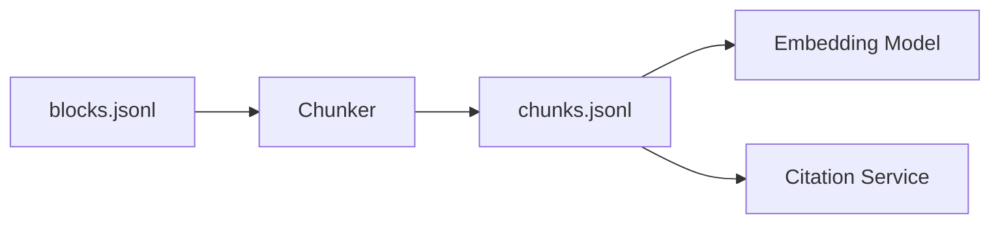

# Chunker Contract

## 1. Purpose and Status

This document defines the contract for the Chunker subsystem: what it receives from the Parser, what artifacts it produces, how identity is derived, and how provenance is preserved.

| Profile | Status |
|---------|--------|
| Common Chunk schema | Accepted v1 |
| `fixed` strategy | Implemented |
| `structure` strategy | Implemented |
| `recursive` strategy | Deferred |
| `semantic` strategy | Deferred |
| `token_aware` strategy | Deferred |



## 2. Input: ParseBundle

The Chunker receives a complete ParseBundle from the Parser:

```text
parsed/{document_id}/{parse_job_id}/
├── manifest.json
├── blocks.jsonl      ← INPUT
├── assets.jsonl
├── links.jsonl
└── issues.jsonl
```

Each line in `blocks.jsonl` is a `ParsedBlock`:

```json
{
  "schema_version": "1.0",
  "document_id": "pdf_dmls_001",
  "block_id": "pdf_dmls_001_b0124",
  "source_type": "pdf",
  "block_index": 124,
  "source_order": 124,
  "block_type": "paragraph",
  "text": "...",
  "heading_path": [
    {"level": 2, "role": "chapter", "text": "Data Engineering Fundamentals"},
    {"level": 3, "role": "section", "text": "Data Sources"}
  ],
  "locator": {...},
  "metadata": {}
}
```

## 3. Output: ChunkBundle

The Chunker produces a ChunkBundle:

```text
parsed/{document_id}/{parse_job_id}/
├── manifest.json
├── blocks.jsonl
├── chunks.jsonl      ← OUTPUT
├── assets.jsonl
├── links.jsonl
└── issues.jsonl
```

Each line in `chunks.jsonl` is a `Chunk`:

```json
{
  "schema_version": "1.0",
  "chunk_id": "sha256:abc123def456",
  "document_id": "pdf_dmls_001",
  "chunk_index": 1,
  "text": "Data Engineering Fundamentals. Data sources include...",
  "char_count": 245,
  "token_count": 58,
  "source_type": "pdf",
  "source_block_ids": ["pdf_dmls_001_b0124", "pdf_dmls_001_b0125"],
  "page_numbers": [70, 71],
  "heading_context": ["Data Engineering Fundamentals", "Data Sources"],
  "block_types": ["heading", "paragraph"],
  "chunker_strategy": "structure",
  "chunker_config": {"max_tokens": 512}
}
```

## 4. Invariants

### I1: Deterministic Identity
- `chunk_id` must be generated as: `sha256(document_id:chunk_index:text)`
- Running the same config produces identical `chunk_id`

### I2: Strict Lineage
- `source_block_ids` must be non-empty
- Every ID in `source_block_ids` must exist in `blocks.jsonl`

### I3: Context Preservation
- `heading_context` must contain parent heading texts
- Enables "what section is this chunk from?"

### I4: Token-Aware Sizing
- `token_count` must be actual tokenizer count (tiktoken)
- Not character-based estimates

### I5: Idempotent Ingestion
- `document_id` + `chunk_index` is stable upsert key
- 1-based indexing

### I6: Overlap-Safe
- A block may appear in multiple chunks
- Each chunk's `source_block_ids` must accurately reflect its subset

## 5. Chunk Schema

```python
class ChunkerStrategy(str, Enum):
    FIXED = "fixed"
    RECURSIVE = "recursive"
    SEMANTIC = "semantic"
    STRUCTURE_AWARE = "structure"
    TOKEN_AWARE = "token_aware"

@dataclass
class Chunk:
    # Tier 1: Identity
    schema_version: str = "1.0"
    chunk_id: str = ""
    document_id: str = ""
    chunk_index: int = 0  # 1-based

    # Tier 2: Content
    text: str = ""
    char_count: int = 0
    token_count: int = 0  # Actual tokenizer count

    # Tier 3: Provenance
    source_type: str = ""
    source_block_ids: List[str] = field(default_factory=list)  # NON-EMPTY
    page_numbers: List[int] = field(default_factory=list)

    # Tier 4: Logical Context
    heading_context: List[str] = field(default_factory=list)
    block_types: List[str] = field(default_factory=list)

    # Tier 5: Reproducibility
    chunker_strategy: ChunkerStrategy = ChunkerStrategy.FIXED
    chunker_config: Dict[str, Any] = field(default_factory=dict)
```

## 6. Implemented Strategies

### Fixed Size (FIXED)
- Splits by token count
- Config: `window_size`, `overlap_ratio`
- Overlap ensures context continuity

### Structure Aware (STRUCTURE_AWARE)
- Splits at heading boundaries
- Respects document structure
- Config: `max_tokens`

## 7. Validation

```python
class ChunkValidator:
    @staticmethod
    def validate_invariants(chunk: Chunk, block_ids_in_blocks_jsonl: set) -> List[str]:
        errors = []
        
        # I2: source_block_ids non-empty
        if not chunk.source_block_ids:
            errors.append("I2 Violation: source_block_ids cannot be empty")
        
        # I2: each ID exists in blocks.jsonl
        for block_id in chunk.source_block_ids:
            if block_id not in block_ids_in_blocks_jsonl:
                errors.append(f"I2 Violation: {block_id} not found")
        
        # I4: token_count > 0
        if chunk.token_count <= 0:
            errors.append("I4 Violation: token_count must be > 0")
        
        # I5: chunk_index >= 1
        if chunk.chunk_index < 1:
            errors.append("I5 Violation: chunk_index must be >= 1")
        
        return errors
```

## 8. Downstream Contracts

- **Embedding Model**: Requires `chunk_id`, `text`, `token_count`
- **Citation Service**: Requires `source_block_ids` → block_id → locator → source
- **Vector DB**: Uses `document_id` + `chunk_index` as upsert key