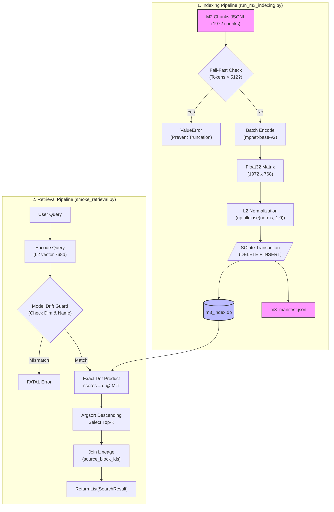

# Embedding and Local Vector Index Contract

## 1. Purpose and Status

Defines the M3 slice: consume frozen Chunk v1 artifacts (M2) → embed into
dense vectors via a local sentence-transformer → persist in a local
exact-search SQLite index → retrieve Top-K while preserving full citation
lineage to ParsedBlocks. Upstream of retrieval evaluation (M4).

| Profile | Status |
|---|---|
| Embedding contract | Accepted v1 |
| Local vector index contract | Accepted v1 |
| Hybrid dense+sparse / BM25 / RRF | DEFERRED |
| Cross-encoder reranker | DEFERRED |
| ANN (HNSW / IVF / PQ) | DEFERRED (Only considered when exact search exceeds strict latency budgets, typically N > 100,000+ chunks. Current scale is trivial for Exact KNN) |
| Cloud vector database | DEFERRED (AWS phase) |

## 2. Locked Baseline

| Field | Locked Value |
|---|---|
| Canonical input | evaluation/runs/m2-final/chunks_structure.jsonl |
| Chunk count | 1972 (StructureAwareChunker CANDIDATE, multi-source) |
| Excluded input | chunks_fixed.jsonl (REJECT — coverage 100%, but structural bounds ignored) |
| Model | sentence-transformers/paraphrase-multilingual-mpnet-base-v2 |
| Model revision (HF commit) | 4328cf26390c98c5e3c738b4460a05b95f4911f5 |
| max_seq_length | 512 wordpieces (XLM-R tokenizer; overridden from default 128) |
| Dimension | 768 |
| Pooling | mean (model-defined) |
| Normalization | L2 (unit length, normalize_embeddings=True) |
| Similarity metric | dot product = cosine (L2-normalized) |
| Search | Exact KNN brute-force: q @ M.T, argsort descending |
| Persistence | SQLite: chunk_id PK + vector BLOB + lineage fields |
| Library pin | sentence-transformers==2.7.0 (src/requirements.txt) |
| Index artifacts | evaluation/index/m3_index.db, evaluation/index/m3_manifest.json |

Rationale for mpnet over MiniLM-L12: the longest M2 chunk has token_count=261
(tiktoken). MiniLM max_seq_length=128 wordpieces would silently
truncate it. mpnet at 512 clears all 1972 chunks with margin. Silent truncation
corrupts M4 recall attribution and is unacceptable as a baseline. See ADR-003.

## 3. Architecture

Modules (M3 scope):

- `src/indexer/embedding.py` — EmbeddingEngine: encode, fail-fast guard, L2 norm
- `src/indexer/schema.py` — IndexMeta, SearchResult (Pydantic v2)
- `src/indexer/vector_store.py` — SQLiteVectorStore: upsert_index, load_meta, search
- `evaluation/scripts/run_m3_indexing.py` — build pipeline + all invariant checks
- `evaluation/scripts/smoke_retrieval.py` — Top-K demo, lineage verification

## 4. Pipeline

## 5. Input Contract

Each input line must satisfy Chunk schema v1 (09-chunker-contract.md).
M3 consumes: `chunk_id`, `chunk_index`, `document_id`, `text`,
`token_count`, `source_block_ids`, `heading_context`.

M3 must NOT modify `src/chunker/`. Chunk schema v1 is frozen.

## 6. Output Contract

### IndexMeta (schema.py + m3_manifest.json)

| Field | Rule |
|---|---|
| model_name | Exact HF model ID string |
| revision | HF commit hash from config._commit_hash; sentinel "main" if offline |
| dimension | Read from model at runtime via get_sentence_embedding_dimension() |
| max_seq_length | Read from model at runtime after any override |
| normalization | Literal "L2" |
| index_version | Literal "1.0" |
| created_at | ISO-8601 UTC; audit-only; freeze via M3_EXECUTION_TIME env var |

### SQLite Database Schema (`evaluation/index/m3_index.db`)

The database consists of exactly two tables: `index_meta` and `embeddings`.

**Table 1: `index_meta`** (1 row)
- `model_name` (TEXT)
- `revision` (TEXT)
- `dimension` (INTEGER)
- `max_seq_length` (INTEGER)
- `normalization` (TEXT)
- `index_version` (TEXT)
- `created_at` (TEXT)

**Table 2: `embeddings`** (1972 rows)
- `chunk_id` (TEXT PRIMARY KEY)
- `document_id` (TEXT)
- `source_block_ids` (TEXT) - JSON array of block IDs
- `vector` (BLOB) - Float32 binary payload (768 * 4 = 3072 bytes)

**Sample Data (5 Random Rows from `embeddings`):**
| chunk_id | document_id | source_block_ids | vector size |
|---|---|---|---|
| sha256:6825ad6f0d989cae | pdf_aws_001 | `["pdf_aws_001_b_d0c6d8..."]` | 3072 bytes (BLOB) |
| sha256:294ea37573443f53 | pdf_aws_001 | `["pdf_aws_001_b_37ae73..."]` | 3072 bytes (BLOB) |
| sha256:2e08f9a6660d2809 | pdf_aws_001 | `["pdf_aws_001_b_f7fcb7..."]` | 3072 bytes (BLOB) |
| sha256:80f4adbe5d726bdb | pdf_aws_001 | `["pdf_aws_001_b_0d4464..."]` | 3072 bytes (BLOB) |
| sha256:5fe16105333045aa | pdf_aws_001 | `["pdf_aws_001_b_8d7303..."]` | 3072 bytes (BLOB) |

### SearchResult (schema.py)

Fields: `chunk_id`, `chunk_index`, `score` (float in [-1, 1]), `document_id`,
`text`, `source_block_ids` (non-empty list), `heading_context`, `token_count`.

## 7. Invariants

| ID | Invariant | Enforcement |
|---|---|---|
| V1 | No silent truncation: wordpieces > max_seq_length raises ValueError | EmbeddingEngine.encode pre-check |
| V2 | All stored vectors are unit-length | np.allclose(norms, 1.0, atol=1e-5) |
| V3 | index_count == chunk_count | SQL COUNT(*) vs Python len() |
| V4 | chunk_id mapping is bijective | set(db_ids) == set(chunk_ids) |
| V5 | Citation lineage intact | all source_block_ids present in blocks.jsonl |
| V6 | Dimension consistency at query time | assert query_vector.shape[0] == meta.dimension |
| V7 | Rebuild determinism | re-encode same texts, max abs diff < 1e-6 |
| V8 | Atomic write | single with sqlite3.connect() transaction |
| V9 | created_at does not affect index identity | excluded from content comparison |

## 8. Expected Behavior

- `run_m3_indexing.py` exits 0; prints PASS for all V1-V9 checks.
- `smoke_retrieval.py` returns exactly `top_k` results per query; scores in
  [-1, 1]; each result carries non-empty `source_block_ids`.
- `m3_index.db` and `m3_manifest.json` exist in `evaluation/index/`.
- Pytest: `src/tests/indexer/test_indexer.py` — 3 tests pass.

## 9. Failure Modes

| Symptom | Root cause | Response |
|---|---|---|
| ValueError on encode | chunk wordpieces > max_seq_length | Fail fast, non-zero exit; do NOT truncate |
| index_count mismatch | dropped or duplicate row | Non-zero exit (V3/V4) |
| score outside [-1, 1] | vectors not normalized | V2/V6 assertions fire |
| source_block_id not in blocks.jsonl | broken lineage from chunker | V5 check fails |
| rebuild vectors differ | nondeterministic model state | V7 max-diff check fails |
| partial DB after crash | write outside transaction | Prevented by V8 |

## 10. Deferred (Not in M3)

Hybrid retrieval, BM25, RRF, reranker, ANN/HNSW/IVF/PQ, embedding cache,
migration trigger for N > 10,000, cloud vector DB, Recall@K/MRR (M4),
generation and citation rendering (M5/M6).

## 11. Downstream Contract (M4)

M4 reads `evaluation/index/m3_index.db` via `SQLiteVectorStore.search()`
and `m3_manifest.json` for config freeze. M4 may scope by document_id via
`search(filter_dict={"document_id": ...})`. M4 must not rebuild the index.

**Model Drift Guard (Implemented in Smoke Retrieval):**
When downstream tools load the index, they must verify the runtime embedding engine against the stored manifest to prevent Model Drift. The guard enforces:
1. `Dimension Guard`: Hard crash if runtime dimension != index dimension.
2. `Normalized Name Guard`: Hard crash if runtime model name (normalized base name) != index model name.
