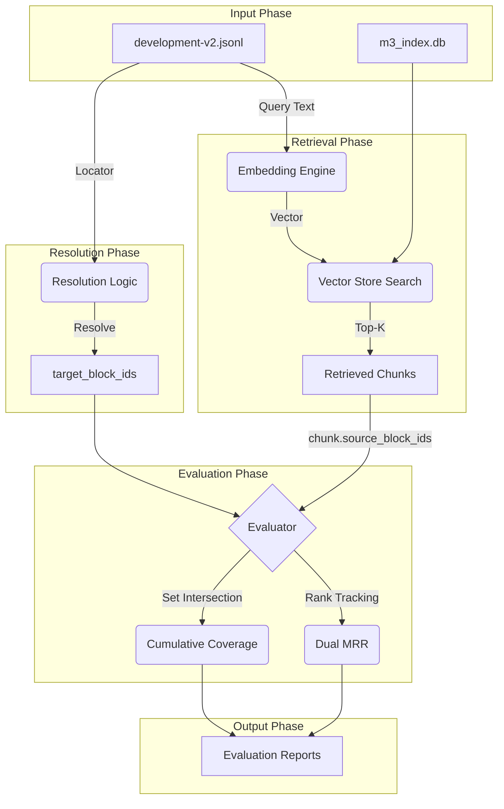

# M4 - Retrieval Evaluation Contracts

## 1. DEFINE TASK M4
**Baseline Retrieval Evaluation**: Đo lường và đánh giá năng lực của hệ thống Retrieval (Indexer + Embedding) trong việc tìm kiếm và trích xuất đúng các bằng chứng (evidence) từ cơ sở dữ liệu đã được index, dựa trên tập Ground Truth có sẵn.

## 2. OBJECT
- Hệ thống **Retrieval** (bao gồm Embedding Model và Vector Store).
- Cấu trúc **Chunk Lineage** (Khả năng truy xuất ngược từ Chunk về Block gốc).

## 3. CÁC KĨ THUẬT ĐƯỢC DÙNG

### 1. Late Binding & Runtime Querying (Đóng dấu đỏ lên mặt sau mảnh giấy)
*   **Cách hình dung:** Cắt cuốn sách ra thành 1,000 mảnh giấy nhỏ (`Chunk`). Thay vì ngồi ghi vào một cuốn sổ tay riêng *"Mảnh 1 cắt từ Trang 65"*, máy tự động **đóng con dấu đỏ lên mặt sau của chính mảnh giấy đó**: `[Nguồn: Block 120, Block 121]`.
*   **Khi đi thi:** Trọng tài nhặt mảnh giấy lên, chỉ cần lật mặt sau ra xem con dấu đỏ là biết ngay nó cắt ra từ đâu.
*   **Vì sao xịn?** Đổi cấu hình cắt mảnh giấy to hơn hay nhỏ hơn, con dấu đỏ vẫn tự động đóng đúng nguồn gốc. Không bao giờ lo cuốn sổ tay tra cứu bị lệch pha hay mất đồng bộ!

### 2. Evidence Subset / Graded Relevance (Mảnh ghép bức tranh Puzzle)
*   **Cách hình dung:** Đáp án chuẩn của đề thi là một bức tranh gồm 4 mảnh ghép `[A, B, C, D]`. Không chấm điểm theo kiểu "Đúng/Sai", mà đếm xem mảnh giấy nhặt về **mang lại những mảnh ghép nào**:
    *   Mảnh giấy 1 mang về mảnh `[A]` -> Đóng góp được 25% bức tranh.
    *   Mảnh giấy 2 mang về mảnh `[B, C]` -> Đóng góp được 50% bức tranh.
*   **Vì sao xịn?** Không đánh đồng mảnh chỉ mang 1 chữ với mảnh mang cả trang sách, cũng không trừng phạt vô lý nếu mảnh giấy quá nhỏ không ôm nổi cả 4 mảnh ghép.

### 3. Cumulative Block Coverage@K (Mở 5 túi quà dồn dập — Trùng thì bỏ qua, mới thì tích lũy)
*   **Cách hình dung:** Mở lần lượt 5 túi quà (Top 5 Chunks trả về) để gom đủ 4 mảnh ghép `[A, B, C, D]`:
    *   **Túi 1:** Nhặt được mảnh `[A]` -> Tích lũy được 25%.
    *   **Túi 2:** Mở ra lại gặp mảnh `[A]` -> **Đồ trùng! Pass qua**, điểm tích lũy vẫn giữ nguyên 25%.
    *   **Túi 3:** Nhặt được mảnh `[B, C]` -> Tích lũy nhảy vọt thành `[A, B, C]` (75%).
*   **Vì sao xịn?** Nhìn vào chỉ số này là biết ngay bộ tìm kiếm có đang bị "ngốc" khi lấy về 5 túi quà giống hệt nhau, làm lãng phí không gian đọc của LLM hay không.

### 4. Dual MRR - First Hit vs. Full Coverage (2 chiếc đồng hồ bấm giờ của Trọng tài)
*   **Đồng hồ 1 (First Hit):** Bấm giờ xem mất bao lâu bộ tìm kiếm mới nhặt được **mảnh ghép đầu tiên** (Ví dụ: nhặt được mảnh `A` ngay túi số 1 -> Score 1.0 - Siêu nhanh!).
*   **Đồng hồ 2 (Full Coverage):** Bấm giờ xem phải mở đến tận túi thứ mấy mới **gom đủ 100% bức tranh** `[A, B, C, D]` (Ví dụ: túi 1 nhặt được `A`, nhưng tận túi 10 mới nhặt được mảnh `D` cuối cùng -> Score 1/10 = 0.1 - Quá chậm!).
*   **Vì sao xịn?** Nếu Đồng hồ 1 chạy siêu nhanh mà Đồng hồ 2 chạy siêu chậm, hệ thống cảnh báo ngay: *"Thông tin bị phân mảnh cực sâu! Cần lắp thêm bộ Re-ranker ở M5 để kéo mảnh D lên sớm hơn!"*

### 5. Global Search (Bơi ra biển lớn — Thả vào thư viện 10,000 cuốn sách)
*   **Cách hình dung:** Thay vì nhốt bộ tìm kiếm vào phòng kín chỉ có đúng 1 cuốn sách (Filtered Search), thả nó tự do vào một **thư viện khổng lồ chứa 10,000 cuốn sách** và bảo: *"Tự đi tìm đoạn văn đúng đi!"*.
*   **Vì sao xịn?** Thử thách thực tế khốc liệt! Xem bộ tìm kiếm có bị lừa bởi những cuốn sách "rác" chứa từ khóa na ná nhưng nội dung trật quẻ hay không.

## 4. WORKFLOW / DIAGRAM


## 5. INPUT
- `development-v2.jsonl`: Tập dữ liệu test chứa Query và Ground Truth Locators.
- `blocks.jsonl`: Cung cấp định nghĩa ParsedBlock để phục vụ Resolution Phase.
- `m3_index.db`: Vector Index đang chứa các chunks cần được evaluate.

## 6. OUTPUT & REPORTS (M4 EXPECTATION)

Dựa trên toàn bộ Evaluation Contract (D1–D7), output của bước Retrieval Evaluation (M4) sẽ được kết xuất dưới dạng 2 Artifacts chuẩn mực:

### 6.1. File Trace Thô Chi Tiết Theo Case (`m4_eval_results.jsonl`)
Đây là file nhật ký lưu trữ kết quả đánh giá thô của **100% test cases** trong tập `development-v2.jsonl`. Mỗi dòng (JSON record) là một case chạy độc lập, lưu giữ toàn bộ vết bằng chứng kỹ thuật mà **không gán nhãn phán đoán chủ quan (No Subjective Labeling)**:

```json
{
  "run_metadata": {
    "run_id": "m4-baseline-v1",
    "dataset": "development-v2",
    "index": "m3_index.db",
    "timestamp": "2026-09-09T13:30:00Z"
  },
  "retrieval_config": {
    "metric": "cosine_similarity",
    "embedding_model": "text-embedding-3-small",
    "embedding_dimension": 768,
    "top_k": 10
  },
  "case_id": "eval_txt_observability_pillars_001",
  "category": "cross_lingual",
  "query": "Các trụ cột chính của Observability bao gồm những gì?",
  "target_block_ids": ["block_txt_24", "block_txt_25"],  // D1: Resolved từ Locator
  "total_target_blocks": 2,
  "metrics": {
    "coverage_at_1": 0.5,           // D3: 1/2 blocks
    "coverage_at_3": 1.0,           // D3: 2/2 blocks (Đã gom đủ 100%)
    "coverage_at_5": 1.0,
    "coverage_at_10": 1.0,
    "mrr_first_hit": 1.0,           // D4: Vị trí mảnh đầu tiên = Rank 1 (1/1)
    "mrr_full_coverage": 0.3333     // D4: Nếu không gom đủ 100% trong Top-K, bắt buộc = 0
  },
  "top_k_chunks": [
    {
      "rank": 1,
      "chunk_id": "chunk_901",
      "score": 0.82,
      "source_block_ids": ["block_txt_24", "block_txt_99"],
      "provided_evidence": ["block_txt_24"]   // D2: Phép giao (Set Intersection)
    },
    {
      "rank": 2,
      "chunk_id": "chunk_902",
      "score": 0.75,
      "source_block_ids": ["block_txt_24"],
      "provided_evidence": []                // Trùng lặp (Zero Gain)
    },
    {
      "rank": 3,
      "chunk_id": "chunk_903",
      "score": 0.68,
      "source_block_ids": ["block_txt_25"],
      "provided_evidence": ["block_txt_25"]   // Nạp thêm mảnh block_txt_25
    }
  ],
  "diagnostic_evidence": {
    "target_blocks_exist_in_index": true,     // Block có nằm trong CSDL không?
    "target_blocks_retrieved": true,          // Có được lấy lên trong Top-K không?
    "first_hit_rank": 1,
    "full_coverage_rank": 3,
    "uncovered_block_ids": []                 // Không còn block nào bị sót
  }
}
```

### 6.2. Báo Cáo Metrics Tổng Hợp Baseline (`m4-retrieval-summary.md`)
Báo cáo đo lường "sức khỏe" toàn diện của bộ Retriever trên toàn bộ tập Development Split, tổng hợp dưới dạng bảng chỉ số trung bình (Mean Metrics):

| Metric | Giá trị Baseline (Global Search) | Ý nghĩa Kỹ thuật / SRE |
| :--- | :--- | :--- |
| **Mean Coverage@1** | `45.2%` | Tỷ lệ thông tin đúng nhặt được ngay ở Rank 1. |
| **Mean Coverage@3** | `72.8%` | Tỷ lệ thông tin đúng khi tích lũy Top-3 chunks. |
| **Mean Coverage@5** | `85.0%` | **Chỉ số cốt lõi:** Tỷ lệ nguyên liệu đúng chuẩn bị cho Prompt LLM. |
| **Mean Coverage@10** | `91.5%` | Mức trần thông tin nhặt được ở Top-10. |
| **Mean MRR (First Hit)** | `0.88` | Tốc độ nhặt được manh mối đầu tiên (xếp hạng trung bình ~ 1.1). |
| **Mean MRR (Full Coverage)**| `0.42` | Tốc độ gom trọn bộ 100% bối cảnh (xếp hạng trung bình ~ 2.4). |
| **Wrong Document Rate** | `3.2%` | Tỷ lệ nhặt nhầm chunk từ tài liệu ngoài Scope (Khả năng chống nhiễu). |
| **Evaluation Status** | `PASS (30/30 cases)` | Đảm bảo nguyên tắc **Fail-Fast** (100% case resolve thành công Target Blocks). |

### 7. TÁC DỤNG CỦA 2 OUTPUT NÀY KHI SANG MILESTONE 5 (M5)

Nhờ cấu trúc Output sạch sẽ này, ở **Milestone 5**, chúng ta không bao giờ đoán mò mà có bằng chứng định lượng chính xác:
1. **Phát hiện trùng lặp (Redundancy Detection):** Nếu `Mean Coverage@1` = 45% mà `Mean Coverage@5` chỉ đạt 45% (biểu diễn phẳng lì), đồng thời cột `provided_evidence` ở Rank 2–5 rỗng ➔ **Bằng chứng hệ thống bị lặp thông tin rác**.
2. **Kích hoạt Re-ranking / MMR:** Nếu độ lệch giữa `MRR_First_Hit` (0.88) và `MRR_Full_Coverage` (0.42) quá lớn ➔ **Bằng chứng mảnh thông tin còn thiếu bị giấu sâu ở Rank 8–10**, cần thêm Re-ranker ở M5 để đôn lên Top-2.
3. **Phân loại nguyên nhân trượt (Failure Attribution):** Với các case có `uncovered_block_ids` khác rỗng, ta soi chiếu lại `is_target_in_index` để biết chính xác do Parser chưa parse hay do Vector Embedding bị miss.

## 8. STRICT IMPLEMENTATION POLICIES (THE 6 REFINEMENTS)

Để đảm bảo tính tái lập (Reproducibility) và độ vững chắc của Evaluator, mọi mã nguồn thực thi bắt buộc phải tuân thủ 6 quy tắc "Implementation-Proof" sau:

1. **K Evaluation Points**: Đóng băng `K_VALUES = [1, 3, 5, 10]`. Retriever phải trả ít nhất `max(K_VALUES)` chunks nếu index có đủ (nếu ít hơn, dùng số thực tế và ghi chú).
2. **Full Coverage Fallback**: Nếu không đạt 100% coverage trong Top-K, bắt buộc `MRR_Full_Coverage = 0` (tuyệt đối không để Evaluator tự ý gán giá trị khác).
3. **Invalid-Case Policy (Fail-Fast)**: Evaluator phải **dừng ngay lập tức (throw error/sys.exit)**, tuyệt đối không được silent skip đối với các trường hợp: malformed JSON, thiếu query, thiếu evidence, hoặc locator không resolve được.
4. **Score Semantics & Config**: Raw Trace JSON phải ghi rõ khối `retrieval_config` (metric, model, dimension, top_k) để định nghĩa chính xác "score" đang lưu là L2, Dot Product hay Cosine Similarity.
5. **Reproducibility Metadata**: Mỗi bản chạy phải đóng dấu khối `run_metadata` (run_id, dataset version, index version, timestamp). Đảm bảo nửa năm sau vẫn biết điểm số này sinh ra từ hệ thống nào.
6. **Tách bạch Evaluation vs. Diagnostic**: Phân định rạch ròi giữa `target_blocks_exist_in_index` (có tồn tại trong cơ sở dữ liệu không?) và `target_blocks_retrieved` (có lấy lên được trong Top-K không?) trong khối `diagnostic_evidence`.

## 9. HÀNH TRÌNH PHÁT TRIỂN HYBRID RETRIEVAL (M4 DEVELOPMENT PHASE)

Dựa trên nền tảng Evaluation Contract ở trên, M4 đã tiến hành chuỗi thực nghiệm kiến trúc liên tiếp:
1. **M4-A (Hybrid Baseline)**: Chạy song song Dense và BM25, chứng minh Semantic và Lexical là 2 nguồn tín hiệu bổ trợ trực giao (Specialists).
2. **M4-B (RRF Limitations)**: Phát hiện RRF (Reciprocal Rank Fusion) chỉ thưởng cho sự đồng thuận thứ hạng (Rank Agreement) mà bỏ qua độ lớn điểm số (Score Magnitude). Dẫn đến việc RRF trừng phạt Specialist trong các case có độ lệch hạng cao (Rank Disagreement).
3. **M4-D (Score Fusion)**: Áp dụng Min-Max và Saturation Normalization để hợp nhất bằng Score thay vì Rank. Chứng minh Score Fusion bảo toàn được Score Magnitude, giúp giải cứu Specialist.
4. **M4-E (Alpha Robustness Sweep)**: 
   - Quét trọng số $\alpha$ từ $0.0 \rightarrow 1.0$.
   - Sử dụng Dual MRR để thiết lập Guardrails: `MRR Full` làm Primary, `MRR First` làm Mandatory Guardrail.
   - Phát hiện "Regime Transition" quanh ngưỡng $\alpha \approx 0.5$.
   - Min-Max hé lộ một vùng ứng viên sáng giá (Robust Region) tại $\alpha \approx 0.2 - 0.4$ trên tập `development-v2`.
5. **M4 Holdout Validation (Next Gate)**: Đóng băng tập `test-v1` mới hoàn toàn để kiểm chứng chéo vùng $\alpha$ ứng viên. Quyết định Production (Fixed Weight vs Dynamic Gating vs Cross-Encoder) sẽ được đưa ra tại Gate này để tránh Overfitting.
