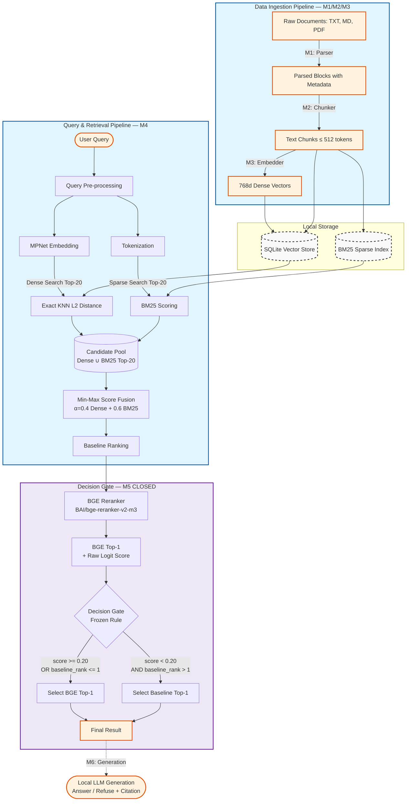
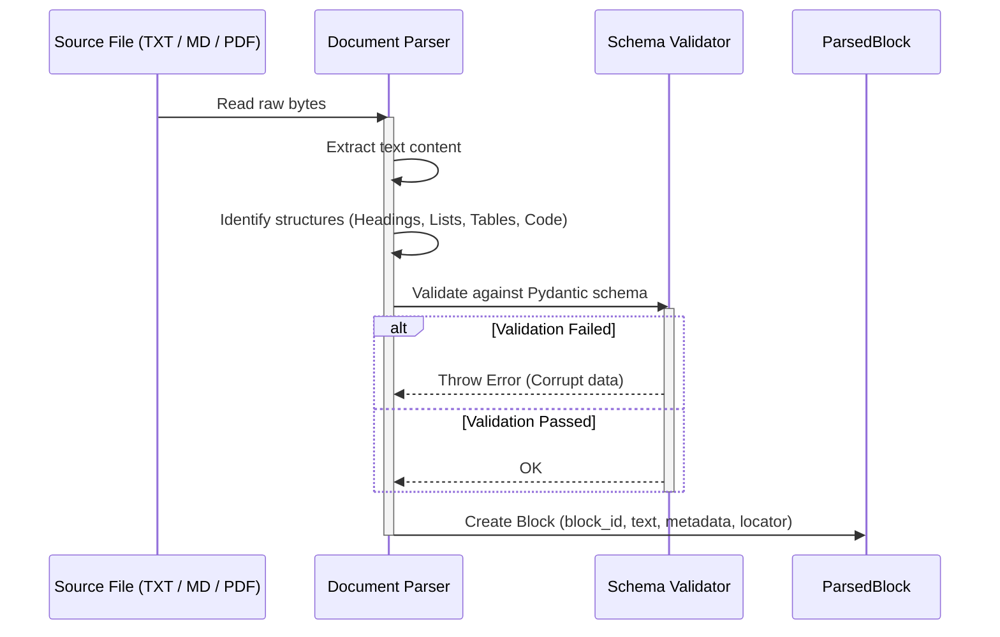
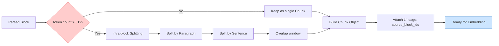
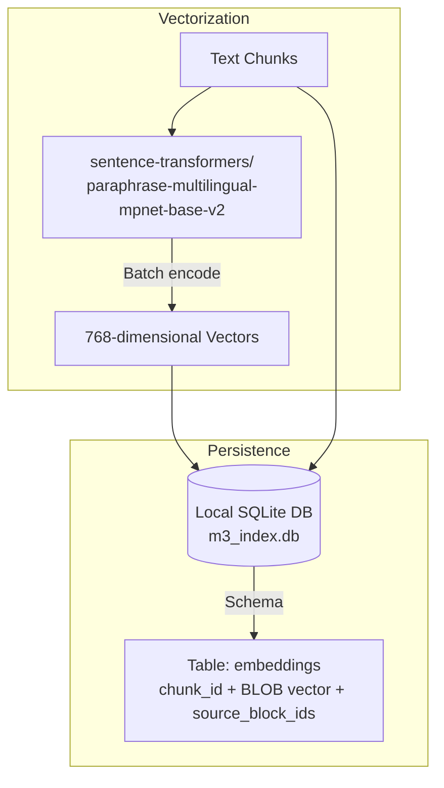
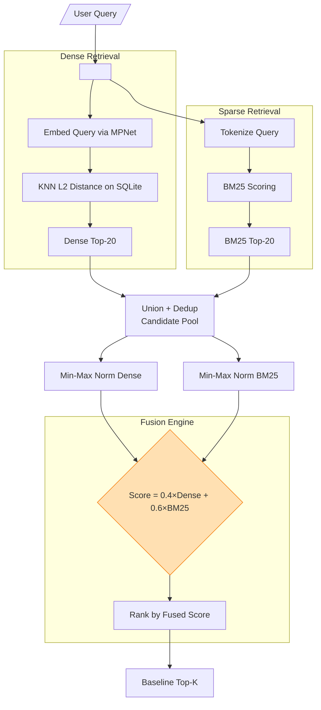
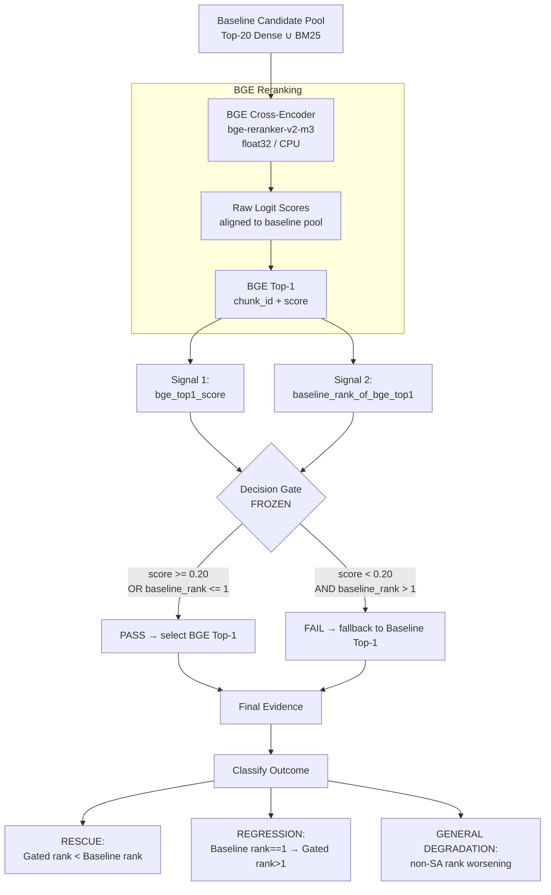

# RAG Pipeline Design & Workflow (M1 - M5)

Tài liệu này mô tả chi tiết luồng xử lý dữ liệu (Data Pipeline) và kiến trúc của hệ thống RAG (Retrieval-Augmented Generation) tại tầng Local Worker, tính đến hết Milestone 5. Hệ thống đã hoàn thiện Data Ingestion, Information Retrieval và Decision Gate. Generation (LLM) sẽ được bổ sung trong M6.

---

## 1. Overall RAG Pipeline Architecture (Current — M5)

Bức tranh toàn cảnh từ tài liệu thô đến khi user nhận được kết quả. **Retrieval pipeline giờ có thêm Decision Gate (M5).**



---

## 2. Milestone Breakdown

### M1: Parser Workflow
Nhiệm vụ: Chuyển đổi tài liệu thô thành Parsed Blocks có cấu trúc, bảo toàn Lineage và Metadata.



**Status:** ✅ CLOSED — TXT, MD, PDF parsers validated. 1910 blocks → `bundle_all/blocks.jsonl`.

---

### M2: Chunker Workflow
Nhiệm vụ: Cắt Parsed Blocks thành Chunks ≤ 512 tokens, bảo toàn `source_block_ids` để Lineage tracking.



**Status:** ✅ CLOSED — 1972 chunks, 100% coverage, 0 schema violations. `evaluation/runs/m2-final`.

---

### M3: Embedding & Indexing Workflow
Nhiệm vụ: Chuyển Text Chunks thành 768d vectors và lưu vào SQLite.



**Status:** ✅ CLOSED — 1972 chunks indexed. 6 invariants passed. `evaluation/index/m3_index.db`.

---

### M4: Hybrid Retrieval — Score Fusion Workflow
Nhiệm vụ: Tìm kiếm và xếp hạng Candidates liên quan nhất với query. Baseline retrieval cho M5.



**Status:** ✅ CLOSED — Fixed alpha rejected (ADR-005). Baseline frozen at α=0.4. Holdout: MRR First = 88.58. `evaluation/results/m4_holdout_results.jsonl`.

---

### M5: Decision Gate Workflow — CLOSED ✅
Nhiệm vụ: Kiểm soát sự đánh đổi Rescue ↔ Regression khi dùng CE Reranker. Gate deterministic, không tune sau Holdout.



**Frozen Rule:**
```python
selected = (
    bge_top1
    if (bge_top1_score >= 0.20 or baseline_rank_of_bge_top1 <= 1)
    else baseline_top1
)
```

**Holdout Results (test-v2.jsonl — 24 cases):**

| System | Rescue | Regression | MRR First | Cov@10 |
|--------|-------:|----------:|--------:|------:|
| Baseline | — | 0 | 88.58 | 0.6256 |
| BGE-only | 4 | 1 | 86.54 | 0.6673 |
| **Gated** | **4** | **1** | **87.88** | **0.6673** |

**H6 = SUPPORTED ON HOLDOUT** (Rescue retention 100% ≥ 90%, Regression 1 ≤ 1)

**Status:** ✅ CLOSED — ADR-006. Artifacts: `m5_holdout_trace.jsonl`, `m5_holdout_report.md`.

> `H6 SUPPORTED ≠ Gate approved for production.` (ADR-006 §9.4)

---

## 3. Complete System Flow — M1 to M5

```mermaid
flowchart LR
    Raw[Raw\nDocuments] -->|Parse| Blocks
    Blocks -->|Chunk| Chunks
    Chunks -->|Embed| Vectors
    Vectors -->|Index| DB[(SQLite)]

    Query[User\nQuery] -->|Dense| Dense[KNN Top-20]
    Query -->|Sparse| Sparse[BM25 Top-20]

    Dense --> Pool[Candidate Pool]
    Sparse --> Pool
    DB --> Dense

    Pool -->|Min-Max\nFusion| Baseline[Baseline\nRanking]

    Baseline -->|CE Score| BGE[BGE\nReranker]
    BGE --> Gate{Decision\nGate}

    Gate -->|score>=0.20\nOR rank<=1| BGEResult[BGE\nTop-1]
    Gate -->|otherwise| BaseResult[Baseline\nTop-1]

    BGEResult --> Evidence[Evidence]
    BaseResult --> Evidence

    Evidence -.->|M6| LLM[Generate\nAnswer]

    style Gate fill:#ede7f6,stroke:#6a1b9a,stroke-width:3px
    style Evidence fill:#c8e6c9,stroke:#2e7d32,stroke-width:2px
    style LLM fill:#fff9c4,stroke:#f9a825,stroke-dasharray: 5 5
```



---

## 4. Known Limitations & Open Issues

| Component | Status | Limitation |
|-----------|--------|-----------|
| Decision Gate | ✅ CLOSED | H6 supported on Holdout but gate not production-approved yet |
| holdout_008 | Residual risk | BGE score=0.9960 but still caused regression — score ≠ always correct |
| Generation | ⏳ M6 | LLM integration pending |
| DOCX / PPTX | ⏳ M7 | Parsers not implemented |
| CE Inference speed | Known | CPU float32 inference: ~25-40min for 35 cases |
| Process isolation | Workaround | CE must run in subprocess to avoid Windows `0xC0000005` |

---

## 5. Artifact Map

```text
evaluation/
├── datasets/
│   ├── test-v3.jsonl          ← M5 Development Set (35 cases)
│   └── test-v2.jsonl          ← M5 Holdout Set    (25 cases, FROZEN)
├── index/
│   └── m3_index.db            ← SQLite Vector Store (1972 chunks)
├── bundle_all/
│   └── blocks.jsonl           ← 1910 parsed blocks
├── results/
│   ├── m5_step5_raw_scores.json  ← Dev sweep CE scores
│   ├── m5_holdout_trace.jsonl    ← Holdout case-level trace
│   └── m5_holdout_report.md      ← Holdout aggregate report
└── scripts/
    ├── m5_step5_gate_sweep.py       ← Dev sweep
    ├── m5_step5_ce_runner.py        ← Dev CE subprocess
    ├── m5_step6_holdout_validation.py  ← Holdout main script
    └── m5_step6_ce_runner.py           ← Holdout CE subprocess

Architecture/
├── ADR-005-retrieval-fusion-decision.md  ← M4 decision
└── ADR-006-decision-gate-holdout.md      ← M5 decision (FROZEN)
```
