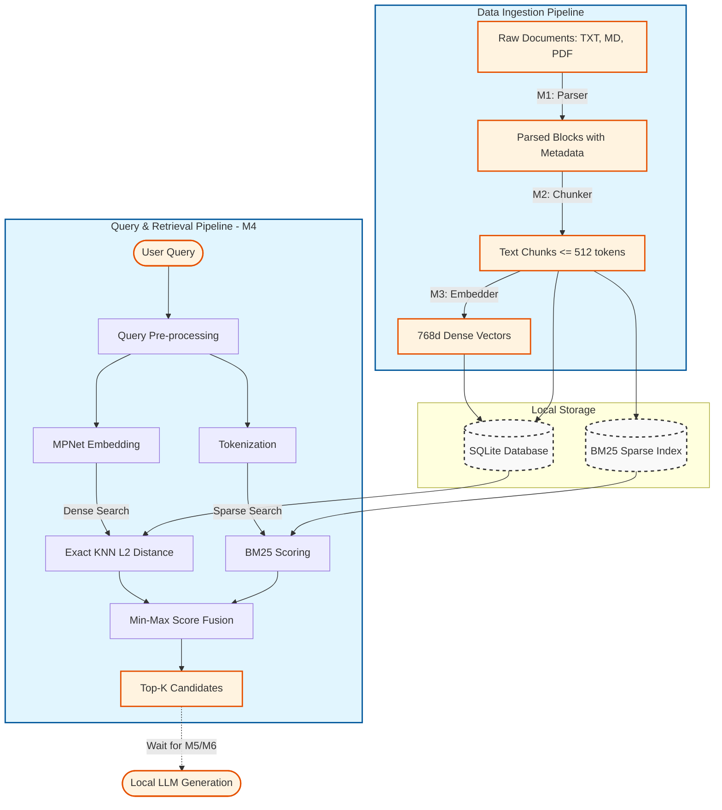
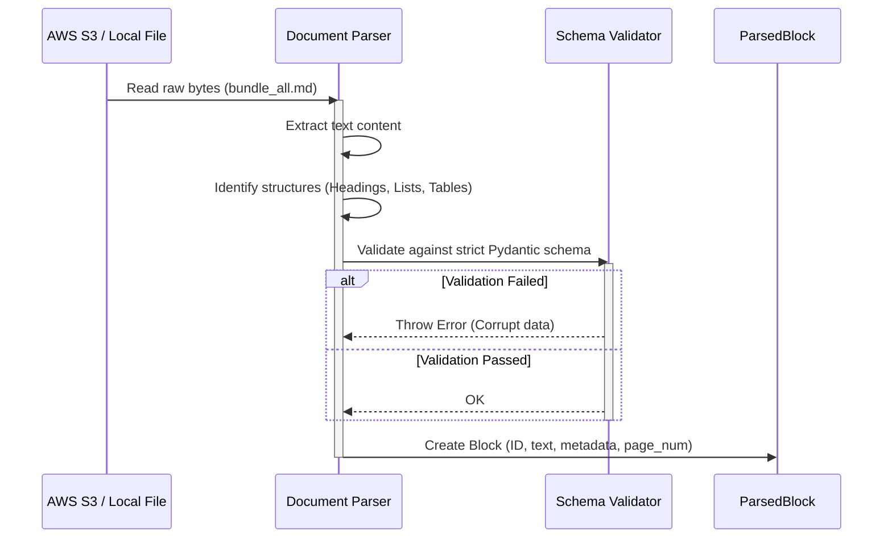
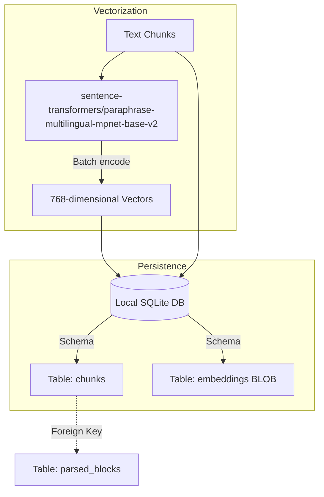
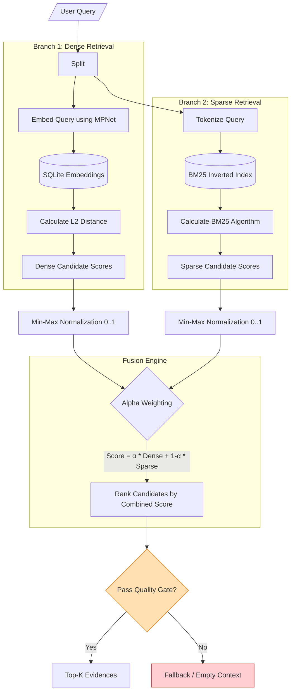
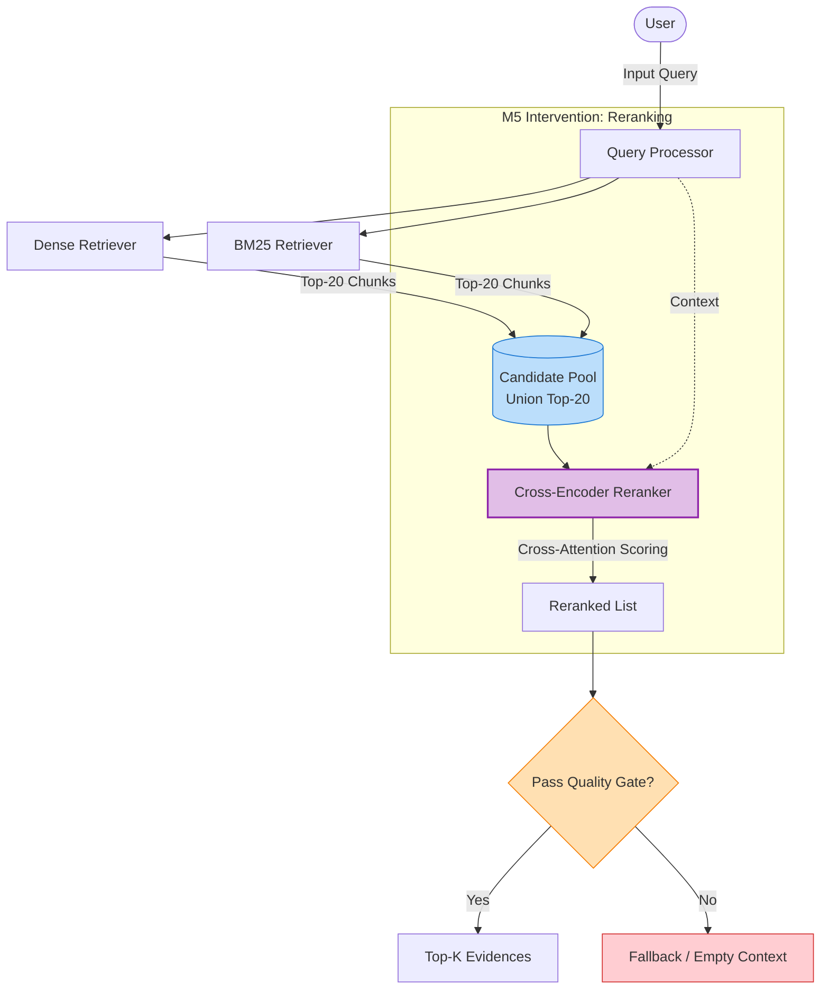

# RAG Pipeline Design & Workflow (M1 - M4)

Tài liệu này mô tả chi tiết luồng xử lý dữ liệu (Data Pipeline) và kiến trúc của hệ thống RAG (Retrieval-Augmented Generation) tại tầng Local Worker, tính đến hết Milestone 4. Hệ thống hiện tại tập trung hoàn toàn vào Data Ingestion và Information Retrieval, chưa bao gồm Generation (LLM).

## 1. Overall RAG Pipeline Architecture

Bức tranh toàn cảnh quá trình một tài liệu thô đi vào hệ thống cho đến khi user thực hiện query.

---

## 2. Milestone Breakdown

Dưới đây là sơ đồ chi tiết (Zoom-in) vào từng Milestone trong quá trình xây dựng RAG Pipeline.

### M1: Parser Workflow
Nhiệm vụ: Chuyển đổi dữ liệu phi cấu trúc thành các Block có cấu trúc, bảo toàn Lineage (nguồn gốc) và Metadata.

### M2: Chunker Workflow
Nhiệm vụ: Cắt ParsedBlocks thành các Chunk có kích thước phù hợp với cửa sổ ngữ cảnh (Context Window) của Embedding Model, không làm rách câu.

### M3: Embedding & Indexing Workflow
Nhiệm vụ: Chuyển đổi Text Chunks thành các vector toán học và lưu trữ an toàn trong Local Database.

### M4: Retrieval & Score Fusion Workflow (Hybrid Search)
Nhiệm vụ: Tìm kiếm và xếp hạng (Ranking) các Chunk liên quan nhất với truy vấn của người dùng. Đây là điểm chốt chặn trước khi đưa ngữ cảnh cho LLM.

---

## 3. Current Limitations (Triggering M5)
Mặc dù M1-M4 đã hoàn thiện Data Pipeline, sơ đồ M4 (Retrieval) đang bộc lộ điểm nghẽn tại bước `Split` và `Guardrail`:
1. M4 không có khả năng tự động bắt cầu từ vựng (Alignment Gap).
2. Điểm số kết hợp (Fusion Engine) thường xuyên thất bại trong việc đưa Target lên Top 1-2 khi gặp nhiễu (Ranking Weakness).
3. Do đó, cần một chiến dịch Can thiệp (M5) nhắm thẳng vào kiến trúc của M4 để vượt qua Guardrail.

---

## 4. Proposed M5 Architecture (with Cross-Encoder Reranking)
*Lưu ý: Đây là sơ đồ hệ thống đang được thử nghiệm trong M5 Step 3. Cross-Encoder hoạt động như một màng lọc ngữ nghĩa lớp 2, thay thế cho MinMax Fusion trực tiếp.*

