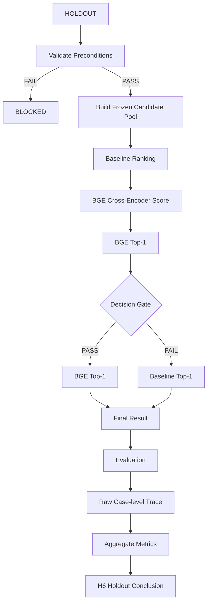

# ADR 006: Decision Gate Holdout Validation Contract (M5)

## 1. Object

**Decision Gate (Decision under Uncertainty) for the Reranker model.**

This contract defines a deterministic mechanism to decide:
> When to allow the Reranker to alter the Baseline's ranking,
> and when the Baseline must be preserved.

This contract does **not** aim to finalize the production model.

---

## 2. Purpose

Validate hypothesis H6:
> "A simple Gate can control the trade-off between Rescue and Regression."

The Development Set demonstrated:
- BGE-only: Rescue = 10, Regression = 5
- Frozen Gate: `Score >= 0.20 OR Baseline Rank <= 1`
- Gate: Rescue = 9, Regression = 2

This indicates that the Gate is capable of reducing collateral regression while retaining the majority of the rescue capability on the Development Set.

The Holdout must validate:
> Can this frozen rule still control the Rescue ↔ Regression trade-off on data that was never used to decide the rule?

---

## 3. Current State

### 3.1 What is established

- Ranking / reranking is a major bottleneck when the target already exists in the candidate pool.
- The reranker model materially changes ranking behavior.
- Cross-Encoders possess rescue capability.
- Unconditional Cross-Encoder application causes collateral regression.
- Observable top-1/top-2 margin is insufficient as a confidence signal.
- A deterministic Gate shows promising results on the Development Set.

Source: M5 Hypothesis Conclusion.

### 3.2 What is not established

Not yet proven:
- the production reranker model;
- the production threshold;
- whether the Gate rule generalizes to the Holdout set;
- whether the CE should run for every query;
- whether a single routing policy is universally optimal.

Therefore, this contract only validates the **mechanism of the Gate**, not the production architecture.

---

## 4. Expected State

Upon completion of this task, the following must exist:
1. A Holdout evaluation executed using the **frozen rule**, with zero tuning.
2. Case-level results containing:
   - Baseline outcome
   - BGE outcome
   - Gate decision
   - Final selected outcome
   - Rescue / Regression classification
3. A raw trace sufficient for auditing every single case.
4. An aggregate comparison between:
   - Baseline
   - BGE-only
   - Gated
5. A single final conclusion:
   - `H6 SUPPORTED on Holdout`
   - or
   - `H6 NOT SUPPORTED on Holdout`
6. No threshold/rule modifications after observing the Holdout result.

---

## 5. Sub-tasks

### 5.1 Freeze experiment inputs
Freeze the following components:
- evaluation dataset;
- candidate pool definition / artifact;
- baseline ranking;
- reranker model + model version;
- inference configuration;
- Gate rule;
- evaluation metrics;
- acceptance criteria.

Do not alter any components once the Holdout run commences.

After execution:
- persist raw reranker scores as evidence.

### 5.2 Preflight validation
Verify that:
- The Holdout dataset exists and is frozen.
- The Candidate pool is built following the exact protocol.
- The Baseline ranking is present.
- The Reranker model/version matches the frozen configuration.
- The BGE scores are computed on the **exact same candidate pool**.
- Case ground truth data is valid.
- No cases are silently skipped.

Testability Precondition:
BGE-only must produce at least:
- 1 Rescue case
- 1 Regression case
(If not, `STATUS = INSUFFICIENT_VARIATION`).

If preconditions fail: `STATUS = BLOCKED` or `INSUFFICIENT_VARIATION`. Do not execute a partial evaluation.

### 5.3 Generate BGE ranking
For each query:
1. Retrieve the candidate pool;
2. Keep the candidate set strictly identical;
3. Score candidates using the frozen Cross-Encoder;
4. Sort by BGE score;
5. Extract `BGE Top-1`.

### 5.4 Apply frozen Gate
For the BGE Top-1 candidate:
```text
bge_top1
    ↓
bge_top1_score
    +
baseline_rank_of_bge_top1
    ↓
Decision Gate
```

Frozen rule:
```python
if (
    bge_top1_score >= 0.20
    or
    baseline_rank_of_bge_top1 <= 1
):
    selected = bge_top1
else:
    selected = baseline_top1
```

Forbidden actions:
- changing `0.20`;
- changing `<= 1`;
- adding margin rules;
- adding score calibration;
- adding heuristics;
- adding models;
- per-case tuning.

### 5.5 Evaluate
Compute results for:
- Baseline
- BGE-only
- Gated

Primary Metrics:
- Rescue count
- Regression count
- Rescue retention
- Regression reduction
- MRR First
- MRR Full
- Coverage@1
- Coverage@3
- Coverage@5
- Coverage@10

These metrics support diagnosis but must not be used to retune the Gate.

### 5.6 Produce raw trace
Every case must record an object extending the established evaluation schema:
```json
{
  "run_metadata": {
    "run_id": "m5-holdout-v1",
    "dataset": "test-v2.jsonl",
    "index": "m3_index.db",
    "timestamp": "2026-09-18T10:00:00Z"
  },
  "retrieval_config": {
    "fusion_method": "min_max",
    "reranker_model": "BAAI/bge-reranker-v2-m3",
    "gate_score_threshold": 0.20,
    "gate_rank_threshold": 1
  },
  "case_id": "eval_test_v2_001",
  "tags": ["pdf", "semantic-heavy"],
  "query": "...",
  "target_block_ids": ["..."],

  "gate_trace": {
    "baseline_top1_chunk_id": "...",
    "bge_top1_chunk_id": "...",
    "bge_top1_score": 0.42,
    "baseline_rank_of_bge_top1": 4,
    "decision": "BGE"
  },

  "metrics_baseline": {
    "mrr_first_hit": 0.142,
    "mrr_full_coverage": 0.0,
    "coverage_at_10": 0.5
  },
  "metrics_bge": {
    "mrr_first_hit": 0.5,
    "mrr_full_coverage": 0.0,
    "coverage_at_10": 0.5
  },
  "metrics_gated": {
    "mrr_first_hit": 0.5,
    "mrr_full_coverage": 0.0,
    "coverage_at_10": 0.5
  },

  "classification": {
    "rescue": true,
    "regression": false,
    "general_rank_degradation": false
  }
}
```

---

## 6. Technique

### 6.1 Candidate pool
The Gate does not generate new candidates.
BGE is only permitted to **rerank the exact candidate pool** used in M5 Step 3.

Candidate pool structure:
```text
Dense Top-20
       +
BM25 Top-20
       ↓
Union / Dedup
       ↓
Baseline ranking
       ↓
BGE reranking
       ↓
Decision Gate
```

Purpose: Separate candidate availability from ranking intervention. If the target does not exist in the candidate pool, the Gate has no capability to rescue it.

### 6.2 Decision variables
The Gate observes exactly two signals:
- **Signal 1:** BGE Top-1 Score
- **Signal 2:** Baseline Rank of the BGE Top-1 candidate

Forbidden inputs:
- Top1/Top2 margin;
- query category;
- query length;
- lexical overlap;
- manual case inspection;
- ground-truth information.

### 6.3 Decision outputs
Exactly two possible outputs:
- BGE Top-1
- Baseline Top-1

The Gate must not synthesize a third ranking via alternative heuristics.

---

## 7. Input

### Required
- Frozen Holdout dataset
- Frozen candidate pool artifacts
- Baseline ranking artifacts
- Frozen BGE reranker configuration
- Ground-truth evaluation data

### Frozen configuration
```yaml
reranker_model: BAAI/bge-reranker-v2-m3

score_threshold: 0.20
baseline_rank_threshold: 1

candidate_dense_top_k: 20
candidate_bm25_top_k: 20

gate_rule:
  type: deterministic_or
  conditions:
    - bge_top1_score >= 0.20
    - baseline_rank_of_bge_top1 <= 1
```

---

## 8. Workflow



### Critical rule
Holdout is a **one-shot validation**.
After the Holdout is executed, the following actions are strictly prohibited:
- threshold sweeps
- rule modifications
- new rerankers
- new candidate depths
- post-hoc heuristics

If the Gate fails: `H6 = NOT SUPPORTED`.
Do not alter the rule and re-run the same Holdout dataset to "save" the results. If a rule modification is desired, a new experiment with a fresh development phase must be initiated.

---

## 9. Criteria Output / Output Format

### 9.1 Case-level classification

#### Rescue
A case is classified as a **Rescue** when:
```text
Gated first-hit rank < Baseline first-hit rank
```
OR the Baseline yielded a zero-hit but the Gated system secured a hit.

#### Collateral Regression
A case is classified as a **Regression** when:
```text
Baseline first-hit rank == 1
AND
Gated first-hit rank > 1
```
This definition maintains consistency with the M5 Strong Anchor analysis.

Separately, record `general_rank_degradation` for instances where the Gate worsens the rank but they are not Strong Anchor regressions, ensuring no information is lost.

### 9.2 Aggregate comparison
Output format:

| System   | Rescue | Regression | MRR First | MRR Full | Cov@10 |
| -------- | -----: | ---------: | --------: | -------: | -----: |
| Baseline |    ... |        ... |       ... |      ... |    ... |
| BGE-only |    ... |        ... |       ... |      ... |    ... |
| Gated    |    ... |        ... |       ... |      ... |    ... |

### 9.3 H6 acceptance criteria
`H6 SUPPORTED ON HOLDOUT` iff:

1. `Regression_Gated <= Regression_BGE`
AND
2. `Rescue_Gated >= (90% × Rescue_BGE)`
AND
3. Holdout execution is valid and complete.

Criterion 2 is derived directly from the Development behavior (9/10 = 90%). The Holdout must demonstrate the ability to retain at least the same level of rescue capability observed on Dev.

**Slice analysis (Subgroup stability):**
- report by available tags/strata
- report rescue/regression distribution
- report whether result is concentrated in a tiny subset

These are diagnostic evidence only. They do not modify the frozen decision.

### 9.4 Important distinction
Do not utilize `Higher MRR` in isolation to conclude H6.
H6 is a hypothesis concerning `Rescue ↔ Regression control`. MRR serves merely as a supporting metric.

---

## 10. Format Report

The report must strictly adhere to this structure:

### 10.1 Experiment Identity
- run_id
- dataset
- candidate-pool version
- reranker model/version
- Gate version
- timestamp

### 10.2 Frozen Configuration
```text
score_threshold = 0.20
baseline_rank_threshold = 1
```

### 10.3 Preconditions
- dataset valid
- candidate pool valid
- baseline valid
- reranker valid
- ground truth valid

### 10.4 Aggregate Result
Baseline vs BGE-only vs Gated table.

### 10.5 Rescue Analysis
- cases rescued
- cases not rescued
- rescue retention percentage

### 10.6 Regression Analysis
- Strong Anchor regressions
- general rank degradations
- cases protected by Gate
- cases where Gate allowed BGE incorrectly

### 10.7 Decision Trace
Top representative cases detailing:
- Case ID
- Baseline rank
- BGE rank
- BGE score
- Baseline rank of BGE Top-1
- Gate decision
- Final rank
- Rescue / Regression classification

### 10.8 H6 Conclusion
Strictly one of:
- `H6 = SUPPORTED ON HOLDOUT`
- `H6 = NOT SUPPORTED ON HOLDOUT`
- `H6 = BLOCKED` (if experiment was invalid)

### 10.9 Interpretation
Clearly distinguish between:
- observed facts;
- metrics;
- hypothesis conclusions;
- unresolved issues.

Do not extrapolate:
`H6 supported → Gate approved for production`. These two conclusions are not equivalent.
