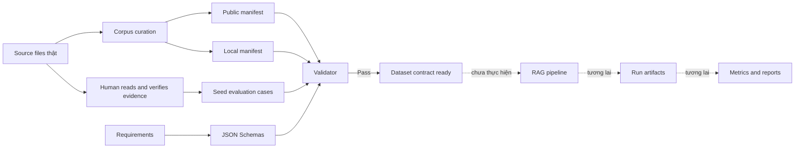

# StudyBot Evaluation Dataset

Thư mục này chứa contract của evaluation dataset, không chứa tài liệu nguồn. Ground truth luôn trỏ về vị trí ổn định trong tài liệu (`page`, `slide`, `section`, `paragraph` hoặc `text_span`), không trỏ vào chunk do pipeline tạo ra.

## Data flow



`relevant_chunk_ids` và `retrieved_chunks` chỉ được sinh trong `runs/` sau khi một cấu hình pipeline cụ thể đã chạy. Chúng bị cấm trong corpus manifest và dataset gốc.

## Cấu trúc

```text
evaluation/
├── schemas/
│   ├── corpus-manifest.schema.json
│   └── evaluation-case.schema.json
├── corpus/
│   ├── manifest.public.jsonl
│   └── manifest.local.jsonl       # Git ignored
├── datasets/
│   ├── development-v1.jsonl
│   └── test-v1.jsonl
├── runs/                          # artifacts theo từng pipeline run
├── reports/
└── scripts/
    └── validate_dataset.py
```

## Quy tắc dữ liệu

- `manifest.public.jsonl` chỉ dùng `document_id` và metadata an toàn để commit; không có absolute path hoặc nội dung nguồn.
- `manifest.local.jsonl` ánh xạ `document_id` sang file thật trên máy và không được commit.
- `development-v1.jsonl` được phép dùng để lựa chọn parser, chunking, embedding, Top-K và refusal threshold.
- `test-v1.jsonl` là holdout; không dùng để điều chỉnh pipeline.
- Reference answer phải được diễn giải ngắn. Evidence note chỉ mô tả bằng chứng, không sao chép đoạn dài.
- `pdf_page` là số trang vật lý của file PDF, bắt đầu từ 1. `printed_page` chỉ là nhãn trang in trong sách và là trường bổ sung.
- `paragraph_index` là thứ tự paragraph trong `word/document.xml`, bắt đầu từ 1; paragraph trong bảng vẫn được tính.
- `start_line` và `end_line` là số dòng 1-based, tính cả dòng trống.

## Trạng thái hiện tại

Đây là **Step 2 seed dataset**, chưa phải evaluation dataset v1 hoàn chỉnh. Bảy case hiện tại dùng để chứng minh schema và locator hoạt động đúng: hai page cases, một slide case, một paragraph case, một section case, một text-span case và một unanswerable case. Step tiếp theo mới mở rộng, cân bằng category và đóng development/test split chính thức.

## Validate

Từ thư mục gốc của repository:

```bat
python evaluation\scripts\validate_dataset.py
python evaluation\scripts\validate_dataset.py --check-local
```

Lệnh đầu kiểm tra schema JSON, public manifest, referential integrity và semantic rules. Lệnh thứ hai kiểm tra thêm local manifest và sự tồn tại của bảy source files trên máy.
